## Módulo 0488 · Desarrollo de Interfaces
### Unidad 1: Principios de UX para Desarrolladores

Diseño Centrado en el Usuario · Heurísticas de Nielsen · Flujos · UX Writing

<small>CFGS DAM · Curso 2025/26</small>

Note:
Bienvenidos a la unidad de UX. Esta unidad es fundamental porque establece las bases de cómo pensamos antes de escribir código. Vamos a cubrir por qué el desarrollador no es el usuario, cómo evaluar interfaces con las 10 heurísticas de Nielsen, y cómo validar nuestras decisiones sin ser diseñadores. Pregunta para empezar: ¿cuántos habéis usado alguna aplicación que os ha hecho sentir frustrados? Esa frustración es lo que vamos a aprender a evitar.

---

## 🎯 Objetivos de Aprendizaje

<div style="font-size: 2rem; line-height: 1.4; text-align: left;">

1. Aplicar Diseño Centrado en el Usuario (UCD) en interfaces | <mark>no diseñar para uno mismo</mark>
2. Evaluar interfaces con las 10 heurísticas de Nielsen
3. Diseñar flujos de usuario con happy path y edge cases
4. Organizar información con patrones de Arquitectura de Información
5. Aplicar principios visuales: jerarquía, Gestalt, contraste
6. Redactar microcopy efectivo: botones, errores, estados vacíos

</div>

Note:
Estos 6 objetivos son el esqueleto de la unidad. El más importante es el primero: entender que el desarrollador no es el usuario. Vamos a dedicar tiempo a cada uno, pero quiero que os quedéis con esta idea: cada vez que digáis "a mí me gusta más así", preguntaros "¿qué datos tengo para afirmar que al usuario le gusta más así?"

---

## 🤔 Motivación: ¿Por qué UX?


<div style="font-size: 1.5rem; line-height: 1.4; text-align: left;">

| Sin UX | Con UX |
|--------|--------|
| ❌ "A mí me gusta así" | ✅ Decisión basada en evidencia |
| ❌ El usuario se frustra y abandona | ✅ El usuario completa la tarea |
| ❌ Soporte técnico saturado | ✅ Interfaz autoexplicativa |
| ❌ Rediseños constantes | ✅ Iteraciones informadas |

<mark>El coste de arreglar un problema de UX tras el lanzamiento es 10x mayor que durante el diseño</mark>
</div>

Note:
Este cuadro resume por qué la UX no es opcional. Un dato: según el informe de Nielsen Norman Group, el coste de corregir un problema de usabilidad en producción es 10 veces superior a corregirlo en fase de diseño. En aplicaciones de gestión, cada minuto de confusión del administrativo es dinero perdido para la empresa. Pregunta al aula: ¿habéis tenido que corregir algo ya desplegado que era confuso? ¿Cuánto costó?

---

## 🔄 Diseño Centrado en el Usuario (UCD)

<div class="mermaid">
graph LR
    A[Empatizar / Investigar] --> B[Definir el problema]
    B --> C[Idear soluciones]
    C --> D[Prototipar]
    D --> E[Testear con usuarios]
    E --> A
</div>

<mark>El desarrollador NO es el usuario</mark>. Nuestra perspectiva está sesgada.

Note:
El proceso UCD tiene 5 fases que se retroalimentan. La clave es que no es lineal: testeamos, aprendemos y volvemos a iterar. El sesgo del desarrollador es real: sabemos demasiado sobre cómo funciona la app por dentro. El usuario solo quiere completar su tarea. Ejemplo: un administrativo no quiere saber de queries SQL, quiere "buscar clientes". Ejercicio mental: pensad en vuestra app de banco. ¿Los textos usan palabras que entendéis o jerga financiera?

---

## 🔍 Fases del UCD en detalle

<div style="font-size: 1.5rem; line-height: 1.4; text-align: left;">

| Fase | Técnica | Ejemplo |
|------|---------|---------|
| **Empatizar** | Entrevistas, shadowing | Pasar un día con administrativos |
| **Definir** | Point of View (POV) | "El admin pierde 45 min/día llamando por teléfono" |
| **Idear** | Crazy Eights, bocetos | 8 variaciones de interfaz en 8 min |
| **Prototipar** | Figma, papel, código | Componente aislado sin backend |
| **Testear** | Test de pasillo, analytics | 5 personas, 5 minutos cada una |

</div>

Note:
Cada fase tiene técnicas concretas. Crazy Eights es genial en clase: 8 minutos, cada uno dibuja 8 versiones de una misma pantalla. El POV estructura el problema en 3 partes: usuario + necesidad + insight. Ejemplo real: "Un administrativo de clínica dental necesita forma rápida de confirmar citas porque actualmente pierde 45 min/día llamando". Esto guía todo el desarrollo.

---

## 📋 Las 10 Heurísticas de Nielsen

<div class="mermaid">
mindmap
  root((10 Heurísticas<br/>de Nielsen))
    1_Visibilidad
      Spinners
      Toast notifications
      Breadcrumbs
    2_Mundo real
      Lenguaje del usuario
      Iconos reconocibles
    3_Control
      Deshacer
      Escape en modales
    4_Consistencia
      Mismo botón = misma acción
      Design System
    5_Prevención
      Validación en tiempo real
      Confirmar acciones destructivas
    6_Reconocimiento
      Menús visibles
      Historial reciente
    7_Flexibilidad
      Atajos de teclado
      Personalización
    8_Minimalismo
      Priorizar información
      Espacio en blanco
    9_Errores
      Lenguaje llano
      Sugerir soluciones
    10_Ayuda
      Tooltips contextuales
      FAQs integradas
</div>

Note:
Este mapa mental es vuestra chuleta para evaluar cualquier interfaz. Cada heurística aborda una dimensión distinta. Truco: cuando reviséis una pantalla, recorred mentalmente las 10. En 5 minutos detectaréis problemas que tardaríais horas en encontrar "a ojo". Las 4 primeras son las que más se violan en apps de gestión: falta de feedback (1), jerga técnica (2), no poder cancelar (3) e inconsistencia visual (4).

---

## ① Visibilidad del Estado del Sistema

<mark>La interfaz debe informar qué está ocurriendo en cada momento</mark>

- **Spinners** durante operaciones asíncronas
- **Toast** al completar: "Cambios guardados"
- **Breadcrumbs** para orientar la navegación
- **Barra de progreso** en operaciones largas

```html
<!-- Angular con señales -->
@if (isLoading()) {
  <app-spinner></app-spinner>
}
<button [disabled]="isLoading()">Guardar</button>
```

Note:
Sin feedback, el usuario hace doble clic y genera registros duplicados. Es uno de los bugs más comunes en aplicaciones de gestión. La solución es sencilla: loading state + disable button + toast de confirmación. En Angular 17+ con señales, `isLoading()` se actualiza automáticamente y la UI reacciona. Pregunta: ¿qué aplicación usáis que no muestra feedback al guardar? ¿Qué hacéis vosotros cuando no veis respuesta?

---

## ① Visibilidad del Estado del Sistema

<mark>La interfaz debe informar qué está ocurriendo en cada momento</mark>

<div class="fragment">
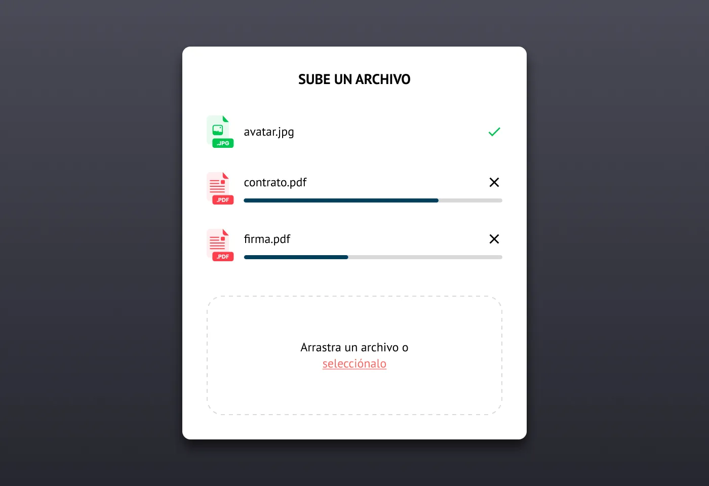
<p class="mini">en todo momento el usuario está informado del proceso de subida de cada uno de los archivos</p>
</div>


Note:
Sin feedback, el usuario hace doble clic y genera registros duplicados. Es uno de los bugs más comunes en aplicaciones de gestión. La solución es sencilla: loading state + disable button + toast de confirmación. En Angular 17+ con señales, `isLoading()` se actualiza automáticamente y la UI reacciona. Pregunta: ¿qué aplicación usáis que no muestra feedback al guardar? ¿Qué hacéis vosotros cuando no veis respuesta?

---

## ② Relación Sistema-Mundo Real


<mark>Habla el idioma del usuario, no jerga técnica</mark>

<div style="font-size: 2rem; line-height: 1.4; text-align: left;">

| ❌ Técnico | ✅ Lenguaje del usuario |
|------------|------------------------|
| "Foreign key constraint violation" | "No puedes eliminar este cliente: tiene facturas pendientes" |
| "Ejecutar query" | "Buscar pacientes" |
| "Query builder" | "Búsqueda avanzada" |
| "Error 500" | "Error interno. Inténtalo en unos minutos" |

</div>
Note:
El error "foreign key constraint" es real: lo he visto en aplicaciones de gestión. La administrativa no sabe qué es una foreign key ni debería saberlo. Nuestra responsabilidad es traducir los errores técnicos a mensajes accionables. Regla práctica: leed cada texto de la interfaz y preguntad "¿mi madre entendería esto?". Si la respuesta es no, reescribidlo.

---

## ② Relación Sistema-Mundo Real


<mark>Habla el idioma del usuario, no jerga técnica</mark>

<div class="fragment">
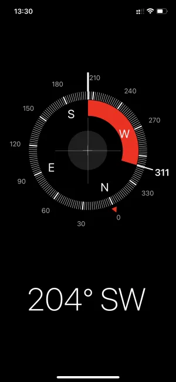
<p class="mini">la app de brújula de iOS está diseñada para parecerse a una brújula de verdad. De esta manera el usuario puede aplicar lo que ya sabe por su experiencia en el mundo real sobre cómo funciona el objeto y no tiene que aprender algo nuevo antes de usarla</p>
</div>
Note:
El error "foreign key constraint" es real: lo he visto en aplicaciones de gestión. La administrativa no sabe qué es una foreign key ni debería saberlo. Nuestra responsabilidad es traducir los errores técnicos a mensajes accionables. Regla práctica: leed cada texto de la interfaz y preguntad "¿mi madre entendería esto?". Si la respuesta es no, reescribidlo.


---

## ③ Control y Libertad del Usuario

<mark>Proporciona salidas de emergencia claras</mark>

- ✅ **Deshacer** en lugar de solo confirmar
- ✅ Cada modal responde a **Escape**
- ✅ Wizard con botones **Anterior/Siguiente**
- ✅ Papelera de reciclaje antes de eliminar definitivamente
- ✅ Guardias de ruta en Angular: `canDeactivate`

Note:
La heurística 3 es la "salida de emergencia". En Angular, los guardias `canDeactivate` son perfectos para preguntar "¿Descartar cambios?" al abandonar un formulario. Las acciones destructivas deben ser reversibles siempre que sea posible. Gmail es el ejemplo canónico: "eliminar" es archivar, y tienes unos segundos para deshacer. Pregunta: ¿qué aplicación usáis que NO tiene botón de cancelar o atrás?

---

## ③ Control y Libertad del Usuario

<mark>Proporciona salidas de emergencia claras</mark>

<div class="fragment">
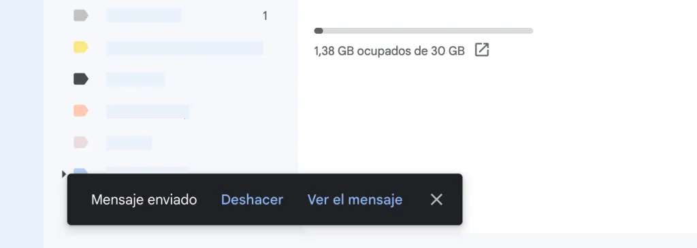
<p class="mini">el usuario cuenta con la opción para poder deshacer el paso que acaba de realizar</p>
</div>

Note:
La heurística 3 es la "salida de emergencia". En Angular, los guardias `canDeactivate` son perfectos para preguntar "¿Descartar cambios?" al abandonar un formulario. Las acciones destructivas deben ser reversibles siempre que sea posible. Gmail es el ejemplo canónico: "eliminar" es archivar, y tienes unos segundos para deshacer. Pregunta: ¿qué aplicación usáis que NO tiene botón de cancelar o atrás?


---

## ④ Consistencia y Estándares

- Mismo botón = misma posición, color y comportamiento en toda la app
- Si eliminar es 🗑️ en una tabla, no puede ser ✖️ en otra
- El logo siempre lleva al inicio (estándar web)
- Campos obligatorios siempre con asterisco rojo

```typescript
// Componente reutilizable = consistencia garantizada
@Component({ selector: 'app-button' })
export class ButtonComponent {
  @Input() variant: 'primary' | 'secondary' | 'danger' = 'primary';
}
```

Note:
La consistencia reduce carga cognitiva. Si el usuario aprende que el botón azul guarda, espera que todos los botones azules guarden. En Tailwind + Angular, la solución es un Design System de componentes: un solo componente Button con variantes. No 7 botones diferentes implementados por 7 desarrolladores. Esto es lo que veremos en la unidad 13.


---

## ④ Consistencia y Estándares

<div class="fragment">
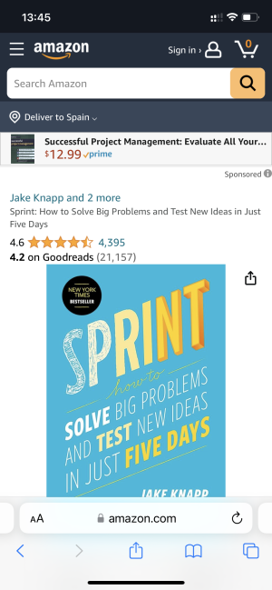
<p class="mini">El icono de la lupa y del menú, por ejemplo, son (casi) universalmente reconocidos y no tendría sentido usar otros que los usuarios no entenderían.</p>
</div>

Note:
La consistencia reduce carga cognitiva. Si el usuario aprende que el botón azul guarda, espera que todos los botones azules guarden. En Tailwind + Angular, la solución es un Design System de componentes: un solo componente Button con variantes. No 7 botones diferentes implementados por 7 desarrolladores. Esto es lo que veremos en la unidad 13.


---

## ⑤ Prevención de Errores

<mark>Mejor que un buen mensaje de error es evitar que ocurra</mark>

- **Deshabilitar el botón** de envío hasta que el formulario sea válido
- **Typeahead / autocompletado** en lugar de texto libre
- **Input masks** para DNI, IBAN, teléfono
- **Select** en lugar de input cuando el dominio es finito
- Confirmar solo acciones <mark>irreversibles</mark>

Note:
"Prevention over cure". Angular Reactive Forms con validadores que se ejecutan en blur y deshabilitan el submit es la implementación canónica. Las máscaras de input (ngx-mask) evitan que el usuario pueda teclear un DNI con formato incorrecto. Cuidado con abusar de los diálogos de confirmación: fatiga de confirmación = el usuario hace clic en "Sí" sin leer.

---

## ⑤ Prevención de Errores

<mark>Mejor que un buen mensaje de error es evitar que ocurra</mark>

<div class="fragment">
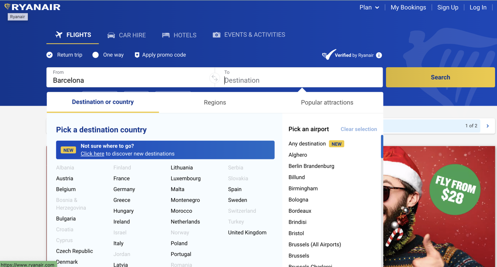
<p class="mini">La pantalla de selección de destinos de Ryanair no permite a los usuarios seleccionar un país al que no se pueda volar desde el origen seleccionado.</p>
</div>

Note:
"Prevention over cure". Angular Reactive Forms con validadores que se ejecutan en blur y deshabilitan el submit es la implementación canónica. Las máscaras de input (ngx-mask) evitan que el usuario pueda teclear un DNI con formato incorrecto. Cuidado con abusar de los diálogos de confirmación: fatiga de confirmación = el usuario hace clic en "Sí" sin leer.

---

## ⑥ Reconocimiento antes que Recuerdo

<mark>Minimiza la carga de memoria del usuario</mark>

- **Menú de navegación siempre visible** (no comandos a memorizar)
- **Historial de búsquedas recientes** (no recordar qué se buscó)
- **Breadcrumbs** visibles (no recordar dónde estoy)
- **Labels SIEMPRE visibles** en formularios (no placeholder que desaparece)
- **Sticky headers** en tablas largas

Note:
La memoria de trabajo humana es limitada (7±2 elementos). Cada cosa que obligamos al usuario a recordar es una oportunidad de error. En Angular, un servicio de historial con localStorage permite persistir búsquedas recientes. Los placeholders NO sustituyen labels: desaparecen al escribir y el usuario pierde la referencia. Pregunta: ¿qué aplicación os hace recordar cosas que debería mostrar?

---

## ⑥ Reconocimiento antes que Recuerdo

<mark>Minimiza la carga de memoria del usuario</mark>

<div class="fragment">
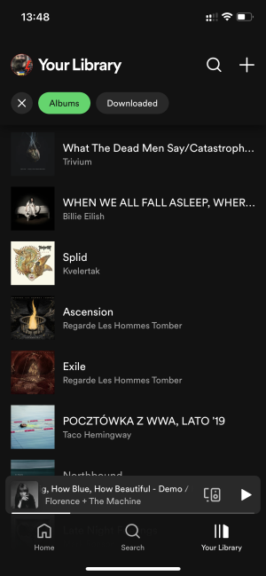
<p class="mini">El listado de álbumes de Spotify enseña también la miniatura de la portada para que sea más fácil reconocer los discos y uno no tenga que leer los títulos cada vez que quiere escuchar algo.</p>
</div>

Note:
La memoria de trabajo humana es limitada (7±2 elementos). Cada cosa que obligamos al usuario a recordar es una oportunidad de error. En Angular, un servicio de historial con localStorage permite persistir búsquedas recientes. Los placeholders NO sustituyen labels: desaparecen al escribir y el usuario pierde la referencia. Pregunta: ¿qué aplicación os hace recordar cosas que debería mostrar?

---


## ⑦ Flexibilidad y Eficiencia de Uso

Dos perfiles: <mark>novato</mark> (menús visibles) y <mark>experto</mark> (atajos)

- **Atajos de teclado**: Ctrl+S guardar, Escape cerrar, Ctrl+Z deshacer
- **Personalización**: columnas visibles, orden del menú, tamaño de fuente
- **Acciones por lotes**: selección múltiple + operación masiva
- **Plantillas guardadas** para formularios recurrentes

Note:
La misma app sirve al becario que acaba de llegar y al administrativo que lleva 15 años. El experto necesita atajos; el novato necesita guía visual. Angular CDK proporciona utilidades de teclado. En aplicaciones de gestión, los atajos multiplican la productividad. Ejemplo: un administrativo procesa 200 facturas al día. Si cada atajo ahorra 1 segundo, son 3 minutos al día, 1 hora al mes.

---


## ⑦ Flexibilidad y Eficiencia de Uso

Dos perfiles: <mark>novato</mark> (menús visibles) y <mark>experto</mark> (atajos)

<div class="fragment">
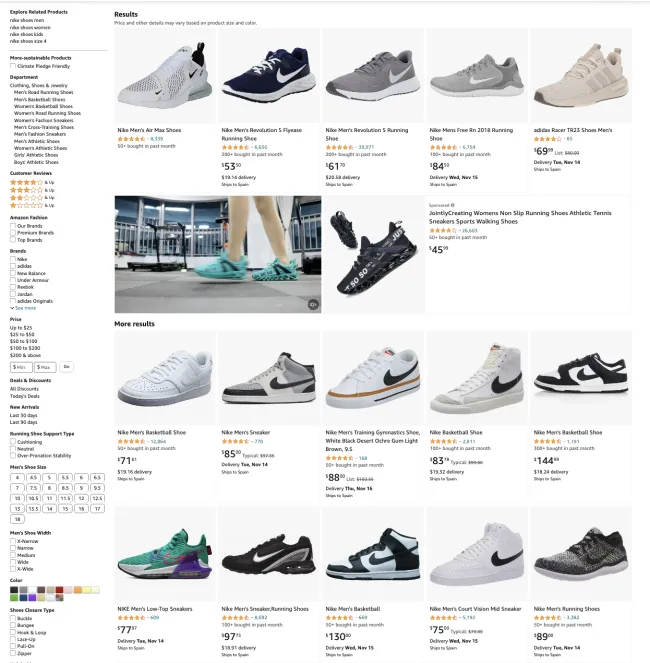
<p class="mini">Los muchos filtros de Amazon son un buen ejemplo de este heurístico. Los usuarios pueden encontrar el producto que desean de muchas maneras distintas según sus necesidades, sus prioridades y su manera de navegar.</p>
</div>

Note:
La misma app sirve al becario que acaba de llegar y al administrativo que lleva 15 años. El experto necesita atajos; el novato necesita guía visual. Angular CDK proporciona utilidades de teclado. En aplicaciones de gestión, los atajos multiplican la productividad. Ejemplo: un administrativo procesa 200 facturas al día. Si cada atajo ahorra 1 segundo, son 3 minutos al día, 1 hora al mes.

---

## ⑧ Diseño Estético y Minimalista

<mark>Cada elemento extra compite por la atención</mark>

- Acciones <mark>principales</mark>: prominentes (color, tamaño)
- Acciones <mark>secundarias</mark>: discretas pero accesibles
- Acciones <mark>terciarias</mark>: ocultas hasta que se soliciten
- Generoso <mark>espacio en blanco</mark> (p-, m-, gap-)
- Un solo `text-xl` por pantalla, resto `text-base` y `text-sm`

Note:
El minimalismo no es quitar funcionalidad, es priorizarla. En Tailwind: un uso generoso de padding y gap, jerarquía tipográfica clara con un solo título grande, colores sobrios para el cromo de la interfaz y colores intensos solo para acciones y alertas. El error del novato: rellenar cada píxel con información. El espacio en blanco no está vacío: guía la mirada.

---

## ⑧ Diseño Estético y Minimalista

<mark>Cada elemento extra compite por la atención</mark>

<div class="fragment">
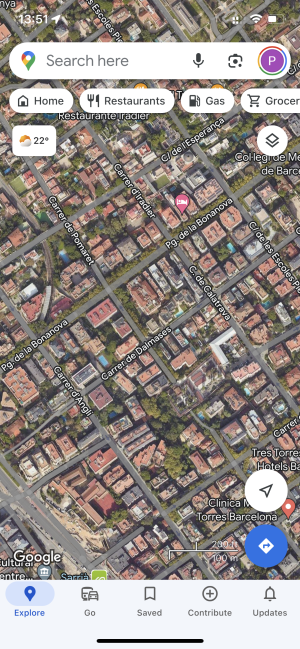
<p class="mini">En la versión de Google Maps de la imagen de arriba podemos ver cómo las distintas opciones de la app están o ocultas en los menús o en áreas menos visibles de la interfaz. La gran mayoría del espacio está ocupado por el mapa, que es el elemento que realmente importa. Versiones sucesivas han ido añadiendo más elementos, haciendo la interfaz un poco más compleja, probablemente debido al hecho que el uso que hacen los usuarios de Maps ha ido evolucionado con el tiempo.</p>
</div>

Note:
El minimalismo no es quitar funcionalidad, es priorizarla. En Tailwind: un uso generoso de padding y gap, jerarquía tipográfica clara con un solo título grande, colores sobrios para el cromo de la interfaz y colores intensos solo para acciones y alertas. El error del novato: rellenar cada píxel con información. El espacio en blanco no está vacío: guía la mirada.

---


## ⑨ Ayudar a Reconocer Errores

<mark>Error en lenguaje llano + causa + solución</mark>

<div style="font-size: 1.5rem; line-height: 1.4; text-align: left;">

| ❌ Mal | ✅ Bien |
|-------|--------|
| "Error 500" | "El servidor no responde. Comprueba tu conexión y reintenta." |
| "Formato inválido" | "El DNI debe tener 8 dígitos seguidos de una letra (ej: 12345678Z)" |
| "Campo requerido" | "El nombre del cliente es obligatorio para continuar" |

```html
<!-- Angular: error asociado al campo -->
<input aria-describedby="dni-error" />
<span id="dni-error" class="text-red-600 text-sm">
  El DNI debe tener 8 dígitos + 1 letra
</span>
```
</div>
Note:
Tres partes del buen mensaje de error: qué pasó, por qué pasó, qué hacer. En Angular, los mensajes de error deben estar asociados al campo con `aria-describedby`. El mensaje aparece junto al campo, en tiempo real (al perder el foco), no en un listado genérico al final del formulario. Esto es tanto UX como accesibilidad (WCAG 3.3.1 y 3.3.3).

---

## ⑨ Ayudar a Reconocer Errores

<mark>Error en lenguaje llano + causa + solución</mark>

<div class="fragment">
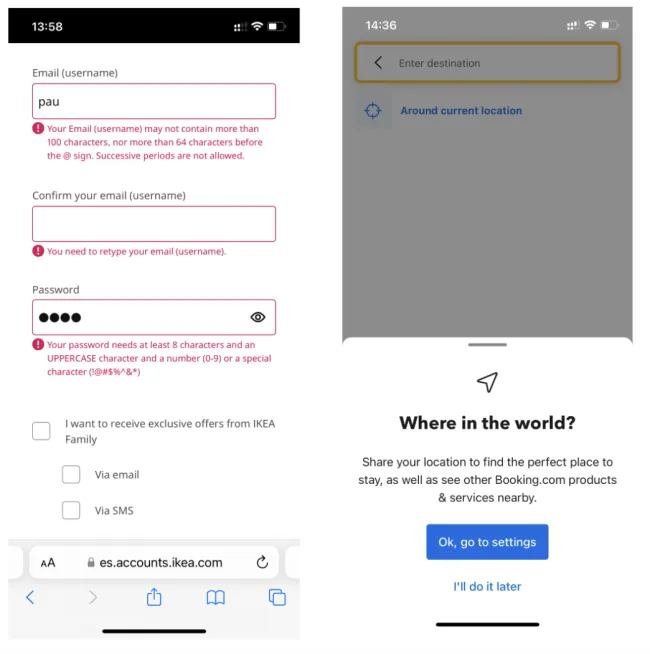
<p class="mini">Los mensajes de error tienen que indicar claramente los errores, sus causas y cómo subsanarlos. Mensajes específicos como “Insertar una contraseña de por lo menos 8 caracteres” son siempre preferibles que mensajes genéricos como “contraseña no válida” En la imagen de la derecha, el sistema no se limita a indicar que los servicios de localización están desactivados, sino también enseña un acceso directo para activarlos.</p>
</div>
Note:
Tres partes del buen mensaje de error: qué pasó, por qué pasó, qué hacer. En Angular, los mensajes de error deben estar asociados al campo con `aria-describedby`. El mensaje aparece junto al campo, en tiempo real (al perder el foco), no en un listado genérico al final del formulario. Esto es tanto UX como accesibilidad (WCAG 3.3.1 y 3.3.3).

---


## ⑩ Ayuda y Documentación

<mark>Ideal: que no se necesite. Realista: que esté a mano</mark>

- **Tooltips** al pasar el cursor sobre iconos ℹ️
- **Walkthrough guiado** para nuevos usuarios (3-5 pasos)
- **FAQs integradas** en el contexto de cada pantalla
- **Textos de ayuda** bajo títulos de sección
- <mark>Enfocada en tareas, no en arquitectura del sistema</mark>

Note:
La ayuda ideal es la que no se necesita porque la interfaz es clara. En sistemas complejos (ERP, software médico), cierta ayuda es inevitable. La clave: que esté donde el usuario la necesita, no en un manual PDF de 300 páginas. Angular CDK proporciona tooltips accesibles. Ejemplo: junto a "Tipo de IVA" un icono ℹ️ con tooltip explicando cada opción.

---

## ⑩ Ayuda y Documentación

<mark>Ideal: que no se necesite. Realista: que esté a mano</mark>

<div class="fragment">
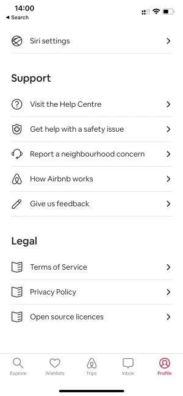
<p class="mini">La app de AirBnB pone a disposición de los usuarios distintas opciones de ayuda y contacto.</p>
</div>

Note:
La ayuda ideal es la que no se necesita porque la interfaz es clara. En sistemas complejos (ERP, software médico), cierta ayuda es inevitable. La clave: que esté donde el usuario la necesita, no en un manual PDF de 300 páginas. Angular CDK proporciona tooltips accesibles. Ejemplo: junto a "Tipo de IVA" un icono ℹ️ con tooltip explicando cada opción.

---

## 🎨 Leyes de Gestalt Aplicadas a Interfaces

<div class="fragment">
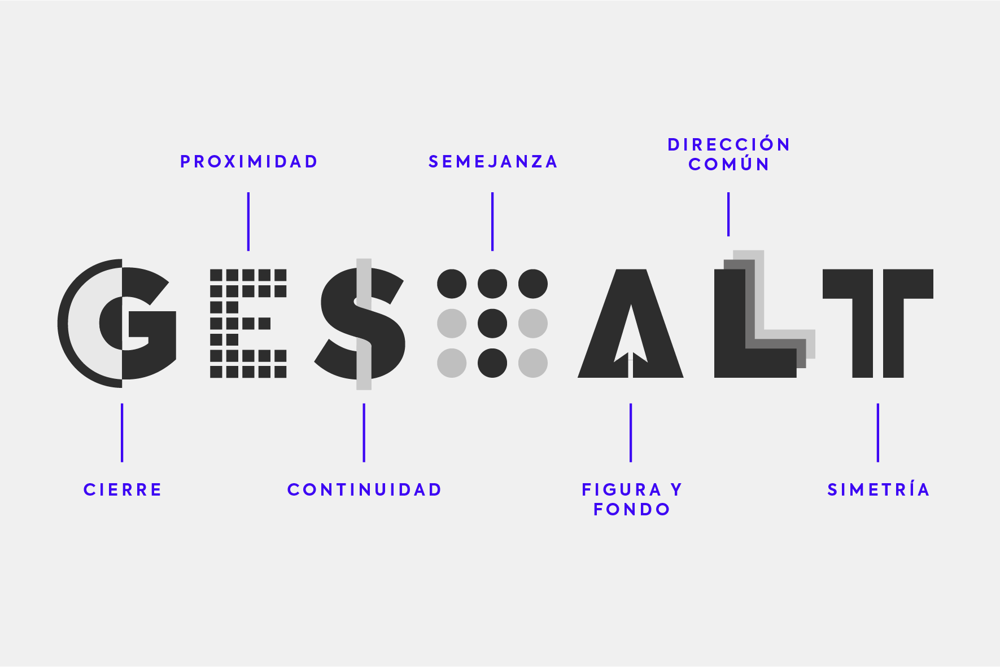
</div>

---

## 🎨 Leyes de Gestalt Aplicadas a Interfaces

<div class="fragment">
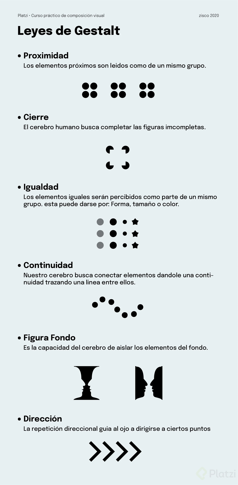
</div>

---

## 🎨 Leyes de Gestalt Aplicadas a Interfaces

<div class="mermaid" style="transform: scale(0.75); transform-origin: top center;">
graph LR
    A[Proximidad] -->|Campos agrupados| F[Formularios por secciones]
    B[Similitud] -->|Mismo estilo| G[Botones secundarios iguales]
    C[Cierre] -->|Formas sugeridas| H[Iconos minimalistas]
    D[Continuidad] -->|Alineación| I[Listas y tablas alineadas]
    E[Figura-Fondo] -->|Overlay oscuro| J[Modales emergen]
    K[Dirección Común] -->|Elementos orientados igual| M[Flechas de navegación o listas]
    L[Simetría] -->|Estructuras equilibradas| N[Tarjetas de precios o grids simétricos]
</div>

Note:
Las leyes de Gestalt explican cómo percibimos patrones. Proximidad: los campos de una misma sección deben estar juntos y separados de otras secciones. Similitud: todos los botones de acción secundaria deben verse igual. Cierre: un icono de lupa no necesita ser una lupa completa, el cerebro completa la forma. Figura-fondo: por eso los modales funcionan con overlay oscuro.


---

## 🗺️ Flujos de Usuario: Happy Path + Edge Cases

<div style="text-align: left;">

1. **¿Qué es?**
- Representación visual de la secuencia de pasos para completar una tarea en la app
- Ahorra días de desarrollo y rediseño (1 hora en pizarra = días de trabajo evitados)

</div>
---

## 🗺️ Flujos de Usuario: Happy Path + Edge Cases

<div style="text-align: left;">

2. **¿Qué debe documentar cada flujo?**
- **Happy path**: camino ideal donde todo sale bien
- **Edge cases**: situaciones límite o poco frecuentes
- **Estados de error**: qué ocurre cuando algo falla
</div>

---

## 🗺️ Flujos de Usuario: Happy Path + Edge Cases

<div style="text-align: left;">

3. **Ejemplos clave**
- **Registro**: bienvenida → formulario → validación → envío → confirmación/verificación por email → acceso
    - Edge: email duplicado, usuario no disponible, servidor caído, email caducado
</div>

---

## 🗺️ Flujos de Usuario: Happy Path + Edge Cases

<div style="text-align: left;">

3. **Ejemplos clave**
- **Compra e-commerce**: búsqueda → detalle → carrito → envío → pago → confirmación → número de pedido
    - Edge: producto agotado, error de pago, sesión expirada, descuento vencido
</div>
---

## 🗺️ Flujos de Usuario: Happy Path + Edge Cases

<div style="text-align: left;">

3. **Ejemplos clave**

- **Recuperar contraseña**: login → solicitar email → enlace temporal → nueva contraseña → login
    - Edge: email no registrado, enlace/token expirado, contraseña igual a la anterior
</div>

---

## 🗺️ Flujos de Usuario: Happy Path + Edge Cases

<div style="text-align: left;">

4. **Herramientas**
- Pizarra con cajas y flechas, hoja de cálculo, Draw.io o Miro (gratuitas)
- No se necesitan herramientas sofisticadas
</div>

---

## 🗺️ Flujos de Usuario: Happy Path + Edge Cases

<div style="text-align: left;">

5. **Clave final**
- El valor está en el **razonamiento sistemático** de todos los caminos posibles **antes de escribir código**
- En equipos ágiles: se integran a las historias de usuario y se revisan en la planificación del sprint
</div>

---


## 🗺️ Flujos de Usuario: Happy Path + Edge Cases

<div class="mermaid">
flowchart LR
    A[Inicio] --> B{¿Email registrado?}
    B -->|No| C[Formulario de registro]
    B -->|Sí| D[Error: email ya existe]
    C --> E{¿Servidor responde?}
    E -->|Sí| F[Email de verificación enviado]
    E -->|No| G[Error de conexión · Reintentar]
    F --> H{¿Verifica email?}
    H -->|Sí| I[✅ Cuenta activa]
    H -->|Link caducado| J[Reenviar email]
</div>

Note:
Todo flujo debe documentar: happy path (verde), edge cases (amarillo) y estados de error (rojo). Una hora dibujando flujos en pizarra ahorra días de desarrollo. En equipos ágiles, los flujos forman parte de las historias de usuario. Pregunta: dibujad mentalmente el flujo de "recuperar contraseña" de una app que uséis. ¿Cuántos edge cases se os ocurren?

---


## 🗺️ Flujos de Usuario: Happy Path + Edge Cases

<div class="fragment">
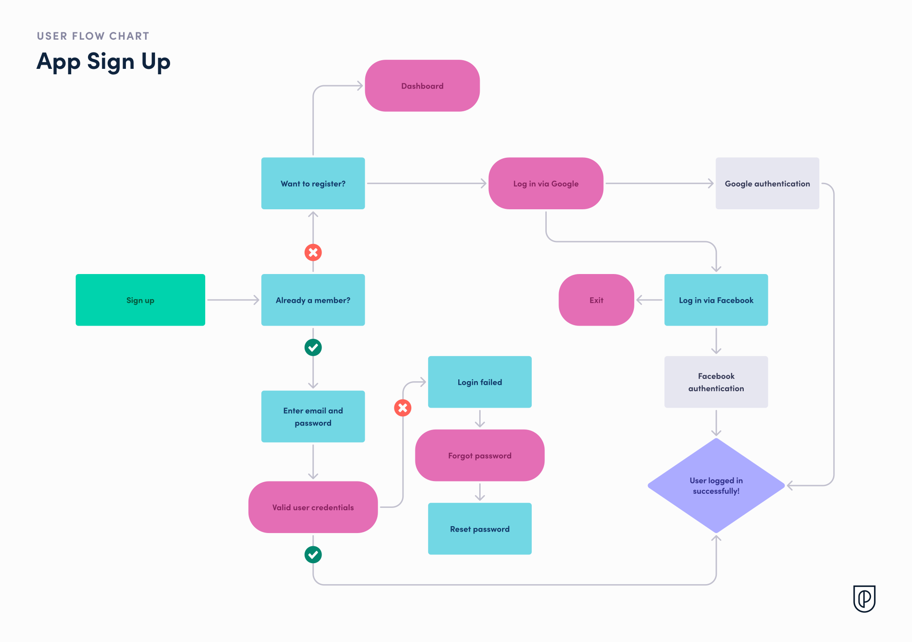
</div>

---


## 🗺️ Flujos de Usuario: Happy Path + Edge Cases

<div class="fragment">
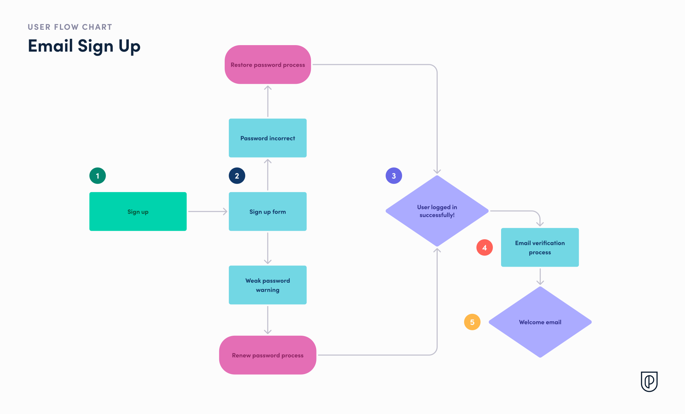
</div>

---

## ✍️ UX Writing: Microcopy Efectivo
<div style="text-align: left;">

1. **¿Qué es?**
- Disciplina de redactar los textos de la interfaz: botones, errores, ayuda, estados vacíos, placeholders, notificaciones
- Textos pequeños (microcopy) con impacto enorme en la experiencia
- Un texto confuso = abandono; un error claro = evita llamadas al soporte

</div>

---

## ✍️ UX Writing: Microcopy Efectivo
<div style="text-align: left; font-size: 2rem;">

2. **Botones**
- Verbos de acción claros y específicos: **verbo** + **objeto**, en imperativo
- "Guardar" > "OK/Aceptar"; "Enviar solicitud" > "Enviar"; "Añadir al carrito" > "Comprar"
- Sin signos de exclamación ni ambigüedades
- Acciones destructivas: verbo completo ("Eliminar cliente") + confirmación que reitera la acción con nombre concreto y opción clara ("Sí, eliminar" / "Cancelar")

</div>

---

## ✍️ UX Writing: Microcopy Efectivo
<div style="text-align: left;">

3. **Mensajes de error** (clave en software empresarial)
- Estructura de 3 partes: **qué ocurrió** (lenguaje llano) + **por qué** + **qué puede hacer**
- ❌ "Error de validación: el campo 'cif' no cumple el patrón"
- ✅ "El CIF no es válido. Debe empezar por una letra y 7-8 dígitos. Revisa el formato e inténtalo de nuevo"

</div>

---

## ✍️ UX Writing: Microcopy Efectivo
<div style="text-align: left;">

4. **Estados vacíos** (nunca pantallas en blanco)
- Causa confusión: ¿roto? ¿cargando? ¿sin datos?
- 3 elementos: **título** ("Aún no tienes clientes") + **descripción** ("Crea tu primer cliente para facturar") + **CTA** ("Crear primer cliente")
- Icono o ilustración amable

</div>

---

## ✍️ UX Writing: Microcopy Efectivo
<div style="text-align: left;">

5. **Placeholders vs etiquetas**
- Toda etiqueta debe ser **visible** (el placeholder desaparece al escribir)
- El placeholder solo para ejemplos/aclaraciones: etiqueta "Teléfono" + placeholder "Ej: 954 123 456"

</div>

---

## ✍️ UX Writing: Microcopy Efectivo
<div style="text-align: left;">

6. **Tono**
- Humano, directo y adaptado al contexto (empresarial: profesional y cálido; consumo: más informal)
- Nunca: robótico, paternalista, culpabilizador ni humorístico en errores

</div>

---

## ✍️ UX Writing: Microcopy Efectivo

**Botones**: Verbo + objeto, imperativo, sin exclamaciones

| ❌ Mal | ✅ Bien |
|-------|--------|
| "OK" | "Guardar cliente" |
| "Enviar" | "Enviar solicitud" |
| "Eliminar" | "Eliminar cliente" |


Note:
El microcopy es pequeño en tamaño, enorme en impacto. Un botón "OK" no dice qué va a pasar. "Guardar cliente" sí. Los estados vacíos son el patrón más olvidado: si no hay datos, el usuario piensa que la app está rota. Decidle siempre que es normal y guiadle al siguiente paso. El tono: profesional pero humano, nunca robótico ni culpabilizador ("Has introducido mal la contraseña" → "La contraseña no coincide").

---

## ✍️ UX Writing: Microcopy Efectivo


**Mensajes de error**: <mark>Qué pasó + por qué + qué hacer</mark>

**Estados vacíos**: Título descriptivo + explicación + CTA


Note:
El microcopy es pequeño en tamaño, enorme en impacto. Un botón "OK" no dice qué va a pasar. "Guardar cliente" sí. Los estados vacíos son el patrón más olvidado: si no hay datos, el usuario piensa que la app está rota. Decidle siempre que es normal y guiadle al siguiente paso. El tono: profesional pero humano, nunca robótico ni culpabilizador ("Has introducido mal la contraseña" → "La contraseña no coincide").

---

## ✍️ UX Writing: Microcopy Efectivo


<div class="fragment" style="font-size: 1.5rem">
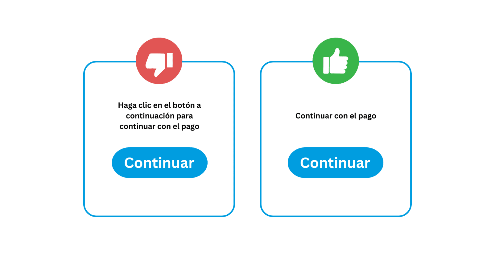

*Transmite un mensaje de manera eficaz utilizando la menor cantidad de palabras posible*
</div>


---

## ✍️ UX Writing: Microcopy Efectivo


<div class="fragment" style="font-size: 1.5rem">
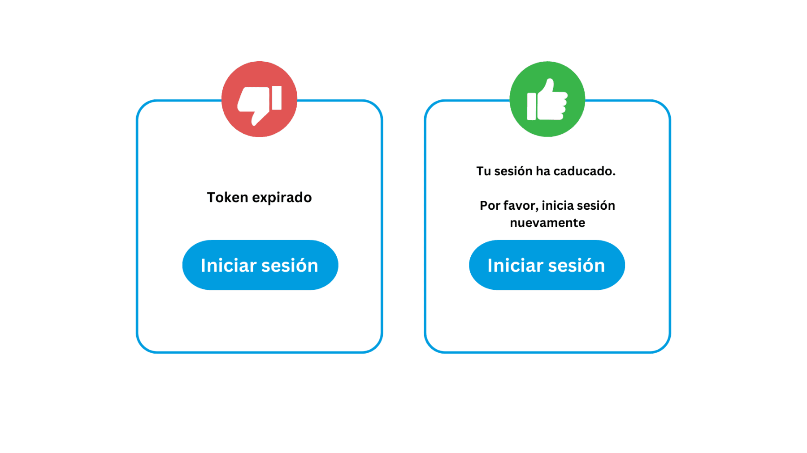

*Asegúrate de que tus textos están **orientados a los usuarios, no a los desarrolladores***
</div>

---

## ✍️ UX Writing: Microcopy Efectivo


<div class="fragment" style="font-size: 1.5rem">
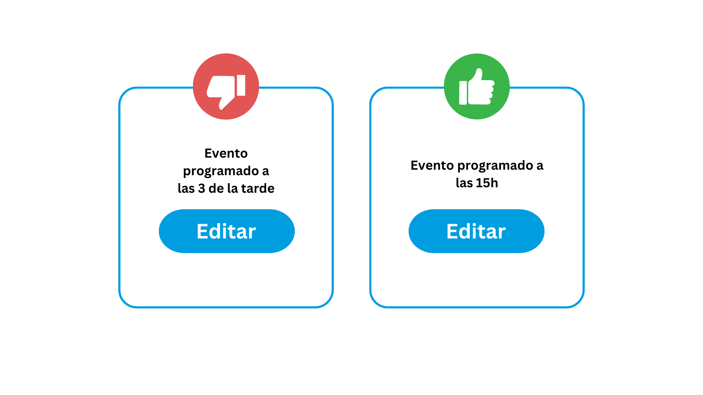

*Utiliza números para cantidades y fechas para que la información sea más fácil de entender y recordar.*
</div>

---

## ✍️ UX Writing: Microcopy Efectivo


<div class="fragment" style="font-size: 1.5rem">
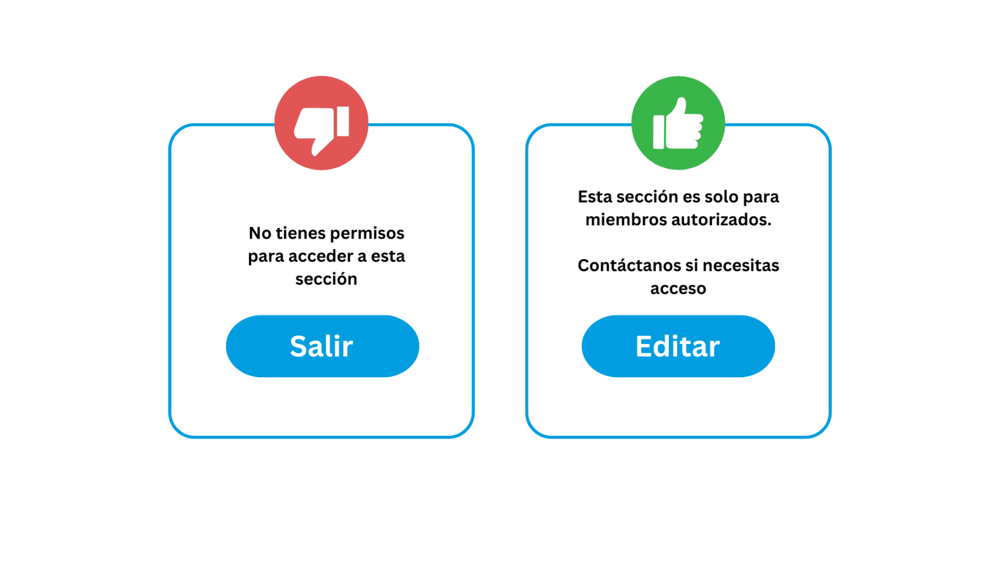

*Evita utilizar palabras negativas que puedan desalentar o confundir.*
</div>

---

## ✍️ UX Writing: Microcopy Efectivo


<div class="fragment" style="font-size: 1.5rem">
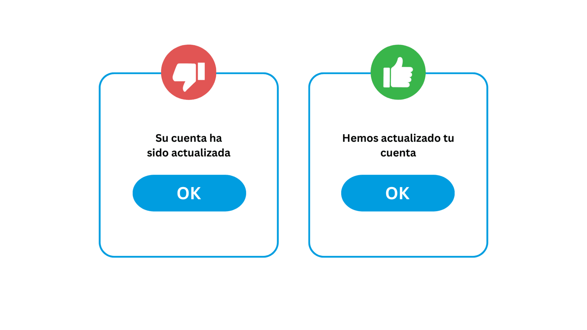

*El uso de la voz activa hace que la **comunicación sea más directa y natural***
</div>

---

## ✍️ UX Writing: Microcopy Efectivo


<div class="fragment" style="font-size: 1.5rem">
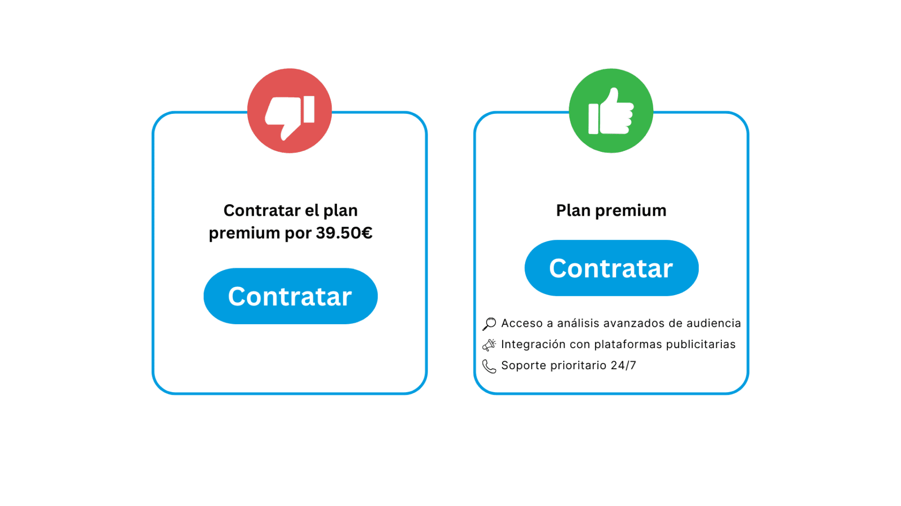

*Proporciona la mayor cantidad de información posible sin abrumar al usuario.*
</div>

---

## ✍️ UX Writing: Microcopy Efectivo


<div class="fragment" style="font-size: 1.5rem">
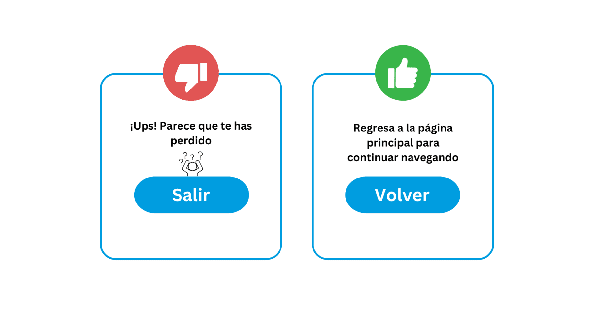

*El humor es subjetivo y puede no ser adecuado para todos los contextos*
</div>

---

## 🧪 Validación de UX sin ser Diseñador

<div style="text-align: left; font-size: 2rem;">

1. Idea principal

   - Técnicas ligeras, rápidas y factibles en el ritmo de desarrollo
   - No sustituye la investigación de UX profesional: añade una capa básica de validación que mejora la interfaz incrementalmente

</div>

Note:
No necesitáis laboratorios ni eye-trackers. Con 5 compañeros, 5 minutos cada uno y una libreta de anotaciones, detectáis la mayoría de problemas. Regla de oro del test de pasillo: observar en silencio. Si el usuario pregunta "¿cómo se hace?", responded "¿dónde buscarías?". Microsoft Clarity es gratis e ilimitado: instaladlo desde el día 1.

---

## 🧪 Validación de UX sin ser Diseñador

<div style="text-align: left; font-size: 2rem;"> 

2. Test de usabilidad de pasillo (guerrilla testing)

   - Pide a compañeros (que no conozcan el proyecto) que **realicen una tarea**, observando en silencio
   - Sin laboratorios ni eye-trackers: portátil + 5 minutos + libreta
   - 5 tests descubren la mayoría de problemas graves
   - Clave: no ayudar → responder con "¿qué esperarías que ocurriera?" / "¿dónde buscarías esa opción?"

</div>

Note:
No necesitáis laboratorios ni eye-trackers. Con 5 compañeros, 5 minutos cada uno y una libreta de anotaciones, detectáis la mayoría de problemas. Regla de oro del test de pasillo: observar en silencio. Si el usuario pregunta "¿cómo se hace?", responded "¿dónde buscarías?". Microsoft Clarity es gratis e ilimitado: instaladlo desde el día 1.

---

## 🧪 Validación de UX sin ser Diseñador

<div style="text-align: left; font-size: 2rem;"> 

3. Evaluación heurística

   - Contrastar la interfaz con las **10 heurísticas de Nielsen**
   - En equipo: revisión independiente de pantallas → anotar violaciones con gravedad 0-4 → consensuar y priorizar
   - Para una app mediana: **una mañana** de trabajo → decenas de mejoras

</div>

Note:
No necesitáis laboratorios ni eye-trackers. Con 5 compañeros, 5 minutos cada uno y una libreta de anotaciones, detectáis la mayoría de problemas. Regla de oro del test de pasillo: observar en silencio. Si el usuario pregunta "¿cómo se hace?", responded "¿dónde buscarías?". Microsoft Clarity es gratis e ilimitado: instaladlo desde el día 1.

---

## 🧪 Validación de UX sin ser Diseñador

<div style="text-align: left; font-size: 2rem;"> 

4. Dogfooding ("comer tu propia comida")

   - El equipo **usa la app para sus tareas diarias** (gestor de tareas → gestionar el proyecto; tickets → soporte interno)
   - Los problemas teóricos se vuelven **frustraciones diarias** → motivación inmediata para corregirlos

</div>

Note:
No necesitáis laboratorios ni eye-trackers. Con 5 compañeros, 5 minutos cada uno y una libreta de anotaciones, detectáis la mayoría de problemas. Regla de oro del test de pasillo: observar en silencio. Si el usuario pregunta "¿cómo se hace?", responded "¿dónde buscarías?". Microsoft Clarity es gratis e ilimitado: instaladlo desde el día 1.

---

## 🧪 Validación de UX sin ser Diseñador

<div style="text-align: left; font-size: 2rem;"> 

5. Analytics y mapas de calor

   - Microsoft Clarity (gratuito) o Hotjar: datos de uso reales
   - Mapas de calor (clics, scroll, atención) + grabaciones de sesiones anónimas
   - Revelan lo que los tests no ven: botones nunca usados, formularios abandonados, flujos alternativos improvisados 

</div>

Note:
No necesitáis laboratorios ni eye-trackers. Con 5 compañeros, 5 minutos cada uno y una libreta de anotaciones, detectáis la mayoría de problemas. Regla de oro del test de pasillo: observar en silencio. Si el usuario pregunta "¿cómo se hace?", responded "¿dónde buscarías?". Microsoft Clarity es gratis e ilimitado: instaladlo desde el día 1.

---

## 🧪 Validación de UX sin ser Diseñador

<div style="font-size: 0.75em">

| Técnica | Esfuerzo | Descripción |
|---------|----------|-------------|
| **Test de pasillo** | 5 min/persona | 5 compañeros, observar en silencio |
| **Evaluación heurística** | 1 mañana | Revisar con las 10 heurísticas |
| **Dogfooding** | Continuo | Usar tu propia aplicación |
| **Microsoft Clarity** | Gratis | Mapas de calor y grabaciones |

<mark>5 tests de pasillo revelan ~85% de problemas graves de usabilidad</mark>

</div>


Note:
No necesitáis laboratorios ni eye-trackers. Con 5 compañeros, 5 minutos cada uno y una libreta de anotaciones, detectáis la mayoría de problemas. Regla de oro del test de pasillo: observar en silencio. Si el usuario pregunta "¿cómo se hace?", responded "¿dónde buscarías?". Microsoft Clarity es gratis e ilimitado: instaladlo desde el día 1.

---

## 🎬 Demo: Evaluación Heurística en 5 Minutos

1. Abrimos la app de gestión de biblioteca escolar
2. Recorremos las 10 heurísticas una por una
3. Anotamos cada violación con gravedad (0-4)
4. Priorizamos: primero las graves, luego las cosméticas

| Heurística | Problema | Gravedad | Solución |
|------------|----------|----------|----------|
| 1. Visibilidad | Sin spinner al guardar préstamo | 3 | `@if(isLoading())` + disable |
| 4. Consistencia | Botones azules/verdes sin criterio | 2 | Componente Button con variantes |
| 5. Prevención | Select muestra libros ya prestados | 4 | Filtrar disponibles |

Note:
Voy a hacer una demo rápida de evaluación heurística con una app de gestión de biblioteca. Abro la pantalla de préstamos. Primera heurística: ¿veo feedback al hacer clic en Guardar? No hay spinner → gravedad 3. Cuarta heurística: ¿los botones son consistentes? En catálogo son azules, en préstamos verdes → gravedad 2. Quinta: ¿puedo seleccionar un libro ya prestado? Sí → gravedad 4 porque genera error tras enviar. Esto es lo que haréis en la actividad.

---

## 🏋️ Actividad en Clase

**Auditoría de usabilidad del portal del instituto**

| ⏱️ Tiempo | 🎯 Objetivo | 📦 Entregable |
|-----------|-------------|---------------|
| 45 min | Evaluar 3 pantallas con las 10 heurísticas | Tabla de hallazgos priorizada |

**Proceso**:
1. Formar equipos de 3 personas (2 min)
2. Cada miembro evalúa 3 pantallas en silencio (20 min)
3. Puesta en común y consolidación de hallazgos (15 min)
4. Priorizar top 10 problemas (8 min)

Note:
Vais a evaluar el portal de vuestro instituto o la plataforma educativa que usáis. Es importante que cada miembro evalúe de forma independiente primero, para evitar sesgos. Luego juntáis hallazgos. Cada problema se puntúa de 0 (no es problema) a 4 (catástrofe). El entregable es una tabla con: heurística, ubicación, problema, gravedad, solución y captura.

---

## ✅ Buenas Prácticas

1. **5 entrevistas de 20 min** con usuarios reales > semanas de debate interno
2. **Documentar flujos** antes de escribir código (happy path + edge cases + errores)
3. **Evaluación heurística** al final de cada sprint (1 hora del equipo)
4. Usar componentes reutilizables para garantizar <mark>consistencia</mark>
5. Validación de formularios <mark>en tiempo real</mark>, no solo al enviar
6. **Microsoft Clarity desde el día 1** de despliegue (gratis e ilimitado)

Note:
Estas 6 prácticas son de aplicación inmediata. La más infravalorada es la evaluación heurística al final del sprint: en 1 hora, todo el equipo revisa lo implementado contra las 10 heurísticas. Los problemas detectados temprano son baratos de corregir. El microcopy debe ser un ejercicio explícito: dedicad tiempo a revisar cada texto de la interfaz.

---

## ❌ Errores Frecuentes

| Error | Consecuencia | Solución |
|-------|-------------|----------|
| **Diseñar para uno mismo** | Interfaz que solo el equipo entiende | Tests con usuarios reales |
| **Sobrecargar de información** | Usuario abrumado, abandona | Priorizar: esencial primero, detalle a demanda |
| **Ignorar estados vacíos y de error** | Usuario cree que la app está rota | Cada pantalla: loading, empty, error, data |
| **Jerga técnica en la UI** | Usuario no entiende los mensajes | Lenguaje del dominio del negocio |
| **Abusar de confirmaciones** | Fatiga: clic en "Sí" sin leer | Solo para acciones irreversibles |

Note:
Estos 5 errores son los que más veo en proyectos de alumnos y en empresas. El primero es el más difícil de erradicar: requiere humildad para aceptar que tu criterio no es el del usuario. El tercero es el más fácil de arreglar técnicamente: en Angular, un `@if` con 4 ramas (loading, empty, error, data) cubre todos los estados de cualquier pantalla.

---

## 📊 Resumen

| Concepto | Clave |
|----------|-------|
| **UCD** | El desarrollador no es el usuario. Decisiones basadas en evidencia |
| **10 Heurísticas** | Checklist para evaluar cualquier interfaz en 10 minutos |
| **Arquitectura de Información** | La estructura refleja el modelo mental del usuario |
| **Flujos de usuario** | Documentar happy path + edge cases antes de codificar |
| **Gestalt** | Proximidad, similitud, cierre, continuidad, figura-fondo |
| **UX Writing** | Cada texto: claro, humano, orientado a la acción |

Note:
Resumen rápido de los 6 bloques. Si solo os lleváis una cosa de esta unidad: preguntad siempre "¿qué haría el usuario?" en lugar de "¿qué haría yo?". Y usad las 10 heurísticas como checklist mental. Son 30 años de investigación resumidos en 10 principios que podéis aplicar desde hoy.

---

## 🚀 Próximos Pasos

**Unidad 2: Accesibilidad Web (WCAG)**

- Principios POUR: Perceptible, Operable, Comprensible, Robusto
- ARIA: cuándo usarlo y cuándo no
- Componentes accesibles con Angular CDK
- Herramientas: Lighthouse, WAVE, axe, lectores de pantalla

**Para profundizar**:
- Leer "Don't Make Me Think" de Steve Krug (200 páginas, se lee en un fin de semana)
- Instalar Microsoft Clarity en un proyecto personal
- Hacer un test de pasillo con 5 compañeros esta semana

Note:
La accesibilidad es la extensión natural de la UX. Todo lo que hemos visto sobre usabilidad aplica también a personas con discapacidad. En la siguiente unidad veremos cómo implementar interfaces que funcionen con lectores de pantalla, navegación por teclado y tecnologías asistivas. Tarea opcional: instalad Microsoft Clarity en algún proyecto vuestro esta semana. En 7 días tendréis datos reales de uso.
