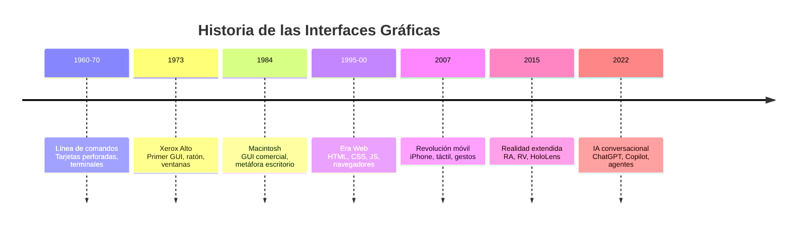
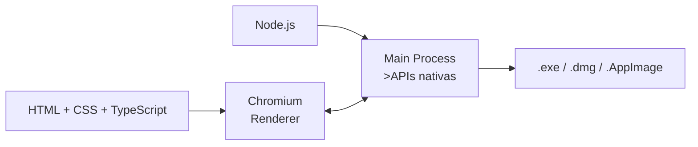
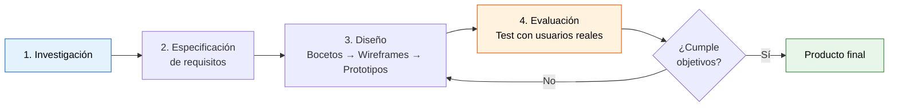
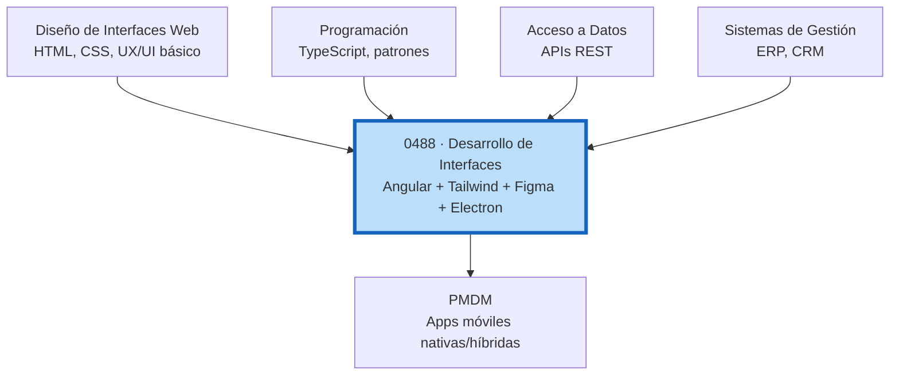

# Desarrollo de Interfaces 

## Unidad 1 · Introducción al Desarrollo de Interfaces 

**Módulo 0488 · Desarrollo de Interfaces**  
CFGS Desarrollo de Aplicaciones Multiplataforma (DAM)

Note:
Bienvenida a la primera unidad del módulo. Soy vuestro profesor de Desarrollo de Interfaces. Hoy sentamos las bases conceptuales de todo lo que construiremos durante el curso. Esta unidad es fundamental: define el vocabulario, los conceptos y el marco mental con el que trabajaremos durante 96 horas. Vamos a entender qué es una interfaz, cómo hemos llegado hasta aquí, qué diferencia UX de UI, y por qué Angular, Tailwind y Electron son nuestro stack.

---

## Objetivos de aprendizaje I

<span class="fragment">1. Definir el concepto de **interfaz de usuario** y clasificar sus tipos</span>

<span class="fragment">2. Describir la **evolución histórica** desde la CLI hasta la IA conversacional</span>

<span class="fragment">3. Diferenciar con precisión **UX** (experiencia) de **UI** (interfaz visual)</span>


Note:
Estos 6 objetivos son la columna vertebral de la unidad. No son contenidos estancos: cada uno se conecta con el anterior. Al final de esta sesión deberíais poder explicar cada uno de estos puntos a un compañero que no haya venido a clase. Pregunta para el aula: ¿cuál de estos objetivos os parece más relevante para vuestro futuro profesional?

---

## Objetivos de aprendizaje II

<span class="fragment">4. Identificar tipos de interfaces: web, PWA, híbridas, nativas y **Electron**</span>

<span class="fragment">5. Situar **Angular** en el ecosistema de desarrollo de interfaces</span>

<span class="fragment">6. Explicar el proceso de **Diseño Centrado en el Usuario** (UCD)</span>


Note:
Estos 6 objetivos son la columna vertebral de la unidad. No son contenidos estancos: cada uno se conecta con el anterior. Al final de esta sesión deberíais poder explicar cada uno de estos puntos a un compañero que no haya venido a clase. Pregunta para el aula: ¿cuál de estos objetivos os parece más relevante para vuestro futuro profesional?

---

## Motivación inicial


<span class="fragment"> ¿Cómo consigue **Visual Studio Code** que su interfaz funcione exactamente igual en Windows, Linux y macOS?</span>


<span class="fragment"> Está construido con tecnologías **web** (HTML, CSS, TypeScript) y empaquetado con **Electron** como aplicación nativa de escritorio.</span>


<span class="fragment"> Lo mismo hacen **Discord, Slack, Figma, Postman y Notion**. Todas usan el stack que aprenderéis en este módulo. </span>


Note:
Abrid VS Code un momento. Mirad la barra de título, los menús nativos, el rendimiento al escribir. Todo eso que parece una app nativa de Windows/Linux/Mac está construido con HTML, CSS y TypeScript. Electron empaqueta Chromium + Node.js. Esta es la razón de ser de nuestro módulo: aprender a construir interfaces con tecnologías web que luego pueden ser web, escritorio y hasta móvil. Pregunta: ¿qué otras aplicaciones usáis a diario que sepáis que están construidas con Electron?

---

## ¿Qué es una interfaz de usuario?


<span class="fragment" >El **punto de encuentro** entre un ser humano y un sistema informático.</span>


<span class="fragment" > Traduce intenciones humanas → acciones del sistema → respuestas comprensibles </span>

<span class="fragment" >

Para el usuario, la **interfaz es el producto** <br>
<span class="mini">(no importa lo bueno que sea tu algoritmo si el usuario no encuentra el botón)</span>

</span>

<span class="fragment" >

Condiciona: **percepción de calidad**, **satisfacción** y **adopción** del producto

</span>

Note:
"La interfaz es el producto" es una máxima del diseño. Si tu backend procesa un millón de transacciones por segundo pero el usuario tarda 30 segundos en encontrar el botón de enviar, has fracasado. Pregunta: poned un ejemplo de una aplicación que uséis y que os parezca que tiene buena interfaz, y otra que os frustre. ¿Qué diferencia hay entre ambas?

---

## Tipos de interfaces

<div style="display: grid; grid-template-columns: 1fr 1fr; gap: 0.6rem; font-size: 1.5rem; text-align: left;">

<div class="fragment">
<mark>GUI</mark> — Graphical User Interface<br>
<span >Ventanas, iconos, menús, puntero (WIMP). Ratón, teclado, pantalla táctil.</span>
</div>

<div class="fragment">
<mark>CLI</mark> — Command Line Interface<br>
<span >Texto. El usuario teclea comandos. Bash, PowerShell. DevOps y sysadmin.</span>
</div>

<div class="fragment">
<mark>VUI</mark> — Voice User Interface<br>
<span >Voz. NLP + ASR. Alexa, Siri, Google Assistant.</span>
</div>

<div class="fragment">
<mark>NUI</mark> — Natural User Interface<br>
<span >Gestos, movimientos corporales. Kinect, HoloLens, pantallas táctiles.</span>
</div>

<div class="fragment">
<mark>TUI</mark> — Tangible User Interface<br>
<span >Objetos físicos. Controladores MIDI, Reactable, maquetas interactivas.</span>
</div>

<div class="fragment" >
<mark>Conversacional</mark> — IA + Lenguaje natural<br>
<span >ChatGPT, Copilot, Gemini. La interfaz se diluye en el diálogo.</span>
</div>

</div>

Note:
Cada tipo de interfaz tiene su contexto donde es superior. La CLI es "arcaica" pero más rápida y automatizable que cualquier GUI para un sysadmin. La VUI es ideal para conducir. La TUI es insustituible para un DJ. La clave es entender cuál elegir según el usuario y el contexto. En este módulo nos centramos en GUI con tecnologías web.

---

## Evolución de las interfaces



<span class="fragment" > **Tendencia:** reducir la distancia entre intención del usuario y acción del sistema </span>

Note:
Fijaos en la tendencia: memorizar comandos → señalar con un clic → deslizar con el dedo → hablar → pensar. Cada generación reduce la fricción y amplía la base de usuarios. Nuestro trabajo como desarrolladores de interfaces es precisamente construir esas capas de abstracción que hacen la tecnología accesible. Pregunta: ¿dónde creéis que estaremos dentro de 10 años?
<!-- .element: style="font-size: 1.3rem" -->
---

## UX vs UI · Dos caras de una misma moneda


<div style="font-size: 1.8rem;">

| UX (User Experience) | UI (User Interface) |
|---|---|
| ¿Es **útil**? ¿Resuelve un **problema**? | ¿Cómo se **ve**? ¿Es **atractivo**? |
| ¿Es **fácil de usar**? | ¿Comunica bien la **jerarquía**? |
| ¿Resulta **satisfactorio**? | ¿Es **consistente** visualmente? |
| Investigación, flujos, arquitectura | Color, tipografía, espaciado, iconos |
| Prototipado, test de usabilidad | Sistemas de diseño, microinteracciones |

</div>

<span class="fragment" > **La metáfora del coche:** UX = experiencia de conducir · UI = diseño del salpicadero
</span>

Note:
Este es probablemente el concepto más importante de la unidad. "UX y UI no son lo mismo" es la confusión más frecuente en la industria. UX es investigación y estructura ("dónde pongo este botón y por qué"). UI es ejecución visual ("de qué color y forma es el botón"). Ambas son necesarias y complementarias. En vuestro perfil profesional, haréis más desarrollo (UI), pero debéis entender y colaborar con UX.

---

## UX en detalle · Lo que NO se ve

<div style="font-size: 1.5rem; text-align: left;">

<span class="fragment">**Investigación de usuarios:** entrevistas, encuestas, observación contextual</span>

<span class="fragment">**Arquitectura de la información:** organizar y etiquetar contenido · <em>card sorting</em></span>

<span class="fragment">**Diseño de interacción:** ¿cómo responde el sistema a cada acción?</span>

<span class="fragment">**Prototipado:** del boceto en papel hasta el prototipo interactivo en Figma</span>

<span class="fragment">**Evaluación de usabilidad:** test con usuarios reales · medir tiempo, errores, satisfacción</span>

</div>

Note:
La UX es lo que ocurre ANTES de abrir Figma. Es el trabajo de campo, las entrevistas, el análisis. Si diseñáis sin investigación previa, estáis diseñando para vosotros mismos, no para el usuario. El card sorting es una técnica fascinante: pedís a usuarios que agrupen tarjetas con conceptos y que pongan nombre a cada grupo. Así descubrís el modelo mental real del usuario.

---

## UI en detalle · Lo que SÍ se ve

<div style="font-size: 0.95rem; text-align: left;">

<span class="fragment">**Diseño visual:** colores, tipografías, iconos — teoría del color, jerarquía, contraste</span>

<span class="fragment">**Sistemas de diseño:** bibliotecas de componentes reutilizables + reglas</span>

<span class="fragment">**Espaciado y layout:** retículas, márgenes, respiración visual</span>

<span class="fragment">**Tipografía:** familias, escalas, jerarquías (títulos, cuerpo, notas)</span>

<span class="fragment">**Microinteracciones:** feedback, transiciones, animaciones con propósito</span>


</div>

Note:
La UI es la capa visible. Pero ojo: una UI excelente no salva una mala UX. Podéis hacer los botones más bonitos del mundo, pero si el flujo no tiene sentido, la aplicación fracasará. Un desarrollador de interfaces profesional debe tener sensibilidad visual suficiente para implementar diseños con fidelidad y para detectar incongruencias.

---

## Interfaces web y multiplataforma

<div style="text-align: left; font-size: 0.85rem;">

<span class="fragment">**Web app tradicional:** navegador, sin instalación, actualizaciones transparentes</span>

<span class="fragment">**PWA** (Progressive Web App): offline, instalable, notificaciones push, service workers</span>

<span class="fragment">**Aplicación híbrida:** web dentro de contenedor nativo (Cordova, Ionic, Capacitor)</span>

<span class="fragment">**Aplicación nativa:** Swift/Kotlin/C# — máximo rendimiento, acceso total al hardware</span>

</div>

<div class="fragment">

<span style="font-size: 1.3rem; display: block; margin-top: 1.5rem;">
<mark>Electron</mark> = Chromium + Node.js empaquetados como app nativa
</span>



</div>

Note:
Electron es un game-changer. Con un solo código base (HTML, CSS, TS) desplegáis en web, escritorio y —con Capacitor— en móvil. La contrapartida: la app pesa ~100 MB mínimo (incluye Chromium entero) y consume más RAM que una app nativa pura. VS Code demuestra que, bien optimizado, el rendimiento puede ser excelente. En la unidad 18 profundizaremos en Electron como proyecto.

---

## Tendencias actuales en diseño

<div style="display: grid; grid-template-columns: 1fr 1fr; gap: 0.6rem; font-size: 0.78rem; text-align: left;">

<div class="fragment">
<strong>Neumorfismo</strong><br>
Sombras suaves, efecto plástico. <br>⚠️ Bajo contraste → problemas de accesibilidad
</div>

<div class="fragment">
<strong>Glassmorphism</strong><br>
<code>backdrop-filter: blur()</code>, fondos translúcidos. Windows 11, macOS.
</div>

<div class="fragment">
<strong>Minimalismo</strong><br>
Reducir a lo esencial. <br>Notion, Linear, Things.
</div>

<div class="fragment">
<strong>Dark Mode</strong><br>
<span style="color: #888;">prefers-color-scheme</span>, ahorro OLED. <br>Implementar desde el inicio.
</div>

<div class="fragment">
<strong>Microinteracciones</strong><br>
Feedback, estado, personalidad. <br>El botón que cambia al hacer clic.
</div>

<div class="fragment">
<strong>Diseño inclusivo</strong><br>
Más allá de WCAG: edad, cultura, idioma, conexión lenta, una sola mano.
</div>

</div>

Note:
Las tendencias son herramientas, no recetas. Que algo esté de moda no significa que debáis usarlo. El neumorfismo es visualmente atractivo pero desastroso para la accesibilidad (bajo contraste). Pregunta: ¿qué tendencia os gusta más y cuál menos? ¿por qué? Es importante formaros un criterio propio.

---

## Angular en el ecosistema

<div style="font-size: 0.95rem; text-align: left;">

<span class="fragment">**Framework completo** (<em>batteries included</em>) mantenido por Google</span>

<span class="fragment">Pensado para aplicaciones **enterprise-grade**: equipos grandes, proyectos largos</span>

<span class="fragment">**TypeScript** como lenguaje principal → tipado estático, Interfaces, genéricos</span>

<span class="fragment">**Componentes standalone** encapsulan template HTML + estilos CSS + lógica TS</span>

<span class="fragment">**Servicios inyectables** extraen lógica de negocio de los componentes</span>

<span class="fragment">**Signals**: nuevo modelo de reactividad granular (el futuro de Angular)</span>

</div>

Note:
Angular es un framework "opinionated": te dice cómo hacer las cosas. Esto tiene ventajas (consistencia, estructura clara) e inconvenientes (menos flexibilidad). Para aplicaciones empresariales con 10+ desarrolladores, esta estructura es una ventaja competitiva. React te da más libertad pero te exige tomar más decisiones. Cada herramienta tiene su momento.

---

## Componentes Angular

```typescript
@Component({
  selector: 'app-card',
  standalone: true,
  imports: [NgIf],
  template: `
    <div class="rounded-lg bg-white p-6 shadow-md">
      <h3 class="text-lg font-bold">{{ title }}</h3>
      <p class="text-gray-600">{{ description }}</p>
    </div>
  `,
  styles: [],
})
export class CardComponent {
  @Input({ required: true }) title!: string;
  @Input() description = '';
}
```

<span class="fragment" style="font-size: 0.9rem;">
Standalone, sin NgModule · Template inline con Tailwind · Inputs tipados con `required`
</span>

Note:
Así se ve un componente Angular moderno con arquitectura standalone. Fijaos: sin NgModule, con imports explícitos, y con Tailwind en el template. Es como un bloque de LEGO autocontenido. En las próximas unidades construiremos decenas de componentes siguiendo este patrón.

---

## Diseño Centrado en el Usuario (UCD)



<span class="fragment" style="font-size: 0.85rem;">
ISO 9241-210 · Ciclo construir-medir-aprender · <mark>Corregir en diseño cuesta 10× menos que en desarrollo</mark>
</span>

Note:
El UCD es antifrágil: cada iteración te acerca más a lo que el usuario realmente necesita. No consiste en preguntar "¿qué quieres?" (Henry Ford: "me habrían dicho caballos más rápidos"), sino en observar, empatizar y validar hipótesis. El dato clave: un error de usabilidad detectado en diseño cuesta 10€ corregirlo; en desarrollo, 100€; tras el lanzamiento, 1000€. Invertid en investigación al principio.

---

## Herramientas UCD

<div style="display: grid; grid-template-columns: 1fr 1fr 1fr; gap: 0.7rem; font-size: 0.72rem; text-align: left;">

<div class="fragment">
<strong>Personas</strong><br>
Arquetipos ficticios basados en datos reales<br><br>
<em>"María, 42 años, profesora. Usa el móvil con una mano en el autobús."</em>
</div>

<div class="fragment">
<strong>Mapas de empatía</strong><br>
Lo que piensa, siente, ve, dice, hace y escucha<br><br>
Ayuda a comprender más allá de los datos demográficos
</div>

<div class="fragment">
<strong>Customer Journey Map</strong><br>
Recorrido completo: descubrimiento → uso → objetivo<br><br>
Puntos de dolor, emociones, oportunidades
</div>

</div>

Note:
Estas herramientas humanizan los datos. Una persona no es "usuario de 35-45 años con smartphone Android". Es "Carlos, 38, padre de dos hijos, que revisa el correo a las 6 AM antes de que se despierten los niños". Cuando diseñáis para Carlos en lugar de para un segmento demográfico, las decisiones de diseño se vuelven más claras y empáticas.

---

## El rol del desarrollador de interfaces

<div style="text-align: left; font-size: 0.85rem;">

**Hard skills:**
<span class="fragment">HTML5 semántico + ARIA</span>
<span class="fragment"> · CSS3 (Flexbox, Grid, animaciones)</span>
<span class="fragment"> · TypeScript</span>
<span class="fragment"> · Angular (o React/Vue)</span>
<span class="fragment"> · Git</span>
<span class="fragment"> · Testing (unitario, e2e)</span>

<div class="fragment" style="margin-top: 0.7rem;">
<strong>Soft skills:</strong> comunicación con diseñadores, colaboración multidisciplinar, aprendizaje continuo, pensamiento crítico
</div>

<div class="fragment" style="margin-top: 0.7rem;">
<strong>Colaboras con:</strong> diseñador UX · diseñador UI · product manager · backend · QA · DevOps
</div>

</div>

Note:
Vuestro perfil es técnico pero no está aislado. Sois el puente entre diseño y backend. Si no entendéis lo que os pide el diseñador, implementaréis mal. Si no sabéis explicar limitaciones técnicas al diseñador, diseñará algo inviable. La comunicación es tan importante como el código. Y sí, el aprendizaje continuo es no-negociable: el frontend evoluciona más rápido que ninguna otra área.

---

## El módulo en el currículo DAM



<span class="fragment">
6h/semana · 2º curso DAM
</span>

Note:
Este esquema resume cómo se conecta DI con el resto de módulos. DIW os dio la base de diseño y maquetación. Programación os dio TypeScript. Aquí convergen ambos más Angular y Tailwind. Acceso a Datos os proporciona las APIs que consumiréis. PMDM comparte el interés por las interfaces pero desde el mundo móvil. SGE os da el contexto de aplicación empresarial real.

---

## Caso real · Genially (Córdoba)

<div style="font-size: 0.95rem; text-align: left;">

🏢 **Genially** · Fundada en 2015 · +30M usuarios · 190 países

<span class="fragment">Stack: React + TypeScript + diseño propio en Figma + Storybook</span>

<span class="fragment">Desafíos: editor drag-and-drop, animaciones en tiempo real, colaboración multi-usuario, exportación a HTML/PDF/SCORM</span>

<span class="fragment">Accesibilidad WCAG 2.1 AA · Rendimiento: LCP < 2.5s</span>

</div>

<div class="fragment" style="margin-top: 0.7rem; font-size: 0.8rem;">

> De PHP + jQuery a una arquitectura moderna con sistema de diseño propio.
> Del mercado local a competir en todo el mundo. **Desde Andalucía.**

</div>

Note:
Genially es el caso que demuestra que desde Andalucía se puede construir producto tecnológico de clase mundial. Su evolución técnica es la que buscamos en este módulo: pasaron de jQuery a un sistema de diseño profesional con componentes documentados en Storybook. Lo que aprenderéis aquí es exactamente lo que empresas como Genially utilizan a diario.

---

## Demo · Reactividad con Signals (1/2)

<span style="font-size: 0.85rem;">El futuro de Angular: estado granular que se actualiza solo</span>

```typescript
// Definimos estado con Signals
@Component({...})
export class CounterComponent {
  count = signal(0);
  double = computed(() => this.count() * 2);

  increment() { this.count.update(n => n + 1); }
}
```

Note:
Esto es una demo rápida del modelo de reactividad que usaremos en Angular. Signals sustituye al viejo sistema basado en Zone.js. Es más eficiente y más fácil de razonar.

---

## Demo · Reactividad con Signals (2/2)

```html
<button (click)="increment()"
        class="bg-blue-500 text-white px-4 py-2 rounded">
  Count: {{ count() }}
</button>
<p class="text-gray-600">Double: {{ double() }}</p>
```

<span class="fragment" style="font-size: 0.85rem;">
`computed()` recalcula automáticamente cuando `count` cambia — sin suscripciones manuales
</span>

Note:
`computed()` es magia pura: definís una relación y Angular se encarga de mantenerla actualizada. En la unidad 6 profundizaremos en esto.

---

## Actividad en clase

<div style="text-align: left; font-size: 0.85rem;">

<strong>🎯 Objetivo:</strong> Analizar la UX/UI de una aplicación real

<strong>⏱️ Tiempo:</strong> 25 minutos · <strong>👥 Formato:</strong> Grupos de 3

<strong>📋 Tarea:</strong> Elegid una app (Spotify, Notion, Discord...) y responded:

<span class="fragment">1. ¿Qué patrón de **navegación** usa? (menú lateral, tabs, breadcrumbs…)</span>

<span class="fragment">2. Identificad 3 elementos de **UI** (colores, tipografía, espaciado)</span>

<span class="fragment">3. Identificad 2 decisiones de **UX** (flujo, organización de información)</span>

<span class="fragment">4. ¿Usa **Electron** o es web? ¿Cómo lo sabéis?</span>

<div class="fragment" style="margin-top: 0.6rem;">
<strong>📤 Entregable:</strong> 2 diapositivas con capturas anotadas
</div>

</div>

Note:
Esta actividad conecta directamente con el objetivo 3 (diferenciar UX de UI) y el objetivo 4 (identificar tecnologías de interfaz). No quiero un análisis exhaustivo: quiero que entrenéis el ojo para distinguir decisiones de UX de decisiones de UI. En 25 minutos, presentación rápida de cada grupo. Pregunta guía: ¿qué mejoraríais de la app que habéis analizado?

---

## Buenas prácticas

<div style="text-align: left; font-size: 0.78rem;">

<span class="fragment">✅ **Diseña para el usuario, no para ti mismo** — tú no eres el usuario</span>

<span class="fragment">✅ **Comienza con análisis, nunca con código** — ¿quién, qué, dónde, cómo?</span>

<span class="fragment">✅ **Consistencia ante todo** — cada decisión debe ser coherente en toda la app</span>

<span class="fragment">✅ **No confundas tendencia con buena práctica** — evalúa críticamente</span>

<span class="fragment">✅ **Piensa en accesibilidad desde el minuto cero** — no es un checklist final</span>

<span class="fragment">✅ **Documenta tus decisiones de diseño** — para ti, para tu equipo, para el futuro</span>

</div>

Note:
"Documenta tus decisiones" es una de las prácticas más infravaloradas y más valiosas. Dentro de 6 meses, cuando tengáis que modificar un componente, agradeceréis tener documentado por qué tomasteis ciertas decisiones. No hace falta un documento de 50 páginas: un comentario en el código o una nota en Figma es suficiente.

---

## Errores frecuentes

<div style="text-align: left; font-size: 0.78rem;">

<span class="fragment">❌ **Creer que UX y UI son lo mismo** — el error conceptual #1</span>

<span class="fragment">❌ **"A mí me parece intuitivo"** — tú diseñaste el sistema, el usuario no</span>

<span class="fragment">❌ **Empezar a programar sin diseño previo** — inconsistencia asegurada</span>

<span class="fragment">❌ **Subestimar la CLI** — sigue siendo más rápida y potente para muchas tareas</span>

<span class="fragment">❌ **Aplicar tendencias sin criterio** — neumorfismo bonito pero inaccesible</span>

<span class="fragment">❌ **Diseñar solo para tu setup** — tu monitor 4K no es el móvil del usuario</span>

</div>

Note:
"A mí me parece intuitivo" es probablemente la frase más peligrosa en desarrollo de interfaces. Todo es intuitivo para quien lo diseñó. La intuición del usuario se construye sobre sus experiencias previas, no sobre las vuestras. Testear con usuarios reales es la única forma de validar. Por eso el UCD es iterativo: diseñar, probar, corregir, repetir.

---

## Resumen · Conceptos clave

<div style="font-size: 0.85rem; text-align: left;">

🎯 La **interfaz es el producto** para el usuario — condiciona adopción y satisfacción

<span class="fragment">📜 La evolución va de **memorizar comandos** a **dialogar con IA**</span>

<span class="fragment">🧠 **UX ≠ UI**: UX es investigación y estructura. UI es ejecución visual</span>

<span class="fragment">🌐 **Electron** permite llevar tecnologías web al escritorio (VS Code, Discord, Figma)</span>

<span class="fragment">🅰️ **Angular** es un framework enterprise-grade con componentes standalone + Signals</span>

<span class="fragment">👤 **UCD** es el proceso iterativo que garantiza que diseñamos para el usuario real</span>

</div>

Note:
Estos 6 conceptos resumen la unidad. Si os lleváis solo una idea hoy, que sea esta: el desarrollo de interfaces no es solo "escribir HTML y CSS". Es entender al usuario, diseñar soluciones, implementarlas con precisión y validarlas constantemente. Es una disciplina que combina empatía, diseño y tecnología.

---

## Próximos pasos

<div style="font-size: 1rem;">

**Unidad 2 · Ecosistema Profesional del Desarrollo Frontend**

</div>

<div style="text-align: left; font-size: 0.85rem; margin-top: 0.8rem;">

<span class="fragment">🔧 Instalaremos y configuraremos **todo el stack** de desarrollo</span>

<span class="fragment">🖥️ Angular CLI + Tailwind CSS 4 + ESLint + Prettier</span>

<span class="fragment">📦 Primer proyecto: estructura de carpetas profesional</span>

<span class="fragment">🚀 Flujo de trabajo: del diseño al despliegue</span>

</div>

<div class="fragment" style="margin-top: 1rem; font-size: 0.75rem; color: #888;">

📖 Leed los apuntes de la Unidad 1 (sección UCD y evolución de interfaces)  
💻 Traed el portátil con Node.js 20+ instalado para la Unidad 2

</div>

Note:
En la próxima sesión metemos las manos en el teclado. Configuraremos el entorno completo de desarrollo profesional. Es fundamental que traigáis el portátil con permisos de administrador. Si alguien no tiene Node.js instalado, que me avise antes y lo solucionamos. Los apuntes de esta unidad están en Zeniscal: leed especialmente la parte de UCD y el caso de Genially para el debate de la próxima clase.

---

## ¿Preguntas?

<div style="font-size: 1.5rem; margin-top: 2rem;">

Desarrollo de Interfaces · Unidad 1  
<small>0488 · DAM · Curso 2025/2026</small>

</div>

Note:
Momento para preguntas y debate. Temas sugeridos si nadie pregunta: ¿cómo creéis que será la interfaz de usuario dentro de 10 años? ¿Creéis que la IA va a reemplazar a los desarrolladores de interfaces o va a ser una herramienta más? ¿Qué aplicación que uséis a diario tiene la peor interfaz y por qué?
