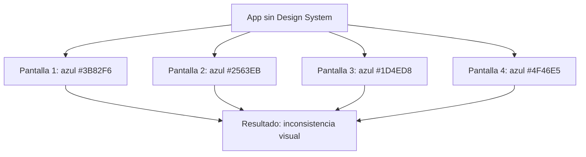
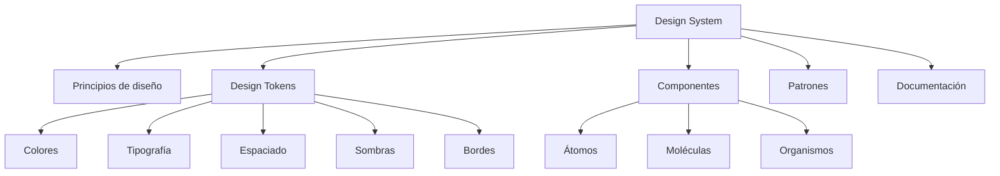
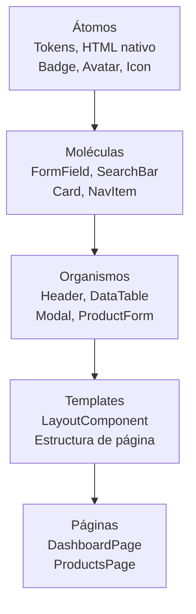
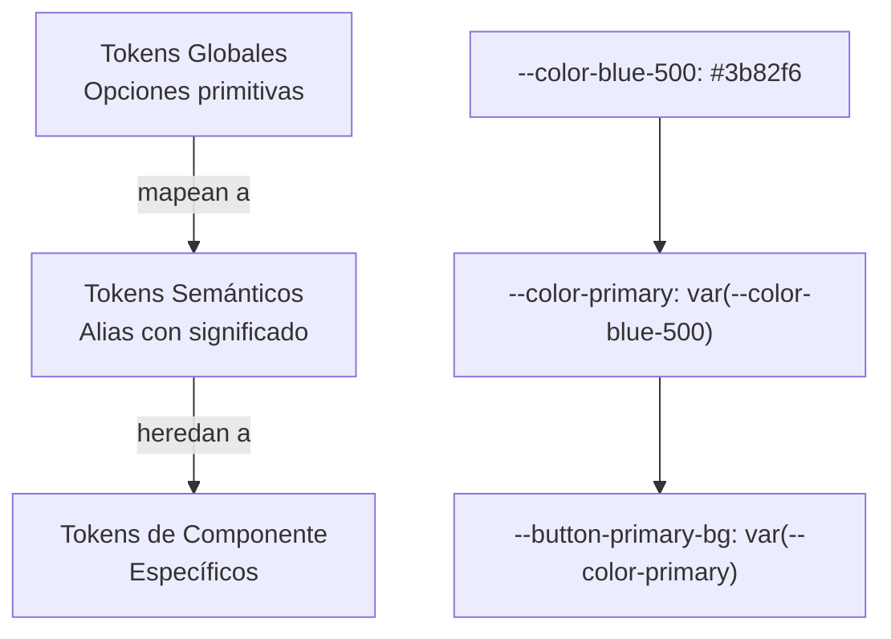
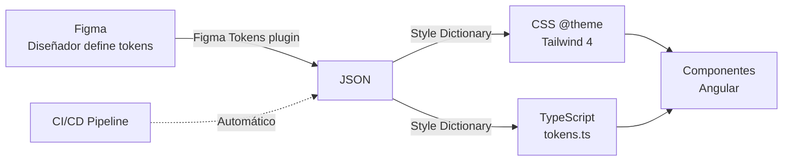
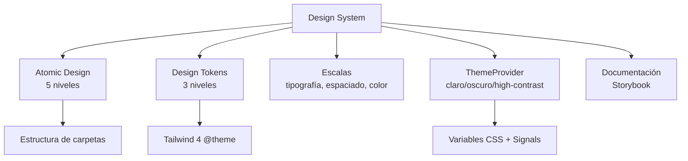

# Unidad 09 — Design Systems

---

## Portada

### Módulo 0488 — Desarrollo de Interfaces
## Design Systems
#### Atomic Design + Design Tokens + Tailwind 4 @theme + ThemeProvider

Note:
Bienvenidos a la Unidad 9. Hoy vamos a construir un Design System completo. Veremos qué es realmente un Design System, cómo aplicar Atomic Design en Angular, cómo definir Design Tokens y sincronizarlos entre Figma y código, y cómo implementar un ThemeProvider para cambiar temas en tiempo real. Esta unidad conecta diseño y desarrollo.

---

## Objetivos de aprendizaje

- Comprender qué es un <mark>Design System</mark> y su valor estratégico <!-- .element: class="fragment" -->
- Aplicar <mark>Atomic Design</mark> (átomos → moléculas → organismos → templates → páginas) <!-- .element: class="fragment" -->
- Definir <mark>Design Tokens</mark> como fuente única de verdad <!-- .element: class="fragment" -->
- Implementar tokens con <mark>Tailwind 4 @theme</mark> <!-- .element: class="fragment" -->
- Analizar Design Systems reales (Material 3, Ant, Carbon) <!-- .element: class="fragment" -->
- Construir <mark>ThemeProvider</mark> con Signals (claro/oscuro/high-contrast) <!-- .element: class="fragment" -->

Note:
Seis objetivos ambiciosos. El más transformador: entender que un Design System es mucho más que una librería de componentes — es un lenguaje visual compartido entre diseño y desarrollo que acelera la construcción de interfaces consistentes.

---

## Motivación: 15 pantallas, 8 azules diferentes



### Sin Design System: caos. Con Design System: armonía.

Note:
Sin un Design System, cada desarrollador elige colores, tamaños y espaciados ligeramente diferentes. El resultado es una aplicación que se siente "rara" aunque el usuario no sepa explicar por qué. Un Design System establece reglas: un solo azul primario, una escala tipográfica, un sistema de espaciado. Todo coherente.

---

## Sección A: Qué es un Design System



Note:
Un Design System tiene 5 componentes fundamentales. Principios: valores que guían decisiones. Tokens: variables que definen colores, tipografía, espaciado. Componentes: implementaciones reutilizables. Patrones: combinaciones frecuentes. Documentación: Storybook, guías de uso. Es la materialización de la identidad visual en herramientas reutilizables.

---

## Beneficios medibles de un Design System

| Beneficio | Impacto |
|-----------|---------|
| <mark>Consistencia visual</mark> | Misma paleta, tipografía y espaciado en toda la app |
| <mark>Velocidad</mark> | 25-50% menos tiempo en nuevas funcionalidades |
| <mark>Escalabilidad</mark> | Nuevos productos sobre la misma base |
| <mark>Comunicación</mark> | Lenguaje compartido diseño-desarrollo |
| <mark>Onboarding</mark> | Catálogo documentado para nuevos miembros |

Note:
Los beneficios son sustanciales y medibles. Empresas como Shopify, Airbnb y Uber reportan reducciones de 25-50% en tiempo de desarrollo tras implementar un Design System. El onboarding de nuevos desarrolladores pasa de semanas a días porque tienen un catálogo documentado de qué existe y cómo usarlo.

---

## Sección B: Atomic Design



Note:
Atomic Design, creado por Brad Frost, organiza interfaces en 5 niveles jerárquicos. Cada nivel compone al anterior. Átomos: elementos más básicos (botones, inputs, tokens). Moléculas: combinaciones con propósito (FormField = label + input + error). Organismos: secciones complejas (Header con nav + search + user menu). Templates: estructuras de página. Páginas: instancias concretas con datos reales.

---

## Átomos: Los bloques fundamentales

```css
/* styles/tokens.css — @theme de Tailwind 4 */
@import "tailwindcss";

@theme {
  /* Colores semánticos */
  --color-primary: var(--color-blue-600);
  --color-primary-hover: var(--color-blue-700);
  --color-success: #059669;
  --color-warning: #d97706;
  --color-error: #dc2626;

  /* Tipografía */
  --font-family-sans: 'Inter', ui-sans-serif, system-ui;

  /* Escala tipográfica modular */
  --font-size-xs: 0.75rem;
  --font-size-sm: 0.875rem;
  --font-size-base: 1rem;
  --font-size-lg: 1.125rem;
  --font-size-xl: 1.25rem;
  --font-size-2xl: 1.5rem;
  --font-size-3xl: 1.875rem;

  /* Espaciado (baseline 4px) */
  --spacing-1: 0.25rem;
  --spacing-2: 0.5rem;
  --spacing-4: 1rem;
  --spacing-6: 1.5rem;
  --spacing-8: 2rem;
}
```

Note:
En Angular + Tailwind, los átomos no suelen ser componentes independientes, sino tokens definidos en `@theme` y estilos base para elementos HTML. Los tokens definen colores, tipografía y espaciado. Las clases utilitarias de Tailwind se generan automáticamente a partir de estos tokens. Podéis usar `bg-primary`, `text-success`, `p-4`, etc.

---

## Moléculas: SearchBar

```typescript
@Component({
  selector: 'ui-search-bar',
  standalone: true,
  template: `
    <div class="relative">
      <div class="pointer-events-none absolute inset-y-0 left-0 flex items-center pl-3">
        <svg class="h-5 w-5 text-gray-400" aria-hidden="true">...</svg>
      </div>
      <input
        type="search"
        [placeholder]="placeholder()"
        [value]="value()"
        (input)="onInput($event)"
        (keydown.escape)="clear()"
        class="block w-full rounded-lg border border-gray-300 bg-white py-2 pl-10 pr-10 text-sm
               placeholder:text-gray-400 focus:border-blue-500 focus:ring-2 focus:ring-blue-500" />
      @if (value()) {
        <button type="button"
                class="absolute inset-y-0 right-0 flex items-center pr-3 text-gray-400 hover:text-gray-600"
                (click)="clear()" aria-label="Limpiar búsqueda">✕</button>
      }
    </div>
  `,
})
export class SearchBarComponent {
  value = model('');
  placeholder = input('Buscar...');
  search = output<string>();
}
```

Note:
La SearchBar es un ejemplo perfecto de molécula: combina un input (átomo), un icono de lupa (átomo), un botón de limpiar (átomo) y lógica de interacción. Usa `model()` para two-way binding del valor. El botón X solo aparece si hay texto. Escape limpia el campo. Todo con clases Tailwind.

---

## Organismos: Header

```typescript
@Component({
  selector: 'app-header',
  standalone: true,
  imports: [SearchBarComponent, ThemeToggleComponent, DropdownComponent],
  template: `
    <header class="sticky top-0 z-40 border-b border-gray-200 bg-white">
      <div class="flex h-16 items-center gap-4 px-4 sm:px-6">
        <a routerLink="/" class="flex items-center gap-2">
          
          <span class="text-lg font-bold text-gray-900">Brand</span>
        </a>

        <nav class="hidden md:flex items-center gap-1 ml-8">
          @for (item of navItems(); track item.label) {
            <a [routerLink]="item.route"
               class="rounded-lg px-3 py-2 text-sm font-medium transition-colors"
               routerLinkActive="bg-gray-100 text-gray-900">
              {{ item.label }}
            </a>
          }
        </nav>

        <div class="flex-1"></div>
        <div class="hidden lg:block w-80"><ui-search-bar /></div>
        <ui-theme-toggle />
        <ui-dropdown [items]="userMenuItems()">
          <button dropdown-trigger>
            <ui-avatar [name]="userName()" size="sm" />
          </button>
        </ui-dropdown>
      </div>
    </header>
  `,
})
export class HeaderComponent {}
```

Note:
El Header es un organismo: compone logo (átomo), navegación (múltiples NavItem = moléculas), SearchBar (molécula), ThemeToggle (molécula) y Dropdown de usuario (molécula) con Avatar (átomo). Todos estos componentes son reutilizables e independientes. El Header simplemente los orquesta en un layout.

---

## Aplicación práctica en estructura de carpetas

```
src/app/
├── design-system/          # Átomos (tokens, configuración)
│   ├── tokens.css          # @theme de Tailwind 4
│   └── theme.service.ts    # Servicio de tema
├── shared/components/       # Átomos y moléculas
│   ├── button/             # Átomo
│   ├── badge/              # Átomo
│   ├── avatar/             # Átomo
│   ├── form-field/         # Molécula
│   ├── search-bar/         # Molécula
│   ├── card/               # Molécula
│   ├── data-table/         # Organismo
│   └── modal/              # Organismo
├── layout/                  # Templates
│   ├── layout.component.ts
│   ├── header/             # Organismo
│   ├── sidebar/            # Organismo
│   └── footer/             # Organismo
└── features/                # Páginas
    ├── dashboard/
    └── products/
```

Note:
La estructura de carpetas refleja naturalmente Atomic Design. `design-system/` contiene los átomos de configuración. `shared/components/` contiene átomos, moléculas y organismos reutilizables. `layout/` contiene templates. `features/` son las páginas. Esta estructura es predecible y escala bien con equipos grandes.

---

## Sección C: Design Tokens en profundidad

### Tres niveles jerárquicos



Note:
Tres niveles de tokens. Globales: valores crudos sin significado semántico (blue-500, red-500). Semánticos: mapean globales a significados funcionales (primary, success, error). De componente: específicos para cada componente, heredan de semánticos. Si cambiamos el color primario de azul a verde, solo tocamos el token semántico. Todos los componentes se actualizan automáticamente.

---

## Tokens en CSS y TypeScript

### CSS con @theme:
```css
@theme {
  --color-primary: var(--color-blue-600);
  --color-surface: var(--color-white);
  --color-text-primary: var(--color-gray-900);
  --color-border: var(--color-gray-200);
}
```

### TypeScript (para lógica):
```typescript
export const tokens = {
  colors: {
    primary: { 50: '#eff6ff', 500: '#3b82f6', 600: '#2563eb' },
    success: '#059669',
    error: '#dc2626',
  },
  spacing: { 1: '0.25rem', 2: '0.5rem', 4: '1rem', 6: '1.5rem' },
  fontSize: { xs: '0.75rem', sm: '0.875rem', base: '1rem' },
  borderRadius: { sm: '0.375rem', md: '0.5rem', lg: '0.75rem' },
  shadow: {
    sm: '0 1px 2px 0 rgb(0 0 0 / 0.05)',
    md: '0 4px 6px -1px rgb(0 0 0 / 0.1)',
    lg: '0 10px 15px -3px rgb(0 0 0 / 0.1)',
  },
} as const;
```

Note:
Los tokens deben existir en dos formatos: CSS (para Tailwind y estilos) y TypeScript (para lógica que necesite valores de diseño, como colores de gráficos o animaciones procedurales). Ambas fuentes deben estar sincronizadas. Herramientas como Style Dictionary generan ambos formatos desde una única fuente JSON o YAML.

---

## Sincronización Figma ↔ Código



Note:
El flujo ideal: diseñadores definen tokens en Figma → se exportan a JSON → Style Dictionary los transforma a CSS y TypeScript → los componentes los consumen. Este pipeline se automatiza con CI/CD para que cada cambio en Figma genere un PR con los tokens actualizados. Así diseño y código nunca se desincronizan.

---

## Sección D: Construcción paso a paso

### Los 8 pasos del Design System

1. Auditoría visual → inventariar todo <!-- .element: class="fragment" -->
2. Principios de diseño → 3-5 valores rectores <!-- .element: class="fragment" -->
3. Design Tokens → colores, tipografía, espaciado <!-- .element: class="fragment" -->
4. Implementar tokens en Tailwind → `@theme` <!-- .element: class="fragment" -->
5. Componentes atómicos → Button, Input, Badge, Avatar <!-- .element: class="fragment" -->
6. Moléculas y organismos → componiendo átomos <!-- .element: class="fragment" -->
7. Documentar en Storybook → cada variante y estado <!-- .element: class="fragment" -->
8. Versionar y mantener → SEMVER + CHANGELOG <!-- .element: class="fragment" -->

Note:
Ocho pasos secuenciales. La auditoría es el más infravalorado: sin ella, no sabes qué tienes. Los principios de diseño son 3-5 frases que guían decisiones (ej: "Accesibilidad por defecto", "Menos es más"). El versionado semántico es crítico: MAJOR rompe compatibilidad, MINOR añade componentes, PATCH corrige bugs visuales.

---

## Sección E: Escalas y sistemas visuales

### Escala tipográfica modular (razón 1.25)

| Token | REM | PX | Uso |
|-------|-----|-----|-----|
| `xs` | 0.75 | 12 | Texto auxiliar, notas legales |
| `sm` | 0.875 | 14 | Cuerpo pequeño, labels |
| `base` | 1 | 16 | Cuerpo principal |
| `lg` | 1.125 | 18 | Cuerpo destacado |
| `xl` | 1.25 | 20 | Subtítulos |
| `2xl` | 1.5 | 24 | Títulos de sección |
| `3xl` | 1.875 | 30 | Títulos de página (H1) |

Note:
La escala modular (razón 1.25) produce tamaños que guardan relación proporcional entre sí, creando ritmo visual. 7 tamaños cubren desde notas legales (12px) hasta títulos de página (30px). Definir una escala limita las opciones y fuerza consistencia: no puedes usar 17px si no está en la escala.

---

## Escala de espaciado (baseline grid 4px)

| Token | REM | PX | Uso |
|-------|-----|-----|-----|
| `1` | 0.25 | 4 | Mínimo (icono-texto) |
| `2` | 0.5 | 8 | Padding interior pequeño |
| `3` | 0.75 | 12 | Padding de inputs |
| `4` | 1 | 16 | Padding de tarjetas |
| `6` | 1.5 | 24 | Padding de tarjetas grandes |
| `8` | 2 | 32 | Margen entre secciones |
| `12` | 3 | 48 | Separación entre bloques |
| `16` | 4 | 64 | Márgenes de layout desktop |

Note:
El baseline grid establece que todos los espacios sean múltiplos de 4px. Esto garantiza alineación perfecta entre columnas y elementos. Si todos los paddings y márgenes son múltiplos de 4, todo encaja. Es una restricción que libera: no tienes que decidir si usar 13px o 14px, usas 12px o 16px.

---

## Paleta de colores semánticos

| Token | Color | Uso |
|-------|-------|-----|
| `primary` | `#2563eb` | Acciones principales, enlaces |
| `success` | `#059669` | Confirmaciones, estados positivos |
| `warning` | `#d97706` | Advertencias, atención |
| `error` | `#dc2626` | Errores, acciones destructivas |
| `surface` | `#ffffff` | Fondo principal |
| `surface-secondary` | `#f9fafb` | Fondo secundario |
| `text-primary` | `#111827` | Texto principal |
| `text-secondary` | `#6b7280` | Texto secundario |
| `border` | `#e5e7eb` | Bordes |

Note:
Cada color semántico tiene un propósito claro. Primary para acciones principales. Success para confirmaciones. Warning para advertencias. Error para destrucción. Los colores de superficie y texto definen la jerarquía visual. Esto cubre el 95% de las necesidades de color de una aplicación.

---

## Escala de sombras (elevación)

| Nivel | Valor | Uso |
|-------|-------|-----|
| `sm` | `0 1px 2px 0 rgb(0 0 0 / 0.05)` | Tarjetas, inputs |
| `md` | `0 4px 6px -1px rgb(0 0 0 / 0.1)` | Hover, dropdowns |
| `lg` | `0 10px 15px -3px rgb(0 0 0 / 0.1)` | Modales |
| `xl` | `0 20px 25px -5px rgb(0 0 0 / 0.1)` | Drawers |
| `2xl` | `0 25px 50px -12px rgb(0 0 0 / 0.25)` | Alta prioridad |

Note:
Las sombras comunican elevación. Una tarjeta con `shadow-sm` está ligeramente elevada. Un modal con `shadow-lg` flota claramente sobre el contenido. La escala de 1-5 niveles cubre desde elementos sutiles hasta elementos que demandan atención urgente. No uses sombras arbitrarias: elige de la escala.

---

## Sección F: Casos reales de Design Systems

### Comparativa

| Sistema | Origen | Fortalezas |
|---------|--------|------------|
| **Material 3** | Google | Dynamic Color, 3 niveles de tokens |
| **Ant Design** | Alibaba | Enterprise, 60+ componentes, i18n |
| **Carbon** | IBM | Accesibilidad WCAG AA, grid 2x (8px) |
| **Spectrum** | Adobe | Multiplataforma, slots visuales |
| **Lightning** | Salesforce | Gobernanza, 500+ iconos, ecosistema |

Note:
Cinco Design Systems reales, cada uno con lecciones valiosas. Material 3: separación en 3 niveles de tokens es muy poderosa. Ant: demuestra que aplicaciones de datos pueden ser visualmente agradables. Carbon: accesibilidad como pilar fundacional. Spectrum: un mismo lenguaje visual en web, desktop y mobile. Lightning: gobernanza para ecosistemas grandes.

---

## Lecciones de Material Design 3

### Dynamic Color
Motor que extrae colores del wallpaper y genera automáticamente una paleta completa

### 3 niveles de tokens
1. **Reference tokens** — valores crudos
2. **System tokens** — mapeo semántico
3. **Component tokens** — específicos de cada componente

<br/>

> "La generación dinámica de temas demuestra el poder de los tokens semánticos"

Note:
Material You (M3) introduce Dynamic Color: a partir de un color semilla, genera automáticamente toda la paleta (primario, secundario, terciario, neutral). Esto solo es posible porque separan tokens crudos de semánticos. Cambias la semilla y TODO el tema se regenera. Esa es la flexibilidad que buscamos con nuestros tokens.

---

## Sección G: ThemeProvider con Signals

```typescript
@Injectable({ providedIn: 'root' })
export class ThemeService {
  private readonly THEME_KEY = 'app-theme';

  private themeSignal = signal<'light' | 'dark' | 'high-contrast'>(
    this.loadInitialTheme()
  );
  currentTheme = this.themeSignal.asReadonly();

  constructor() {
    this.applyTheme(this.themeSignal());
  }

  setTheme(theme: 'light' | 'dark' | 'high-contrast'): void {
    this.themeSignal.set(theme);
    this.applyTheme(theme);
    localStorage.setItem(this.THEME_KEY, theme);
  }

  toggleTheme(): void {
    const next = this.themeSignal() === 'dark' ? 'light' : 'dark';
    this.setTheme(next);
  }

  private loadInitialTheme(): 'light' | 'dark' | 'high-contrast' {
    const stored = localStorage.getItem(this.THEME_KEY);
    if (stored) return stored as any;
    return window.matchMedia('(prefers-color-scheme: dark)').matches
      ? 'dark' : 'light';
  }

  private applyTheme(theme: string): void {
    const root = document.documentElement;
    root.classList.remove('light', 'dark', 'high-contrast');
    root.classList.add(theme);
    root.style.colorScheme = theme === 'dark' ? 'dark' : 'light';
  }
}
```

Note:
El ThemeService es el corazón del cambio de tema. Almacena el tema actual en una Signal. Al cambiar, añade la clase CSS correspondiente al `documentElement` (`.light`, `.dark`, `.high-contrast`). Respeta la preferencia del sistema (`prefers-color-scheme`). Persiste la elección del usuario en localStorage. `colorScheme` afecta a las barras nativas del navegador.

---

## Variables CSS para temas

```css
/* Tema claro (por defecto) */
:root, .light {
  --surface-color: #ffffff;
  --text-primary-color: #111827;
  --border-color: #e5e7eb;
}

/* Tema oscuro */
.dark {
  --surface-color: #1f2937;
  --text-primary-color: #f9fafb;
  --border-color: #374151;
}

/* Tema high-contrast */
.high-contrast {
  --surface-color: #000000;
  --text-primary-color: #ffffff;
  --border-color: #ffffff;
}
```

```css
/* Tokens que consumen las variables */
@theme {
  --color-surface: var(--surface-color);
  --color-text-primary: var(--text-primary-color);
  --color-border: var(--border-color);
}
```

Note:
Las variables CSS son el mecanismo para cambiar temas. Definimos variables genéricas (`--surface-color`) y las asignamos a valores diferentes según la clase del tema. Los tokens de Tailwind consumen estas variables. Cuando cambia la clase en `documentElement`, todas las variables CSS cambian y los componentes se actualizan automáticamente.

---

## Componente ThemeToggle

```typescript
@Component({
  selector: 'ui-theme-toggle',
  standalone: true,
  template: `
    <button
      type="button"
      class="rounded-lg p-2 text-gray-500 hover:bg-gray-100
             dark:text-gray-400 dark:hover:bg-gray-700"
      (click)="themeService.toggleTheme()"
      [attr.aria-label]="'Cambiar a modo ' + nextThemeLabel()">
      @if (themeService.currentTheme() === 'dark') {
        <!-- Icono sol -->
        <svg class="h-5 w-5" fill="none" viewBox="0 0 24 24" stroke="currentColor">
          <path stroke-linecap="round" stroke-linejoin="round" stroke-width="2"
                d="M12 3v1m0 16v1m9-9h-1M4 12H3m15.364 6.364l-.707-.707M6.343 6.343l-.707-.707m12.728 0l-.707.707M6.343 17.657l-.707.707M16 12a4 4 0 11-8 0 4 4 0 018 0z" />
        </svg>
      } @else {
        <!-- Icono luna -->
        <svg class="h-5 w-5" fill="none" viewBox="0 0 24 24" stroke="currentColor">
          <path stroke-linecap="round" stroke-linejoin="round" stroke-width="2"
                d="M20.354 15.354A9 9 0 018.646 3.646 9.003 9.003 0 0012 21a9.003 9.003 0 008.354-5.646z" />
        </svg>
      }
    </button>
  `,
})
export class ThemeToggleComponent {
  themeService = inject(ThemeService);
  nextThemeLabel = computed(() =>
    this.themeService.currentTheme() === 'dark' ? 'claro' : 'oscuro'
  );
}
```

Note:
El ThemeToggle es simple: un botón con icono de sol (tema oscuro activo → cambiar a claro) o luna (tema claro activo → cambiar a oscuro). Usa `aria-label` dinámico para accesibilidad. Las clases `dark:` de Tailwind funcionan porque la clase `.dark` está en el `documentElement`. El componente es completamente reactivo gracias a las Signals.

---

## Demo: Design System completo para SaaS

### Paso 1 — Auditoría visual
Identificar colores, tipografías, botones, tarjetas, espaciados e inconsistencias

### Paso 2 — Definir tokens
Crear `tokens.css` con `@theme` de Tailwind 4 con todos los valores consolidados

### Paso 3 — Construir componentes atómicos
Button (5 variantes), Input (5 estados), Badge (5 tipos), Avatar, Skeleton

### Paso 4 — Construir moléculas y organismos
SearchBar, DataTable, Modal, EmptyState

### Paso 5 — Documentar
Cada componente con stories en Storybook (ver Unidad 10)

Note:
Vamos a repasar el proceso completo. Auditoría: capturar pantallas, listar colores, detectar inconsistencias. Tokens: consolidar en una escala coherente. Componentes: construir desde átomos hacia organismos. Documentación: Storybook con todas las variantes y estados. Este proceso se itera: el Design System es un producto vivo.

---

## Actividad en clase: Auditoría visual + Tokens

**Duración:** 60 minutos

**Objetivo:** Realizar una auditoría visual de una aplicación web y definir sus Design Tokens

**Entregable:** Documento de auditoría + archivo `tokens.css` con `@theme`

### Desarrollo: <!-- .element: class="fragment" -->
1. Navegar por 5 pantallas de la app proporcionada <!-- .element: class="fragment" -->
2. Listar colores, tipografías, espaciados, sombras encontrados <!-- .element: class="fragment" -->
3. Detectar y documentar inconsistencias <!-- .element: class="fragment" -->
4. Proponer paleta consolidada de tokens <!-- .element: class="fragment" -->
5. Implementar en `tokens.css` con Tailwind 4 `@theme` <!-- .element: class="fragment" -->

Note:
Vais a hacer una auditoría real. El docente os dará la URL de una aplicación. Navegad por al menos 5 pantallas y documentad todo: colores, tamaños de fuente, tipos de botones, espaciados. Luego consolidaréis en una paleta coherente y la implementaréis como tokens. Esto es exactamente lo que se hace en un proyecto real al iniciar un Design System.

---

## Buenas prácticas

1. <mark>Tokens semánticos</mark>, no usar colores crudos en componentes <!-- .element: class="fragment" -->
2. Una <mark>escala tipográfica</mark> limitada (7-9 tamaños máximo) <!-- .element: class="fragment" -->
3. Baseline grid de <mark>4px u 8px</mark> y respetarlo siempre <!-- .element: class="fragment" -->
4. <mark>3 niveles de tokens</mark>: globales → semánticos → componente <!-- .element: class="fragment" -->
5. <mark>No hardcodear valores</mark> — usar siempre tokens o clases Tailwind <!-- .element: class="fragment" -->
6. Versionar el Design System con <mark>SEMVER</mark> y mantener CHANGELOG <!-- .element: class="fragment" -->

Note:
La práctica más importante: usar tokens semánticos, nunca valores hardcodeados. Si un componente usa `#3b82f6` en lugar de `var(--color-primary)`, cambiar el color primario requiere buscar y reemplazar en todo el código. Con tokens semánticos, cambiáis una línea y todo se actualiza.

---

## Errores frecuentes

1. ❌ Usar valores hardcodeados (`#3b82f6`, `16px`) en lugar de tokens <!-- .element: class="fragment" -->
2. ❌ Demasiados tamaños de fuente (14px, 15px, 16px, 17px, 18px...) <!-- .element: class="fragment" -->
3. ❌ Saltarse el baseline grid con espaciados arbitrarios <!-- .element: class="fragment" -->
4. ❌ No versionar el Design System <!-- .element: class="fragment" -->
5. ❌ Olvidar el tema oscuro al definir colores <!-- .element: class="fragment" -->
6. ❌ Documentación desactualizada <!-- .element: class="fragment" -->

Note:
El error más común es hardcodear valores. El segundo: una escala tipográfica inflada. Si tenéis 15 tamaños de fuente diferentes, no tenéis una escala, tenéis caos. Limitar a 7-9 tamaños. Y siempre pensad en el tema oscuro al definir colores: un texto gris claro sobre fondo blanco puede ser ilegible sobre fondo oscuro.

---

## Resumen



Note:
Hemos cubierto la construcción completa de un Design System: Atomic Design como metodología de organización, Design Tokens en 3 niveles como fuente única de verdad, escalas visuales coherentes, ThemeProvider con Signals para cambio de tema en tiempo real, y documentación como parte integral. Un Design System no es un proyecto, es un producto.

---

## Próximos pasos

### Unidad 10 — Storybook

- Instalación y configuración en proyecto Angular <!-- .element: class="fragment" -->
- Stories CSF3 para todos los componentes <!-- .element: class="fragment" -->
- Documentación MDX + addons (Controls, a11y, Figma) <!-- .element: class="fragment" -->
- Testing de interacciones con play functions <!-- .element: class="fragment" -->
- Visual testing con Chromatic <!-- .element: class="fragment" -->
- Publicación y despliegue <!-- .element: class="fragment" -->

Note:
En la última unidad del módulo aprenderemos a documentar profesionalmente nuestro Design System con Storybook. Veremos cómo escribir stories CSF3, documentación MDX, testing de interacciones con play functions, y cómo integrar Chromatic para detectar regresiones visuales automáticamente.

---

## ¡Gracias! ¿Preguntas?

### Repaso rápido:
- ¿Cuáles son los 5 niveles de Atomic Design? <!-- .element: class="fragment" -->
- ¿Por qué usar tokens semánticos en lugar de colores crudos? <!-- .element: class="fragment" -->
- ¿Cómo se implementa el cambio de tema con Signals? <!-- .element: class="fragment" -->

Note:
Tres preguntas de cierre. 1) Átomos, moléculas, organismos, templates, páginas. 2) Porque permiten cambiar el color primario en un solo lugar y que todos los componentes se actualicen. 3) Con un ThemeService que expone una Signal de solo lectura y manipula clases CSS en el documentElement. ¿Alguna duda?
