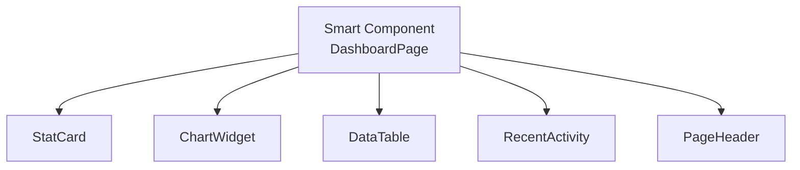
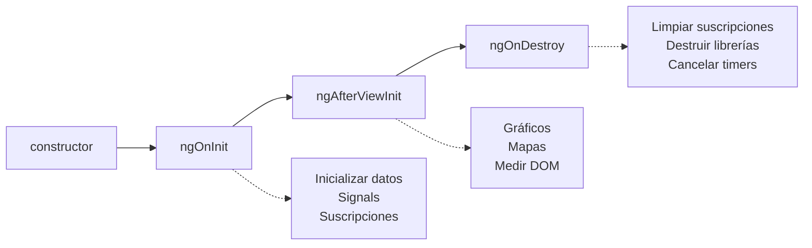
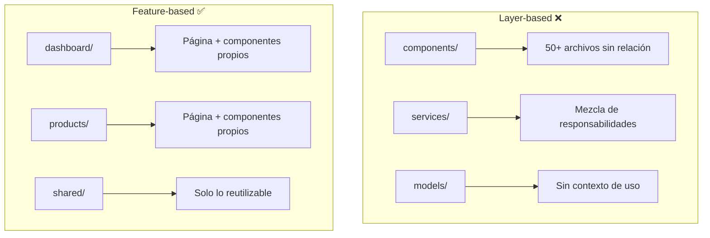
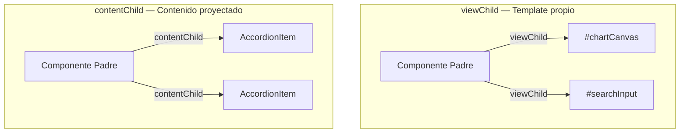

# Unidad 10 — Arquitectura de Interfaces con Angular

---

## Portada

### Módulo 0488 — Desarrollo de Interfaces
## Arquitectura de Interfaces con Angular
#### Smart Components, Standalone y Señales

Note:
Bienvenidos a la Unidad 10. Hoy vamos a abordar cómo estructurar aplicaciones Angular profesionales usando patrones arquitectónicos modernos. Vamos a ver Standalone Components, el patrón Smart vs Presentational, Signals, y comunicación entre componentes. Todo orientado a construir interfaces escalables y mantenibles.

---

## Objetivos de aprendizaje

- Diferenciar Smart y Presentational Components <!-- .element: class="fragment" -->
- Configurar Standalone Components con imports explícitos <!-- .element: class="fragment" -->
- Integrar <mark>Tailwind CSS</mark> en plantillas Angular <!-- .element: class="fragment" -->
- Comunicar componentes con @Input, @Output y Model Inputs <!-- .element: class="fragment" -->
- Gestionar estado de interfaz con Signals <!-- .element: class="fragment" -->
- Acceder al DOM con viewChild y contentChild <!-- .element: class="fragment" -->

Note:
Al finalizar esta unidad seréis capaces de diseñar la arquitectura completa de una interfaz Angular profesional. Los 6 objetivos cubren desde la estructura de componentes hasta la manipulación avanzada del DOM.

---

## Motivación: El problema del "componente Dios"

```typescript
// ❌ 847 líneas, 23 imports, 15 responsabilidades
export class GodComponent {
  // Obtiene datos, renderiza, valida,
  // gestiona errores, anima, rutea...
}
```

### Consecuencias: <!-- .element: class="fragment" -->
- Imposible de testear <!-- .element: class="fragment" -->
- Imposible de reutilizar <!-- .element: class="fragment" -->
- Conflictos constantes en equipo <!-- .element: class="fragment" -->

Note:
Imaginad un componente que lo hace todo: obtiene datos de la API, renderiza HTML, valida formularios, gestiona errores, anima transiciones y controla la navegación. Esto es un "componente Dios". En equipos de 3+ personas, este antipatrón genera conflictos diarios. La solución es separar responsabilidades. ¿Alguien ha sufrido un componente así?

---

## La solución: Separación de responsabilidades



Note:
La solución es descomponer. Un Smart Component se encarga de orquestar datos y delegar la presentación a múltiples componentes pequeños y especializados. Cada uno hace una sola cosa y la hace bien. Así es como escalan las aplicaciones reales.

---

## Standalone Components

```typescript
@Component({
  selector: 'app-stat-card',
  standalone: true,  // ← Clave
  imports: [NgClass, CurrencyPipe],
  template: `...`,
  styles: [`...`],
})
export class StatCardComponent {
  @Input({ required: true }) data!: StatData;
}
```

Note:
Desde Angular 15, los Standalone Components eliminan la necesidad de NgModules. Cada componente declara explícitamente sus dependencias en el array `imports`. Esto hace que el código sea más explícito, fácil de entender y que el tree-shaking sea más efectivo. La propiedad `standalone: true` es obligatoria para marcar el componente como autónomo.

---

## Selector, Template y Styles

```typescript
@Component({
  selector: 'app-stat-card',        // Etiqueta HTML
  templateUrl: './stat-card.html',  // Markup + Tailwind
  styleUrl: './stat-card.css',      // Estilos encapsulados
  standalone: true,
  imports: [NgClass],
})
```

| Propiedad | Función |
|-----------|---------|
| `selector` | Nombre de etiqueta HTML personalizada |
| `template`/`templateUrl` | Markup con clases Tailwind |
| `styles`/`styleUrls` | Estilos encapsulados del componente |

Note:
Tres atributos fundamentales definen un componente. El `selector` es el nombre de la etiqueta HTML que usaréis en las plantillas. El `template` contiene el HTML con clases Tailwind. Los `styles` definen estilos específicos encapsulados que no afectan al resto de la aplicación.

---

## Template con Tailwind CSS

```html
<div class="rounded-xl border border-gray-200 bg-white p-6 shadow-sm">
  <div class="flex items-center justify-between">
    <h3 class="text-sm font-medium text-gray-500">{{ title }}</h3>
    <span class="rounded-full bg-blue-100 px-2 py-1 text-xs font-semibold text-blue-700">
      {{ badge }}
    </span>
  </div>
  <p class="mt-3 text-3xl font-bold text-gray-900">{{ value }}</p>
</div>
```

Note:
Tailwind en Angular supone un cambio de paradigma: en lugar de escribir CSS separado, aplicáis clases utilitarias directamente en el HTML. Esto elimina la fricción de nombrar clases, garantiza consistencia con el sistema de diseño y acelera el desarrollo. Cada clase describe un aspecto visual: `rounded-xl` (borde redondeado), `p-6` (padding de 1.5rem), `shadow-sm` (sombra pequeña).

---

## Tailwind: Variantes arbitrarias con clases Angular

```html
<input
  [formControl]="emailControl"
  class="block w-full rounded-lg border px-3 py-2
         focus:outline-none focus:ring-2
         [&.ng-invalid.ng-touched]:border-red-400
         [&.ng-valid.ng-touched]:border-green-400" />
```

<br/>

`[&.ng-invalid.ng-touched]:border-red-400` reacciona a las clases CSS que Angular añade automáticamente

Note:
Esta sintaxis es muy potente. Las variantes arbitrarias de Tailwind como `[&.ng-invalid.ng-touched]:border-red-400` permiten reaccionar a las clases que Angular añade automáticamente a los controles de formulario. Así eliminamos lógica TypeScript adicional para gestionar clases condicionales. Todo queda en el template.

---

## Encapsulación de estilos: ViewEncapsulation

| Estrategia | Comportamiento | Cuándo usarla |
|-----------|---------------|---------------|
| `Emulated` | Aísla con atributos únicos | **Por defecto**, recomendada |
| `None` | Estilos globales | Componente raíz, themes |
| `ShadowDom` | Shadow DOM nativo | Widgets embebidos |

Note:
Angular ofrece 3 estrategias de encapsulación. Emulated es el valor por defecto y aísla los estilos añadiendo atributos únicos a los elementos y selectores CSS. None desactiva el encapsulamiento — rara vez recomendable. ShadowDom usa Shadow DOM nativo pero presenta limitaciones con Tailwind porque las clases globales no penetran el Shadow DOM.

---

## :host y ::ng-deep

```css
/* Afecta al elemento contenedor del componente */
:host {
  display: block;
  width: 100%;
}
:host(.highlighted) {
  box-shadow: 0 0 0 3px rgba(59, 130, 246, 0.5);
}

/* ⚠️ Usar con moderación — estiliza componentes hijos */
::ng-deep .third-party-slider .track {
  background-color: theme('colors.blue.500');
}
```

Note:
`:host` selecciona el elemento anfitrión del componente, es decir, la etiqueta HTML personalizada como `<app-stat-card>`. Es muy útil para definir display, márgenes o dimensiones del contenedor. `::ng-deep` fuerza a que los estilos atraviesen la encapsulación — está deprecado por Angular pero sigue siendo la única solución para estilizar componentes de terceros. Pregunta al aula: ¿qué alternativas a ::ng-deep conocéis?

---

## Ciclo de vida relevante para interfaces



Note:
Tres hooks son fundamentales para interfaces. `ngOnInit`: inicializar datos y suscripciones. `ngAfterViewInit`: el DOM ya está disponible para librerías externas como Chart.js o mapas. `ngOnDestroy`: limpiar todo para evitar memory leaks. El uso de `takeUntilDestroyed()` desde Angular 16 simplifica enormemente la limpieza de suscripciones.

---

## ngOnInit con Signals y takeUntilDestroyed

```typescript
private dataService = inject(DashboardService);

loading = signal(true);
stats = signal<Stat[]>([]);
error = signal<string | null>(null);

ngOnInit(): void {
  this.dataService.getDashboardStats().pipe(
    takeUntilDestroyed()
  ).subscribe({
    next: (data) => { this.stats.set(data); this.loading.set(false); },
    error: () => { this.error.set('Error al cargar'); this.loading.set(false); }
  });
}
```

Note:
`takeUntilDestroyed()` vincula la suscripción al ciclo de vida del componente. Cuando el componente se destruye, la suscripción se cancela automáticamente. Ya no necesitamos gestionar manualmente Subjects de destrucción. Las Signals almacenan el estado de UI de forma reactiva: `loading`, `stats`, `error`.

---

## ngAfterViewInit: Inicializar librerías externas

```typescript
private chartContainer = viewChild<ElementRef>('chartContainer');

ngAfterViewInit(): void {
  const container = this.chartContainer();
  if (container) {
    const ctx = container.nativeElement.querySelector('canvas')?.getContext('2d');
    if (ctx) {
      new Chart(ctx, { type: 'line', data: {...}, options: {...} });
    }
  }
}
```

Note:
`viewChild` con señales devuelve una referencia reactiva que se actualiza cuando el elemento está disponible. En `ngAfterViewInit`, el DOM ya está renderizado y podemos inicializar librerías como Chart.js, mapas de Leaflet, o editores de texto enriquecido. Es crítico que estas inicializaciones ocurran aquí y no en ngOnInit.

---

## Sección B: Organización de proyectos profesionales

```
src/app/
├── core/          # Servicios singleton, guards, interceptors
├── shared/        # Componentes UI reutilizables
│   └── components/
│       ├── button/
│       ├── modal/
│       ├── card/
│       ├── input/
│       └── data-table/
├── features/      # Pantallas por funcionalidad
│   ├── dashboard/
│   ├── products/
│   └── users/
├── layout/        # Shell: header, sidebar, footer
└── design-system/ # Tokens, tipografía, tema
```

Note:
Esta estructura feature-based es el estándar profesional. `core/` contiene servicios singleton. `shared/` alberga componentes reutilizables sin lógica de negocio. `features/` organiza las pantallas por funcionalidad. `layout/` define el shell de la aplicación. `design-system/` centraliza los tokens de diseño. Esta estructura es predecible y escala bien con equipos grandes.

---

## Feature-based vs Layer-based



Note:
Layer-based agrupa por tipo técnico: todos los componentes juntos, todos los servicios juntos. Cuando la app crece, se convierte en un vertedero. Feature-based agrupa por funcionalidad de negocio: todo lo relacionado con "dashboard" está junto. Esto reduce la carga cognitiva y permite trabajar en features de forma independiente.

---

## Principio de Responsabilidad Única (SRP)

> "Un componente debe tener una, y solo una, razón para cambiar"

<div class="fragment">

### ❌ Componente página monolítico
- Obtiene datos de 3 endpoints
- Renderiza 5 secciones distintas
- Gestiona 4 estados de UI
- Maneja errores, navegación, animaciones

</div>

<div class="fragment">

### ✅ Descomposición correcta
- **DashboardPage**: orquesta datos
- **StatCard**: renderiza estadística
- **ChartWidget**: renderiza gráfico
- **RecentActivity**: renderiza lista de actividad

</div>

Note:
La S de SOLID aplicada a componentes UI. Un componente página no debería contener directamente el HTML de tarjetas, gráficos y tablas. Debe delegar cada sección en un componente especializado. El DashboardPage orquesta, los componentes presentacionales renderizan. Esto facilita el testing, la reutilización y el trabajo en paralelo.

---

## Sección C: Smart vs Presentational Components

```mermaid
graph TB
    subgraph "Smart Components (Containers)"
        S1[DashboardPage]
        S2[ProductsPage]
        S3[UserProfilePage]
    end
    
    subgraph "Presentational Components (Dumb)"
        P1[StatCard]
        P2[ChartWidget]
        P3[DataTable]
        P4[Button]
        P5[Modal]
        P6[Card]
    end
    
    S1 -->|@Input data| P1
    S1 -->|@Input data| P2
    S1 -->|@Input data| P3
    P1 -->|@Output events| S1
    P2 -->|@Output events| S1
```

Note:
Este es el patrón arquitectónico más importante para interfaces Angular. Los Smart Components obtienen datos de servicios y contienen lógica de negocio. Los Presentational Components solo reciben datos por @Input y emiten eventos por @Output. No inyectan servicios, no conocen rutas, son puramente visuales y 100% reutilizables.

---

## Smart Component: DashboardPage

```typescript
@Component({
  selector: 'app-dashboard-page',
  standalone: true,
  imports: [StatCardComponent, ChartWidgetComponent, DataTableComponent],
  template: `
    <app-page-header [title]="'Dashboard'" />
    <div class="grid grid-cols-1 gap-6 sm:grid-cols-2 lg:grid-cols-4">
      @for (stat of stats(); track stat.id) {
        <app-stat-card [data]="stat" />
      }
    </div>
  `,
})
export class DashboardPageComponent implements OnInit {
  private dashboardService = inject(DashboardService);
  stats = signal<StatData[]>([]);
  loading = signal(true);
  // ...
}
```

Note:
Observad el template: es una composición de componentes presentacionales. No contiene prácticamente HTML nativo ni clases de estilo. El Smart Component se limita a orquestar: inyecta el servicio, obtiene datos y los distribuye. Las Signals (`stats`, `loading`) gestionan el estado de UI de forma reactiva.

---

## Presentational Component: StatCard

```typescript
@Component({
  selector: 'app-stat-card',
  standalone: true,
  imports: [NgClass],
  template: `
    <div class="rounded-xl border border-gray-200 bg-white p-6 shadow-sm">
      <p class="text-sm font-medium text-gray-500">{{ data.label }}</p>
      <p class="mt-3 text-3xl font-bold text-gray-900">{{ data.value }}</p>
      <span [ngClass]="data.trend >= 0 ? 'text-green-600' : 'text-red-600'">
        {{ data.trend }}%
      </span>
    </div>
  `,
  changeDetection: ChangeDetectionStrategy.OnPush,
})
export class StatCardComponent {
  @Input({ required: true }) data!: StatData;
}
```

Note:
Reglas de oro del Presentational Component: 1) Recibe todo por @Input. 2) Emite todo por @Output. 3) No inyecta servicios. 4) No conoce rutas ni features. 5) Altamente reutilizable. Observad `ChangeDetectionStrategy.OnPush`: mejora el rendimiento porque solo se reevalúa cuando cambian sus inputs.

---

## Las 5 reglas de oro del Presentational Component

1. Reciben <mark>TODO</mark> lo que necesitan mediante `@Input()` <!-- .element: class="fragment" -->
2. Emiten <mark>TODO</mark> lo que sucede mediante `@Output()` <!-- .element: class="fragment" -->
3. <mark>NO</mark> inyectan servicios de datos ni estado global <!-- .element: class="fragment" -->
4. <mark>NO</mark> conocen la estructura de la aplicación <!-- .element: class="fragment" -->
5. Son <mark>altamente reutilizables</mark> en diferentes contextos <!-- .element: class="fragment" -->

Note:
Estas 5 reglas definen un componente presentacional puro. Si vuestro componente inyecta HttpClient o Router, es un Smart Component. Si solo recibe datos y emite eventos, es presentacional. La pureza de los presentacionales los hace infinitamente reutilizables y trivialmente testeables.

---

## Sección D: Comunicación entre componentes

```mermaid
graph LR
    A[Padre<br/>Smart] -->|@Input<br/>datos ↓| B[Hijo<br/>Presentational]
    B -->|@Output<br/>eventos ↑| A
    A -->|"[()]<br/>two-way"| C[Hijo<br/>Model Input]
```

Note:
Tres mecanismos de comunicación: @Input para pasar datos hacia abajo, @Output para emitir eventos hacia arriba, y Model Inputs para two-way binding. El flujo de datos es unidireccional descendente. Los eventos fluyen hacia arriba. Esto hace que la aplicación sea predecible y fácil de depurar.

---

## @Input con required y transform

```typescript
// Input obligatorio — el compilador exige que el padre lo proporcione
@Input({ required: true }) title!: string;
@Input({ required: true }) items!: MenuItem[];

// Input con transformación automática
@Input({
  required: true,
  transform: (value: string) => value.toLowerCase().trim()
}) email!: string;

@Input({
  transform: (value: Date | string) =>
    value instanceof Date ? value : new Date(value)
}) createdAt!: Date;
```

Note:
`required: true` elimina errores en tiempo de ejecución: el compilador de Angular exige que el padre proporcione el valor. El operador `!` (non-null assertion) indica a TypeScript que Angular inicializará la propiedad. La función `transform` aplica una transformación al valor antes de asignarlo — muy útil para normalizar datos (emails en minúsculas, strings de fecha a objetos Date).

---

## @Output: Emitir eventos hacia el padre

```typescript
// En el componente hijo (Presentational)
@Output() itemSelected = new EventEmitter<MenuItem>();
@Output() actionClicked = new EventEmitter<string>();

selectItem(item: MenuItem): void {
  this.itemSelected.emit(item);
}

// En el componente padre (Smart) — template
// <app-menu (itemSelected)="onItemSelected($event)" />
```

Note:
`@Output` + `EventEmitter<T>` permite a los hijos comunicar eventos. El hijo emite describiendo qué hizo el usuario. El padre recibe y decide la acción de negocio. Es importante tipar el `EventEmitter` con genéricos para tener seguridad de tipos tanto al emitir como al recibir.

---

## Model Inputs: Two-way binding

```typescript
// En el componente hijo — declara una propiedad "model"
checked = model(false);
label = model<string>('');

// En el componente padre — binding bidireccional con [()]
// <app-toggle [(checked)]="isDarkMode" label="Modo oscuro" />
```

<br/>

<div class="fragment">

Reemplaza el patrón tradicional de `@Input` + `@Output(XXXChange)`

Ideal para: switches, selectores, sliders, cualquier control de formulario personalizado

</div>

Note:
Los Model Inputs, introducidos en Angular 17.2, simplifican el two-way binding. La función `model()` crea una propiedad que actúa como input y output simultáneamente. El hijo puede leer y escribir la propiedad como una señal normal, y Angular propaga los cambios al padre automáticamente. Esto reemplaza el patrón verboso de @Input + @Output con nombre `xxxChange`.

---

## Signals para estado de interfaz

```typescript
// Estado local del componente
searchTerm = signal('');
isSidebarOpen = signal(true);
selectedFilters = signal<Filter[]>([]);

// Valores derivados (computados) — lazy + memoizados
sidebarWidth = computed(() =>
  this.isSidebarOpen() ? '16rem' : '4rem'
);

isEmptyState = computed(() =>
  this.data().length === 0 && !this.loading()
);
```

Note:
Las Signals son el nuevo sistema de reactividad de Angular. A diferencia de RxJS, siempre tienen un valor actual y su API es síncrona. `computed()` crea valores derivados que solo se recalculan cuando cambian sus dependencias — son lazy y memoizados. Esto es ideal para estado de UI: clases CSS condicionales, visibilidad, textos dinámicos.

---

## Servicio de estado global con Signals

```typescript
@Injectable({ providedIn: 'root' })
export class UIStateService {
  private sidebarOpen = signal(true);
  private theme = signal<'light' | 'dark'>('light');

  isSidebarOpen = this.sidebarOpen.asReadonly();
  currentTheme = this.theme.asReadonly();

  toggleSidebar(): void {
    this.sidebarOpen.update(v => !v);
  }

  setTheme(theme: 'light' | 'dark'): void {
    this.theme.set(theme);
    document.documentElement.classList.toggle('dark', theme === 'dark');
  }
}
```

Note:
El estado compartido se implementa con servicios que exponen Signals. `asReadonly()` expone la señal para lectura pero impide modificaciones externas — las mutaciones solo ocurren a través de los métodos del servicio. Este patrón es suficiente para estado de UI global y evita la complejidad de NgRx para casos simples.

---

## Sección E: viewChild y contentChild



Note:
`viewChild` accede a elementos que forman parte del template del propio componente. `contentChild` accede a elementos proyectados desde el padre mediante `<ng-content>`. Esta distinción es fundamental para construir componentes compuestos como acordeones, tabs, wizards.

---

## viewChild: Acceder al DOM propio

```typescript
chartCanvas = viewChild<ElementRef<HTMLCanvasElement>>('chartCanvas');

ngAfterViewInit(): void {
  const canvas = this.chartCanvas();
  if (canvas) {
    new Chart(canvas.nativeElement.getContext('2d')!, {
      type: 'bar', data: {...}, options: {...}
    });
  }
}
```

### Casos de uso: <!-- .element: class="fragment" -->
- Gráficos y visualizaciones <!-- .element: class="fragment" -->
- Gestión del foco <!-- .element: class="fragment" -->
- Scroll programático <!-- .element: class="fragment" -->
- Animaciones imperativas <!-- .element: class="fragment" -->

Note:
La sintaxis moderna de `viewChild` con señales devuelve una señal reactiva que se actualiza cuando el elemento está disponible. Los casos de uso más comunes: inicializar gráficos, enfocar campos automáticamente, hacer scroll al primer error de formulario, controlar animaciones complejas con la Web Animations API.

---

## contentChild: Acceder a contenido proyectado

```typescript
@Component({
  selector: 'app-accordion',
  standalone: true,
  template: `<div class="divide-y"><ng-content /></div>`,
})
export class AccordionComponent {
  items = contentChildren(AccordionItemComponent);

  collapseAll(): void {
    this.items().forEach(item => item.collapse());
  }

  expandAll(): void {
    this.items().forEach(item => item.expand());
  }
}
```

Note:
`contentChildren` (la versión plural) accede a todos los hijos proyectados. El componente Accordion recibe AccordionItems como contenido y puede invocar sus métodos públicos (collapse, expand). La comunicación se hace a través de las APIs públicas de los componentes hijos, respetando la encapsulación.

---

## Patrón: Foco automático en modal

```typescript
private searchInput = viewChild<ElementRef<HTMLInputElement>>('searchInput');

showSearch(): void {
  this.isSearchVisible.set(true);
  afterNextRender(() => {
    this.searchInput()?.nativeElement.focus();
  });
}
```

Note:
Cuando se abre un modal o se muestra un formulario de búsqueda, es buena práctica enfocar automáticamente el primer campo. `afterNextRender` (Angular 17+) es preferible a `setTimeout` porque se integra con el ciclo de detección de cambios de Angular. La señal `searchInput` solo tendrá valor después de que Angular haya renderizado el elemento.

---

## Patrón: Scroll al primer error

```typescript
private formContainer = viewChild<ElementRef>('formContainer');

onSubmit(): void {
  if (this.form.invalid) {
    this.markAllAsTouched();
    afterNextRender(() => {
      const firstError = this.formContainer()
        ?.nativeElement.querySelector('.ng-invalid');
      firstError?.scrollIntoView({ behavior: 'smooth', block: 'center' });
      (firstError as HTMLElement)?.focus();
    });
  }
}
```

Note:
En formularios largos, tras un envío fallido, desplazamos la vista hasta el primer campo con error. Buscamos el elemento con clase `.ng-invalid` (que Angular añade automáticamente) dentro del contenedor del formulario, hacemos scroll suave y enfocamos el campo. Esto mejora drásticamente la UX en formularios extensos.

---

## Demo: Dashboard completo en 3 pasos

### Paso 1: Smart Component DashboardPage
```typescript
stats = signal<StatData[]>([]);
chartData = signal<ChartSeries[]>([]);
recentTransactions = signal<Transaction[]>([]);
loading = signal(true);

ngOnInit(): void {
  forkJoin({
    stats: this.dashboardService.getStats(),
    chart: this.dashboardService.getChartData(),
    transactions: this.dashboardService.getRecentTransactions(),
  }).pipe(takeUntilDestroyed()).subscribe({
    next: ({ stats, chart, transactions }) => {
      this.stats.set(stats);
      this.chartData.set(chart);
      this.recentTransactions.set(transactions);
      this.loading.set(false);
    }
  });
}
```

Note:
Vamos a construir paso a paso un dashboard profesional. Paso 1: el Smart Component obtiene datos de 3 endpoints en paralelo con `forkJoin`. Almacena los resultados en Signals. `takeUntilDestroyed()` limpia automáticamente.

---

## Demo: Dashboard (Paso 2)

### Template del Smart Component
```html
<div class="flex h-screen bg-gray-50">
  <app-sidebar [collapsed]="sidebarCollapsed()" />

  <div class="flex flex-1 flex-col overflow-hidden">
    <app-header-bar (menuToggle)="toggleSidebar()" />

    <main class="flex-1 overflow-y-auto p-6">
      <div class="grid grid-cols-1 gap-6 sm:grid-cols-2 lg:grid-cols-4">
        @for (stat of stats(); track stat.id) {
          <app-stat-card [data]="stat" />
        }
      </div>
      <!-- Más secciones con ChartWidget y DataTable -->
    </main>
  </div>
</div>
```

Note:
El template es pura composición: sidebar, header, grid de stat-cards, gráficos y tablas. Cada sección es un componente presentacional que recibe datos. La nueva sintaxis `@for` de Angular 17 reemplaza a `*ngFor` con mejor rendimiento y soporte de `track`.

---

## Demo: Dashboard (Paso 3)

### Presentational Component StatCard
```typescript
@Component({
  selector: 'app-stat-card',
  standalone: true,
  imports: [NgClass, CurrencyPipe],
  template: `
    <div class="rounded-xl border border-gray-200 bg-white p-6
                shadow-sm transition-shadow hover:shadow-md">
      <p class="text-sm font-medium text-gray-500">{{ data.label }}</p>
      <p class="mt-3 text-3xl font-bold text-gray-900">
        {{ data.value | currency:'EUR' }}
      </p>
      <span [ngClass]="data.trend >= 0 ? 'text-green-600' : 'text-red-600'">
        {{ data.trend >= 0 ? '↑' : '↓' }} {{ data.trend }}%
      </span>
    </div>
  `,
  changeDetection: ChangeDetectionStrategy.OnPush,
})
export class StatCardComponent {
  @Input({ required: true }) data!: StatData;
}
```

Note:
El StatCard es presentacional puro: un solo @Input requerido, sin dependencias de servicios, con OnPush para rendimiento. El template usa Tailwind con transiciones (hover:shadow-md) y pipes de Angular (currency). Así de limpio debe ser un componente presentacional.

---

## Actividad en clase: Construir un UserProfilePage

**Duración:** 90 minutos

**Objetivo:** Aplicar el patrón Smart/Presentational construyendo una página de perfil de usuario

**Entregable:** `UserProfilePage` (Smart) + `ProfileCard`, `ActivityList`, `SettingsForm` (Presentational)

### Requisitos: <!-- .element: class="fragment" -->
1. Smart que obtenga datos de un servicio <!-- .element: class="fragment" -->
2. Signals para estado de UI (loading, error, data) <!-- .element: class="fragment" -->
3. Presentational components con @Input/@Output <!-- .element: class="fragment" -->
4. Tailwind para estilos, OnPush en todos <!-- .element: class="fragment" -->

Note:
Vais a aplicar todo lo aprendido en un ejercicio práctico. Construiréis una página de perfil de usuario con el patrón Smart/Presentational. El Smart obtiene datos del servicio. Los Presentational reciben datos y emiten eventos. Usad Signals, Tailwind y OnPush. Al final compararemos soluciones.

---

## Buenas prácticas

1. <mark>Un componente = una responsabilidad</mark> (SRP) <!-- .element: class="fragment" -->
2. Standalone + imports explícitos siempre <!-- .element: class="fragment" -->
3. Signals para estado de UI, RxJS para datos asíncronos <!-- .element: class="fragment" -->
4. `takeUntilDestroyed()` — nunca gestionar suscripciones manualmente <!-- .element: class="fragment" -->
5. `ChangeDetectionStrategy.OnPush` en todos los componentes <!-- .element: class="fragment" -->
6. Si un componente se usa en 2+ features → mover a `shared/` <!-- .element: class="fragment" -->

Note:
Estas 6 prácticas marcan la diferencia entre un proyecto mantenible y uno caótico. OnPush en todos los componentes mejora el rendimiento. `takeUntilDestroyed()` evita memory leaks. La regla de "2+ features → shared/" mantiene el catálogo de componentes reutilizables actualizado.

---

## Errores frecuentes

1. ❌ Crear "componentes Dios" que hacen de todo <!-- .element: class="fragment" -->
2. ❌ Usar `::ng-deep` sin considerar alternativas <!-- .element: class="fragment" -->
3. ❌ Inyectar servicios en componentes presentacionales <!-- .element: class="fragment" -->
4. ❌ No limpiar suscripciones en ngOnDestroy <!-- .element: class="fragment" -->
5. ❌ `ViewEncapsulation.None` sin motivo justificado <!-- .element: class="fragment" -->
6. ❌ Olvidar `track` en `@for` <!-- .element: class="fragment" -->

Note:
Estos son los errores que más veo en proyectos reales. El "componente Dios" es el más común y el más dañino. Inyectar servicios en presentacionales rompe la reutilización. No limpiar suscripciones causa memory leaks difíciles de detectar. `::ng-deep` está deprecado — usad variables CSS o inputs de estilo como alternativa.

---

## Resumen

```mermaid
graph LR
    A[Standalone<br/>Components] --> B[Smart vs<br/>Presentational]
    B --> C[@Input / @Output<br/>Model Inputs]
    C --> D[Signals<br/>para UI State]
    D --> E[viewChild<br/>contentChild]
    E --> F[Arquitectura<br/>Feature-based]
```

Note:
Hemos cubierto: Standalone Components como base, patrón Smart/Presentational para separar responsabilidades, comunicación con @Input/@Output/Model Inputs, Signals para estado de UI reactivo, viewChild/contentChild para manipulación del DOM, y estructura feature-based para proyectos escalables. Todo esto forma la base sobre la que construiréis interfaces profesionales.

---

## Próximos pasos

### Unidad 11 — Componentes Reutilizables

- Catálogo de 14 componentes UI <!-- .element: class="fragment" -->
- Proyección de contenido con ng-content <!-- .element: class="fragment" -->
- Accesibilidad (ARIA, teclado, foco) <!-- .element: class="fragment" -->
- Estados de interfaz: loading, empty, error, data <!-- .element: class="fragment" -->
- Patrón: interfaz TypeScript → template Tailwind → tests <!-- .element: class="fragment" -->

Note:
En la próxima unidad construiremos un catálogo completo de componentes reutilizables siguiendo todo lo aprendido hoy. Veremos proyección de contenido, accesibilidad como parte integral del diseño, y gestión consistente de los 4 estados de interfaz. ¡Traed los ordenadores preparados para codificar!
