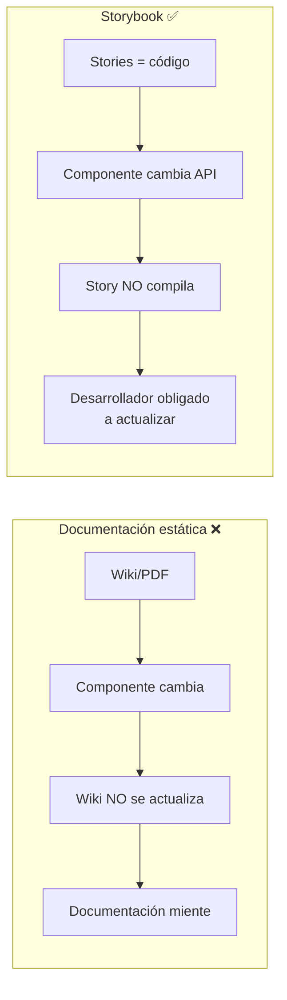
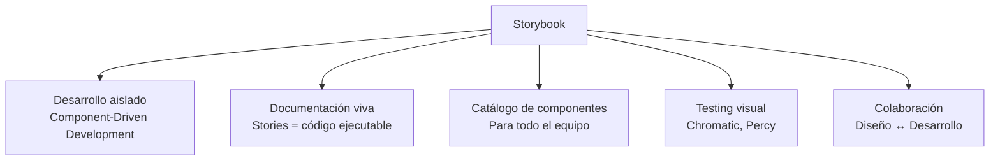
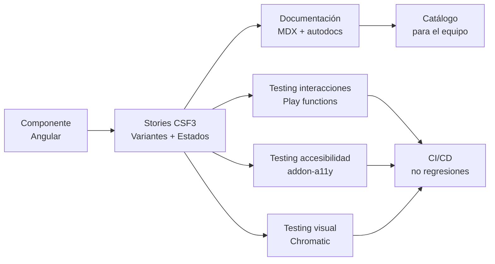
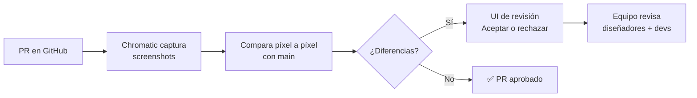
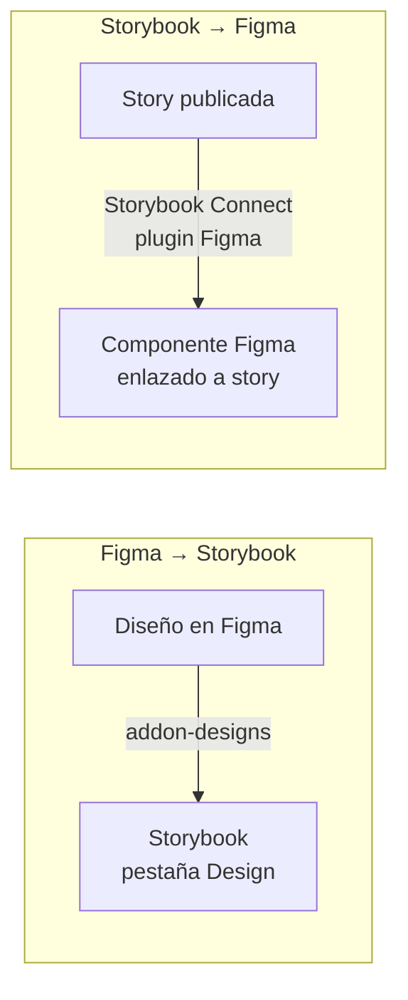
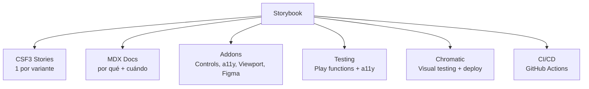

# Unidad 10 — Documentación de Componentes con Storybook

---

## Portada

### Módulo 0488 — Desarrollo de Interfaces
## Storybook
#### Documentación viva + Testing visual + Integración Figma

Note:
Bienvenidos a la última unidad del módulo. Storybook es la herramienta que cierra el círculo: convierte nuestro catálogo de componentes en documentación viva, testeable y compartible. Hoy aprenderéis a instalar Storybook en Angular, escribir stories CSF3, documentar con MDX, testear interacciones y publicar vuestro Design System.

---

## Objetivos de aprendizaje

- Instalar y configurar <mark>Storybook</mark> en Angular + Tailwind 4 <!-- .element: class="fragment" -->
- Escribir stories con formato <mark>CSF3</mark> (Component Story Format 3) <!-- .element: class="fragment" -->
- Documentar con <mark>MDX</mark> + stories interactivas <!-- .element: class="fragment" -->
- Usar addons: <mark>Controls, a11y, Interactions, Viewport, Figma</mark> <!-- .element: class="fragment" -->
- Implementar <mark>play functions</mark> para testing de interacciones <!-- .element: class="fragment" -->
- Configurar <mark>Chromatic</mark> para visual testing y despliegue <!-- .element: class="fragment" -->

Note:
Seis objetivos que os convertirán en expertos en Storybook. Desde la instalación hasta el despliegue en producción, pasando por testing de interacciones y visual testing automatizado. Al final de esta unidad, vuestro Design System tendrá documentación profesional.

---

## Motivación: Documentación que NO se desactualiza



### Storybook: documentación que vive y respira junto al código

Note:
La diferencia fundamental: la documentación tradicional (wikis, PDFs, READMEs) se desactualiza inevitablemente. Las stories de Storybook son código que se ejecuta. Si cambiáis la API de un componente, la story falla al compilar. Esto fuerza a mantener la documentación sincronizada. Es documentación viva.

---

## Sección A: Qué es Storybook



Note:
Storybook cumple 5 roles en el ecosistema de desarrollo. 1) Desarrollo aislado: trabajar en un componente sin arrancar la app completa. 2) Documentación viva: código que se ejecuta. 3) Catálogo: diseñadores y PMs exploran componentes sin preguntar a devs. 4) Testing visual: detecta regresiones píxel a píxel. 5) Colaboración: cierra la brecha diseño-desarrollo.

---

## Sección B: Instalación en Angular

```bash
npx storybook@latest init
```

### Qué hace este comando: <!-- .element: class="fragment" -->
1. Detecta Angular por `angular.json` <!-- .element: class="fragment" -->
2. Instala `@storybook/angular` + addons <!-- .element: class="fragment" -->
3. Crea `.storybook/main.ts` y `.storybook/preview.ts` <!-- .element: class="fragment" -->
4. Añade scripts: `storybook` y `build-storybook` <!-- .element: class="fragment" -->
5. Crea stories de ejemplo en `src/stories/` <!-- .element: class="fragment" -->

Note:
La instalación es un solo comando. Storybook detecta automáticamente que es un proyecto Angular, instala las dependencias necesarias, crea la configuración y añade scripts a package.json. Tras la instalación, `npm run storybook` arranca el servidor en `http://localhost:6006`.

---

## Archivos de configuración: main.ts

```typescript
import type { StorybookConfig } from '@storybook/angular';

const config: StorybookConfig = {
  stories: ['../src/**/*.stories.@(js|jsx|mjs|ts|tsx)'],
  addons: [
    '@storybook/addon-essentials',    // Controls, Actions, Viewport, Docs
    '@storybook/addon-interactions',  // Play functions
    '@storybook/addon-a11y',          // Auditoría accesibilidad
    '@storybook/addon-designs',       // Incrustar Figma
  ],
  framework: {
    name: '@storybook/angular',
    options: {},
  },
  docs: {
    autodocs: 'tag',  // Generar docs automáticas
  },
};

export default config;
```

Note:
`main.ts` es la configuración principal. `stories`: patrón glob para encontrar archivos de stories. `addons`: los 4 addons esenciales. `framework`: Angular. `docs.autodocs: 'tag'`: genera documentación automática para componentes con el tag `'autodocs'`. Cada addon añade funcionalidad: Controls para manipular inputs, a11y para auditoría, interactions para play functions, designs para Figma.

---

## Archivos de configuración: preview.ts

```typescript
import type { Preview } from '@storybook/angular';
import { applicationConfig } from '@storybook/angular';
import { provideZoneChangeDetection } from '@angular/core';
import { provideHttpClient } from '@angular/common/http';
import { provideRouter } from '@angular/router';

// ⚠️ CRÍTICO: importar Tailwind
import '!style-loader!css-loader!postcss-loader!../src/styles.css';

const preview: Preview = {
  parameters: {
    controls: {
      matchers: {
        color: /(background|color)$/i,
        date: /Date$/i,
      },
    },
    backgrounds: {
      default: 'light',
      values: [
        { name: 'light', value: '#ffffff' },
        { name: 'dark', value: '#1f2937' },
      ],
    },
    viewport: {
      viewports: {
        mobile: { name: 'Mobile', styles: { width: '375px', height: '812px' } },
        tablet: { name: 'Tablet', styles: { width: '768px', height: '1024px' } },
        desktop: { name: 'Desktop', styles: { width: '1280px', height: '800px' } },
      },
    },
  },
  decorators: [
    applicationConfig({
      providers: [
        provideZoneChangeDetection({ eventCoalescing: true }),
        provideHttpClient(),
        provideRouter([]),
      ],
    }),
  ],
  tags: ['autodocs'],
};

export default preview;
```

Note:
`preview.ts` configura cómo se renderizan todas las stories. La línea de import de Tailwind es CRÍTICA: sin ella, los componentes aparecen sin estilos. Viewports predefinidos para móvil, tablet y desktop. Backgrounds para probar sobre fondo claro y oscuro. Los providers de Angular (HttpClient, Router) deben configurarse aquí para que los componentes funcionen.

---

## Sección C: CSF3 — Estructura de una story

```typescript
import type { Meta, StoryObj } from '@storybook/angular';
import { ButtonComponent } from './button.component';

const meta: Meta<ButtonComponent> = {
  title: 'UI/Button',           // Jerarquía en la barra lateral
  component: ButtonComponent,
  tags: ['autodocs'],           // Generar docs automáticas
  argTypes: {
    variant: {
      control: 'select',
      options: ['primary', 'secondary', 'outline', 'ghost', 'danger'],
      description: 'Variante visual del botón',
    },
    disabled: {
      control: 'boolean',
      description: 'Deshabilita el botón',
    },
    clicked: {
      action: 'clicked',        // Registrar en panel Actions
    },
  },
  args: {
    variant: 'primary',         // Valores por defecto
    size: 'md',
    disabled: false,
    label: 'Botón',
  },
};

export default meta;
type Story = StoryObj<ButtonComponent>;
```

Note:
CSF3 es el formato moderno para stories. `Meta<>` define metadatos: título (con `/` para jerarquía), argTypes (controles en el panel), args (valores por defecto). `StoryObj<>` es el tipo para las stories individuales. `tags: ['autodocs']` genera documentación automática con tabla de argumentos. `action: 'clicked'` registra eventos en el panel Actions.

---

## CSF3 — Stories para cada variante

```typescript
// Por defecto (usa los args del meta)
export const Primary: Story = {};

// Variantes
export const Secondary: Story = {
  args: { variant: 'secondary', label: 'Cancelar' },
};

export const Outline: Story = {
  args: { variant: 'outline', label: 'Ver más' },
};

export const Danger: Story = {
  args: { variant: 'danger', label: 'Eliminar cuenta' },
};

// Estados
export const Disabled: Story = {
  args: { disabled: true, label: 'Deshabilitado' },
};

export const Loading: Story = {
  args: { loading: true, label: 'Guardando...' },
};

// Tamaños
export const Small: Story = {
  args: { size: 'sm', label: 'Pequeño' },
};

export const Large: Story = {
  args: { size: 'lg', label: 'Grande' },
};
```

Note:
Cada variante y estado es una story independiente. Esto es mucho más útil que una sola story con todos los controles. Las stories son auto-documentadas: el nombre de la exportación aparece en la barra lateral. Cada story sobrescribe solo los args que necesita. El panel Controls permite modificar cualquier arg en tiempo real.

---

## Stories con proyección de contenido (ng-content)

```typescript
const meta: Meta<CardComponent> = {
  title: 'UI/Card',
  component: CardComponent,
  args: { variant: 'default', padding: 'md' },
};

export const WithHeaderAndFooter: Story = {
  render: (args) => ({
    props: args,
    template: `
      <ui-card [variant]="variant" [padding]="padding">
        <div card-header>
          <h3 class="text-lg font-semibold">Tarjeta con header y footer</h3>
        </div>
        <p class="text-gray-600">Contenido principal de la tarjeta.</p>
        <div card-footer>
          <div class="flex justify-end gap-2">
            <ui-button variant="ghost" size="sm">Cancelar</ui-button>
            <ui-button variant="primary" size="sm">Aceptar</ui-button>
          </div>
        </div>
      </ui-card>
    `,
  }),
};
```

Note:
Para componentes con `<ng-content>`, usamos `render` con un template inline. Esto permite proyectar contenido en los slots definidos (`card-header`, `card-footer`, contenido por defecto). Las props se pasan mediante `args` y están disponibles en el template con interpolación. Este patrón funciona para Card, Modal, Tabs y cualquier componente con proyección.

---

## Sección D: Documentación con MDX

### Página de introducción del Design System

```mdx
import { Meta } from '@storybook/blocks';

<Meta title="Introducción" />

# Bienvenido al Design System

Este Design System contiene todos los componentes UI utilizados en MiApp.

## Principios de diseño

1. **Consistencia** — Elementos similares se comportan igual
2. **Accesibilidad** — WCAG 2.1 AA por defecto
3. **Simplicidad** — API intuitiva y predecible

## Design Tokens

| Token | Valor | Uso |
|-------|-------|-----|
| `--color-primary` | `#2563eb` | Acciones principales |
| `--color-success` | `#059669` | Confirmaciones |
| `--color-error` | `#dc2626` | Errores |
| `--spacing-4` | `1rem` | Padding estándar |

## Cómo usar

```typescript
import { ButtonComponent } from '@shared/components/button';
// <ui-button variant="primary" (clicked)="handleSave()">Guardar</ui-button>
```
```

Note:
MDX combina Markdown con componentes de Storybook. Podéis escribir texto narrativo, tablas, ejemplos de código, y embeber stories interactivas. La página de introducción es lo primero que ve quien entra en Storybook. Debe explicar qué es el Design System, sus principios, los tokens disponibles y cómo empezar a usar los componentes.

---

## MDX: Documentación de componente con stories incrustadas

```mdx
import { Meta, Canvas, Controls } from '@storybook/blocks';
import * as ButtonStories from './button.stories';
import { Figma } from '@storybook/addon-designs/blocks';

<Meta of={ButtonStories} />

# Button

El componente `Button` es el bloque fundamental para acciones del usuario.

## Cuándo usar
- Acciones principales en formularios y modales
- Acciones secundarias que complementan una acción principal

## Cuándo NO usar
- Para navegación entre páginas: usar `<a routerLink>`
- Para enlaces externos: usar `<a>` nativo

## Variantes

<Canvas of={ButtonStories.Primary} />
<Canvas of={ButtonStories.Secondary} />
<Canvas of={ButtonStories.Outline} />
<Canvas of={ButtonStories.Danger} />

## Estados

<Canvas of={ButtonStories.Disabled} />
<Canvas of={ButtonStories.Loading} />

## API del componente

<Controls />

## Diseño en Figma

<Figma url="https://www.figma.com/file/xxxxx/Design-System?node-id=42-123" />
```

Note:
El MDX de un componente debe cubrir el "por qué" y el "cuándo", no solo el "qué" (que ya cubre la documentación automática). `<Canvas>` incrusta una story interactiva. `<Controls>` muestra la tabla de argumentos. `<Figma>` incrusta el diseño original. Esto permite comparar implementación vs diseño lado a lado.

---

## Sección E: Addons esenciales

### @storybook/addon-essentials (incluye)

| Addon | Función |
|-------|---------|
| **Controls** | Modificar inputs en tiempo real |
| **Actions** | Registrar eventos emitidos (outputs) |
| **Viewport** | Cambiar tamaño de pantalla |
| **Backgrounds** | Cambiar color de fondo |
| **Docs** | Documentación automática |
| **Toolbars** | Barras de herramientas contextuales |

Note:
`addon-essentials` es un meta-paquete que incluye los 6 addons fundamentales. Controls es el más usado: permite cambiar cualquier arg del componente y ver el resultado instantáneamente. Actions muestra en una consola cada vez que se emite un evento. Viewport simula dispositivos. Backgrounds permite probar sobre fondos claros y oscuros.

---

## @storybook/addon-a11y

```typescript
// En preview.ts
parameters: {
  a11y: {
    config: {
      rules: [
        { id: 'color-contrast', enabled: true },
        { id: 'button-name', enabled: true },
        { id: 'aria-required-attr', enabled: true },
      ],
    },
    element: '#storybook-root',
  },
},
```

### Panel de resultados: <!-- .element: class="fragment" -->
- 🔴 **Violations** — Problemas que deben corregirse <!-- .element: class="fragment" -->
- 🟢 **Passes** — Reglas cumplidas <!-- .element: class="fragment" -->
- 🟡 **Incomplete** — Necesitan revisión manual <!-- .element: class="fragment" -->

Note:
El addon a11y integra axe-core y audita cada story automáticamente. Las violaciones se muestran en un panel con descripción, severidad y elemento afectado. Un componente no está terminado hasta que pasa la auditoría sin violaciones. Las violaciones de accesibilidad deben tratarse con la misma seriedad que los bugs funcionales.

---

## @storybook/addon-interactions: Play functions

```typescript
import { within, userEvent, expect } from '@storybook/test';

export const ClickInteraction: Story = {
  args: { label: 'Haz clic', variant: 'primary' },
  play: async ({ canvasElement }) => {
    const canvas = within(canvasElement);
    const button = canvas.getByRole('button', { name: /haz clic/i });

    // Verificar estado inicial
    await expect(button).toBeEnabled();
    await expect(button).toHaveTextContent('Haz clic');

    // Simular click
    await userEvent.click(button);
  },
};

export const KeyboardNavigation: Story = {
  args: { label: 'Teclado' },
  play: async ({ canvasElement }) => {
    const canvas = within(canvasElement);
    await userEvent.tab();
    await expect(canvas.getByRole('button')).toHaveFocus();
    await userEvent.keyboard('{Enter}');
  },
};

export const DisabledNoInteraction: Story = {
  args: { label: 'Deshabilitado', disabled: true },
  play: async ({ canvasElement }) => {
    const canvas = within(canvasElement);
    const button = canvas.getByRole('button');
    await expect(button).toBeDisabled();
  },
};
```

Note:
Las play functions son tests de interacción que se ejecutan en un navegador real. Usan la API de `@storybook/test` (basada en Testing Library). `within(canvasElement)` crea un scope de búsqueda. `userEvent` simula interacciones reales (click, teclado, tab). `expect` verifica aserciones. Se ejecutan automáticamente en CI/CD.

---

## Flujo completo: Componente → Story → Testing



Note:
El flujo completo: cada componente tiene su archivo de stories CSF3. Las stories alimentan la documentación MDX, los tests de interacción (play functions), la auditoría de accesibilidad (a11y) y el testing visual (Chromatic). Todo se integra en CI/CD para detectar regresiones automáticamente en cada PR.

---

## Sección F: Testing visual con Chromatic



### Instalación: <!-- .element: class="fragment" -->
```bash
npm install --save-dev chromatic
npx chromatic --project-token=<your-token>
```

Note:
Chromatic es el servicio de testing visual de los creadores de Storybook. Captura una screenshot de cada story, la compara con la versión base, y muestra las diferencias en una UI de revisión. Diseñadores y desarrolladores pueden aceptar (cambio intencionado) o rechazar (regresión) cada diferencia. Se integra con GitHub Actions para ejecutarse en cada PR.

---

## Chromatic en CI/CD (GitHub Actions)

```yaml
# .github/workflows/chromatic.yml
name: Chromatic
on: push
jobs:
  chromatic:
    runs-on: ubuntu-latest
    steps:
      - uses: actions/checkout@v4
        with:
          fetch-depth: 0
      - uses: actions/setup-node@v4
        with:
          node-version: 20
      - run: npm ci
      - run: npx chromatic --project-token=${{ secrets.CHROMATIC_TOKEN }}
```

### Beneficios: <!-- .element: class="fragment" -->
- Detecta cambios visuales no intencionados <!-- .element: class="fragment" -->
- Cada PR tiene su propio Storybook desplegado (URL única) <!-- .element: class="fragment" -->
- UI de revisión para aceptar/rechazar cambios <!-- .element: class="fragment" -->

Note:
Este workflow ejecuta Chromatic en cada push. Si hay cambios visuales, Chromatic los muestra en su UI. Si no hay cambios, el check pasa. Chromatic también despliega una versión de Storybook por cada PR, permitiendo a stakeholders revisar los componentes sin necesidad de clonar el repo. Esto es invaluable para la colaboración diseño-desarrollo.

---

## Sección G: Integración Figma ↔ Storybook



### Bidireccional: <!-- .element: class="fragment" -->
- Desde Figma: ver qué componente de diseño tiene implementación <!-- .element: class="fragment" -->
- Desde Storybook: comparar componente desarrollado con diseño original <!-- .element: class="fragment" -->

Note:
La integración es bidireccional. Figma → Storybook: el addon-designs incrusta el diseño de Figma en una pestaña de Storybook. Storybook → Figma: el plugin Storybook Connect vincula componentes de Figma con sus stories. Un diseñador puede ver en Figma si un componente ya está implementado y navegar directamente a su story.

---

## Incrustar Figma en una story

```typescript
const meta: Meta<ButtonComponent> = {
  title: 'UI/Button',
  component: ButtonComponent,
  parameters: {
    design: {
      type: 'figma',
      url: 'https://www.figma.com/file/xxxxx/Design-System?node-id=42-123',
    },
  },
};
```

### O en MDX: <!-- .element: class="fragment" -->
```mdx
import { Figma } from '@storybook/addon-designs/blocks';

<Figma url="https://www.figma.com/file/xxxxx/Design-System?node-id=42-123" />
```

Note:
El parámetro `design` añade una pestaña "Design" en el panel de addons con el diseño de Figma incrustado e interactivo. Se puede hacer zoom, paneo y selección de capas. Esto permite comparar directamente el componente desarrollado con el diseño original sin salir de Storybook.

---

## Sección H: Publicación y despliegue

### Build estático
```bash
npm run build-storybook
# Genera la carpeta storybook-static/
```

### Opciones de despliegue: <!-- .element: class="fragment" -->

| Plataforma | Ventaja |
|-----------|---------|
| **Chromatic** | Hosting gratuito + visual testing |
| **GitHub Pages** | Gratuito, integrado con GitHub |
| **Netlify/Vercel** | URL pública, SSL, preview por PR |

Note:
`build-storybook` genera una carpeta estática que se puede servir desde cualquier hosting. Chromatic ofrece hosting gratuito para proyectos open-source. GitHub Pages es ideal para repos privados. Netlify y Vercel ofrecen preview deployments: cada PR tiene su propia URL para revisar antes de mergear.

---

## Demo: Storybook completo del Button

### Archivos creados:
1. `button.stories.ts` — 12+ stories CSF3 <!-- .element: class="fragment" -->
2. `button.stories.mdx` — Documentación narrativa <!-- .element: class="fragment" -->
3. Play functions para click, teclado y disabled <!-- .element: class="fragment" -->
4. Parámetro `design` con enlace a Figma <!-- .element: class="fragment" -->
5. Todas las variantes (5), tamaños (3), estados (disabled, loading) <!-- .element: class="fragment" -->

Note:
Vamos a repasar el resultado. Un solo componente (Button) genera: 12+ stories cubriendo todas las combinaciones, documentación MDX con guías de uso, play functions que verifican interacciones, y enlace al diseño de Figma. Todo esto se ejecuta en CI/CD para garantizar que no hay regresiones. Así se documenta profesionalmente.

---

## Demo: DataTable con play functions avanzadas

```typescript
export const SortByColumn: Story = {
  play: async ({ canvasElement }) => {
    const canvas = within(canvasElement);
    const nameHeader = canvas.getByText('Nombre');
    await userEvent.click(nameHeader);
    // Verificar que aparece el icono de ordenación ↑
    await expect(nameHeader.closest('th')).toContain('↑');
  },
};

export const PaginateNext: Story = {
  play: async ({ canvasElement }) => {
    const canvas = within(canvasElement);
    const nextButton = canvas.getByRole('button', { name: /siguiente/i });
    await userEvent.click(nextButton);
    // Verificar que cambia la página
    await expect(canvas.getByText(/2/)).toBeInTheDocument();
  },
};

export const SelectAllRows: Story = {
  play: async ({ canvasElement }) => {
    const canvas = within(canvasElement);
    const selectAll = canvas.getByRole('checkbox', { name: /seleccionar todo/i });
    await userEvent.click(selectAll);
    const checkboxes = canvas.getAllByRole('checkbox');
    for (const cb of checkboxes) {
      await expect(cb).toBeChecked();
    }
  },
};
```

Note:
Para la DataTable, las play functions verifican ordenación (click en cabecera → aparece icono), paginación (click en "Siguiente" → cambia la página), selección (click en "Seleccionar todo" → todos los checkboxes checked). Son tests de integración reales en un navegador. No mockean nada.

---

## Actividad en clase: Instalar y crear primeras stories

**Duración:** 60 minutos

**Objetivo:** Instalar Storybook, configurar Tailwind y crear stories para el Button

**Entregable:** Storybook funcionando con al menos 8 stories del Button

### Pasos: <!-- .element: class="fragment" -->
1. `npx storybook@latest init` en el proyecto Angular <!-- .element: class="fragment" -->
2. Configurar `preview.ts` para importar Tailwind <!-- .element: class="fragment" -->
3. Configurar viewports (mobile, tablet, desktop) <!-- .element: class="fragment" -->
4. Crear `button.stories.ts` con 5 variantes + disabled + loading + small/large <!-- .element: class="fragment" -->
5. Ejecutar `npm run storybook` y verificar <!-- .element: class="fragment" -->

Note:
Manos a la obra. Instalad Storybook en vuestro proyecto Angular. El paso más crítico es la importación de Tailwind en `preview.ts` — sin eso, los componentes aparecerán sin estilos. Cread al menos 8 stories: 5 variantes, disabled, loading, y 2 tamaños. Si os da tiempo, añadid una play function de click.

---

## Buenas prácticas

1. <mark>Una story por estado/variante</mark>, no una story monolítica <!-- .element: class="fragment" -->
2. `tags: ['autodocs']` en todos los componentes <!-- .element: class="fragment" -->
3. Nombres descriptivos en <mark>CamelCase</mark>: `Primary`, `WithIcon`, `DisabledState` <!-- .element: class="fragment" -->
4. Jerarquía de títulos: `Atoms/Button`, `Molecules/SearchBar`, `Organisms/Header` <!-- .element: class="fragment" -->
5. <mark>Play functions</mark> para interacciones críticas <!-- .element: class="fragment" -->
6. MDX cubre el <mark>"por qué" y "cuándo"</mark>, autodocs cubre el "qué" <!-- .element: class="fragment" -->

Note:
Seis prácticas que marcan la diferencia. La más importante: una story por estado/variante. No creéis una sola story "Button" con 10 controles. "Primary", "Secondary", "Disabled", "Loading" como stories separadas son mucho más útiles. La jerarquía de títulos (`Atoms/`, `Molecules/`, `Organisms/`) organiza los componentes según Atomic Design.

---

## Buenas prácticas (continuación)

7. Mantener las `.stories.ts` <mark>junto al componente</mark>, no en carpeta centralizada <!-- .element: class="fragment" -->
8. Usar <mark>datos mock realistas</mark>, no "Lorem ipsum" <!-- .element: class="fragment" -->
9. <mark>Versionar stories</mark> junto con el componente en el mismo commit <!-- .element: class="fragment" -->
10. Auditoría de accesibilidad <mark>limpia</mark> antes de dar por terminado <!-- .element: class="fragment" -->
11. <mark>No mockear servicios</mark> en stories de componentes presentacionales <!-- .element: class="fragment" -->
12. <mark>Publicar Storybook</mark> — uno local no sirve al equipo <!-- .element: class="fragment" -->

Note:
Más prácticas importantes. Las stories deben estar en la misma carpeta que el componente (`button.component.ts` y `button.stories.ts` juntos). Los datos mock deben parecer reales: "María García" en lugar de "John Doe". Si una story necesita mockear servicios, es señal de que el componente es Smart y debería dividirse. Y publicad Storybook: uno que solo existe en local no ayuda al equipo.

---

## Errores frecuentes

1. ❌ <mark>No importar Tailwind</mark> en `preview.ts` → componentes sin estilos <!-- .element: class="fragment" -->
2. ❌ Stories que no reflejan el estado real tras cambios en la API <!-- .element: class="fragment" -->
3. ❌ No configurar <mark>viewports</mark> → bugs solo visibles en responsive <!-- .element: class="fragment" -->
4. ❌ Ignorar violaciones de <mark>a11y</mark> — acumular deuda de accesibilidad <!-- .element: class="fragment" -->
5. ❌ Usar `<div onclick>` en lugar de `<button>` — la auditoría a11y lo detecta <!-- .element: class="fragment" -->
6. ❌ No incluir build de Storybook en <mark>CI</mark> → errores pasan desapercibidos <!-- .element: class="fragment" -->

Note:
El error más común: olvidar importar Tailwind en preview.ts. El resultado es un Storybook lleno de componentes sin estilos. Segundo error: no actualizar las stories cuando el componente cambia. Tercero: no configurar viewports — muchos bugs de diseño solo son visibles en móvil. Y el más grave: ignorar las violaciones de accesibilidad. Un componente no está "done" hasta que pasa a11y.

---

## Resumen



Note:
Hemos cubierto: instalación y configuración en Angular, escritura de stories CSF3 con una story por variante/estado, documentación MDX que explica el "por qué" y el "cuándo", addons esenciales (Controls, a11y, Figma), testing de interacciones con play functions, testing visual con Chromatic, y publicación automatizada con CI/CD. Storybook es la herramienta que profesionaliza vuestro desarrollo de componentes.

---

## Próximos pasos tras el módulo

- Aplicar todo lo aprendido en el <mark>proyecto integrador</mark> <!-- .element: class="fragment" -->
- Construir el Design System completo con Storybook <!-- .element: class="fragment" -->
- Implementar CI/CD con Chromatic y GitHub Actions <!-- .element: class="fragment" -->
- Compartir el Storybook desplegado con el equipo <!-- .element: class="fragment" -->

### Recursos: <!-- .element: class="fragment" -->
- [storybook.js.org](https://storybook.js.org) — Documentación oficial <!-- .element: class="fragment" -->
- [chromatic.com](https://chromatic.com) — Visual testing <!-- .element: class="fragment" -->
- [Figma Tokens](https://tokens.studio) — Sincronización diseño-código <!-- .element: class="fragment" -->

Note:
Esto no termina aquí. En el proyecto integrador aplicaréis todo: arquitectura Smart/Presentational, catálogo de componentes, formularios avanzados, Design System con tokens, y Storybook para documentación y testing. El objetivo es que entreguéis un proyecto profesional con documentación viva y testing automatizado.

---

## ¡Gracias! ¿Preguntas?

### Repaso rápido:
- ¿Qué formato usamos para escribir stories? <!-- .element: class="fragment" -->
- ¿Qué addon audita la accesibilidad? <!-- .element: class="fragment" -->
- ¿Para qué sirven las play functions? <!-- .element: class="fragment" -->
- ¿Qué es Chromatic? <!-- .element: class="fragment" -->

Note:
Cuatro preguntas de cierre. 1) CSF3 (Component Story Format 3) con Meta y StoryObj. 2) @storybook/addon-a11y, basado en axe-core. 3) Para simular interacciones del usuario y verificar el comportamiento resultante — tests de integración en navegador real. 4) Servicio de visual testing que captura screenshots de cada story y detecta regresiones visuales píxel a píxel. ¿Alguna duda final?
