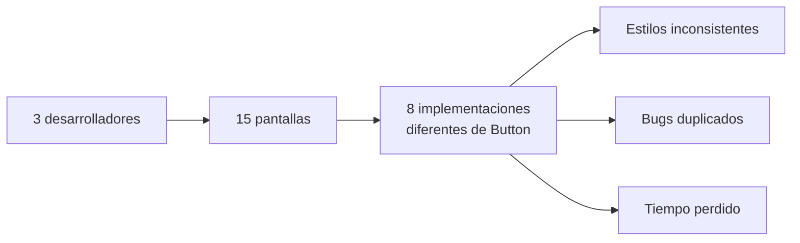
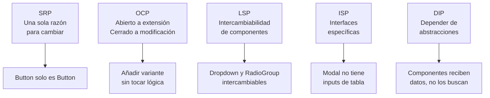
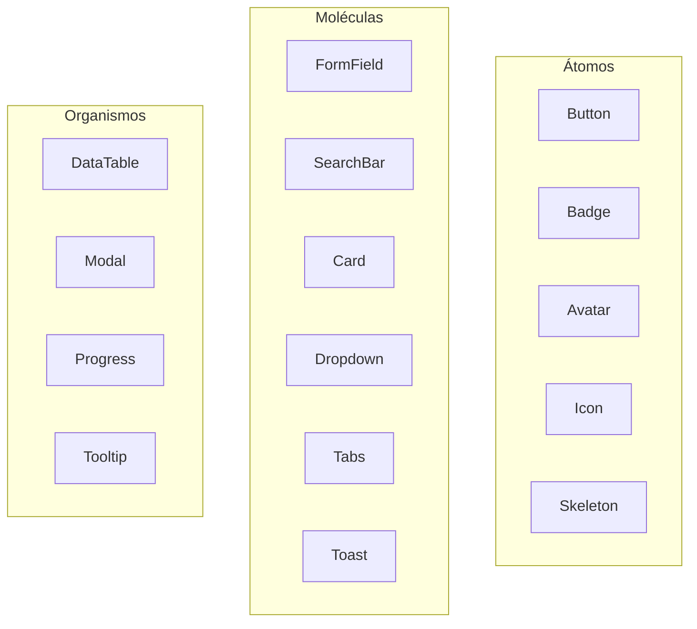
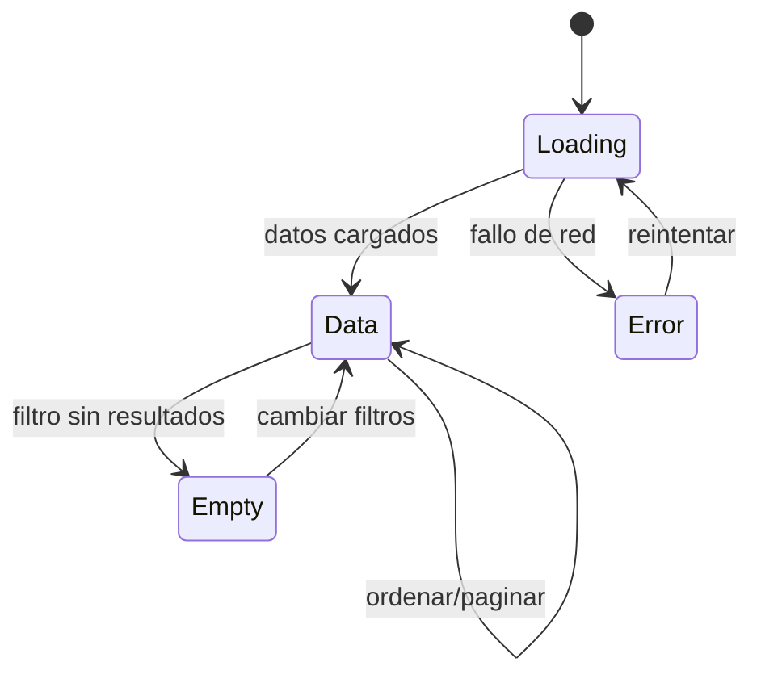
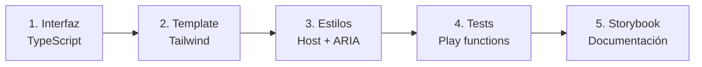
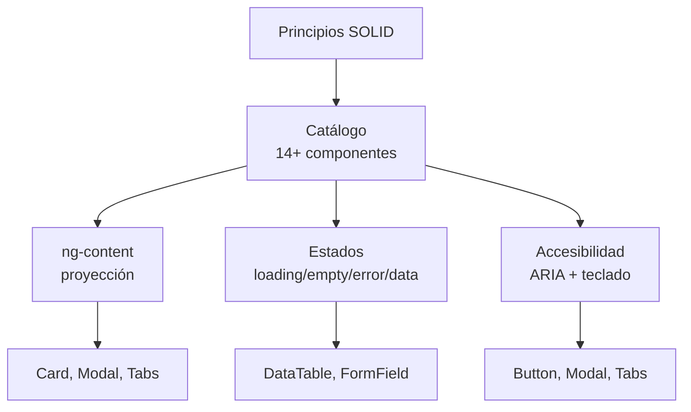

# Unidad 11 — Componentes Reutilizables

---

## Portada

### Módulo 0488 — Desarrollo de Interfaces
## Componentes Reutilizables
#### Catálogo UI con Angular Standalone + Tailwind + Signals

Note:
Bienvenidos a la Unidad 7. Hoy construiremos un catálogo completo de componentes UI reutilizables. Veremos cómo aplicar principios SOLID al diseño de componentes, cómo implementar accesibilidad desde el inicio, y cómo gestionar los 4 estados de interfaz de forma consistente. Al final de esta unidad tendréis una librería de componentes lista para usar en cualquier proyecto.

---

## Objetivos de aprendizaje

- Diseñar componentes <mark>verdaderamente reutilizables</mark> (SOLID) <!-- .element: class="fragment" -->
- Construir catálogo completo con Standalone + Tailwind 4 <!-- .element: class="fragment" -->
- Aplicar proyección de contenido con <mark>ng-content</mark> <!-- .element: class="fragment" -->
- Implementar accesibilidad integral (ARIA, teclado, foco) <!-- .element: class="fragment" -->
- Gestionar estados: <mark>loading, empty, error, data</mark> <!-- .element: class="fragment" -->
- Documentar API pública con tipado completo <!-- .element: class="fragment" -->

Note:
Seis objetivos clave. El más importante: que vuestros componentes sean verdaderamente reutilizables, no solo copias que pegáis entre proyectos. Para ello aplicaremos SOLID, accesibilidad por defecto, y una API bien tipada.

---

## Motivación: El coste de NO reutilizar



Note:
Imaginad un equipo de 3 desarrolladores trabajando en 15 pantallas. Sin componentes reutilizables, cada uno implementa sus propios botones, modales y tablas. El resultado: 8 variantes de Button diferentes, estilos inconsistentes, bugs duplicados, y tiempo perdido arreglando lo mismo en 8 sitios. Un Design System de componentes reutilizables evita todo esto.

---

## Qué hace que un componente sea reutilizable

| Pilar | Significado |
|-------|-------------|
| <mark>Genericidad</mark> | No contiene conceptos de negocio específicos |
| <mark>Configurabilidad</mark> | API rica de inputs para todas las variantes |
| <mark>Desacoplamiento</mark> | No depende de servicios, rutas ni modelos de dominio |
| <mark>Documentación</mark> | API pública documentada con tipos y ejemplos |

Note:
Cuatro pilares definen un componente reutilizable. Genericidad: un Button no sabe qué significa "guardar cambios". Configurabilidad: inputs para variantes, tamaños, estados. Desacoplamiento: no depende de servicios ni modelos de dominio. Documentación: sin ella, nadie sabrá cómo usar el componente correctamente.

---

## Principios SOLID aplicados a componentes UI



Note:
SOLID es perfectamente aplicable a componentes UI. SRP: un botón solo debe ser un botón. OCP: añadir variante "ghost" no debe modificar la lógica interna, solo añadir clases. LSP: un Dropdown y un RadioGroup que implementan la misma interfaz deben ser intercambiables. ISP: Modal no debe tener inputs de tabla. DIP: los componentes reciben datos por @Input, no los buscan ellos mismos.

---

## Catálogo de componentes: Grid visual



Note:
Nuestro catálogo tendrá 14+ componentes organizados por complejidad. Átomos: bloques fundamentales como Button, Badge, Avatar. Moléculas: combinaciones como FormField (label + input + error), SearchBar. Organismos: secciones complejas como DataTable con paginación y ordenación, Modal con trampa de foco. Cada nivel compone al anterior.

---

## Componente 1: Button — Interfaz TypeScript

```typescript
export type ButtonVariant = 'primary' | 'secondary' | 'outline' | 'ghost' | 'danger';
export type ButtonSize = 'sm' | 'md' | 'lg';
export type IconPosition = 'left' | 'right';

export const BUTTON_VARIANTS: ButtonVariant[] = [
  'primary', 'secondary', 'outline', 'ghost', 'danger'
];
export const BUTTON_SIZES: ButtonSize[] = ['sm', 'md', 'lg'];
```

Note:
La interfaz TypeScript define todas las opciones del componente. Usamos union types para variantes y tamaños, arrays constantes para iterar en la documentación. Esta es la "fuente de verdad" de lo que el componente soporta. El tipado estricto evita que se pasen valores inválidos.

---

## Button — Implementación con Signals

```typescript
@Component({
  selector: 'ui-button',
  standalone: true,
  imports: [NgClass],
  template: `...`,
  changeDetection: ChangeDetectionStrategy.OnPush,
})
export class ButtonComponent {
  variant = input<ButtonVariant>('primary');
  size = input<ButtonSize>('md');
  disabled = input(false);
  loading = input(false);
  icon = input<string | null>(null);
  iconPosition = input<IconPosition>('left');
  label = input<string | null>(null);
  type = input<'button' | 'submit' | 'reset'>('button');

  clicked = output<void>();

  isDisabled = computed(() => this.disabled() || this.loading());
  // buttonClasses = computed(...) — siguiente diapositiva
}
```

Note:
Usamos `input()` (signal inputs) en lugar de `@Input` decorator. Esto da máxima reactividad. `output()` reemplaza a `@Output` + `EventEmitter`. El computed `isDisabled` deriva su valor de `disabled` o `loading`. Todo el estado es reactivo y tipado. Observad que `type` por defecto es `'button'` para evitar envíos accidentales de formulario.

---

## Button — Clases dinámicas con computed

```typescript
buttonClasses = computed(() => {
  const base = 'inline-flex items-center justify-center gap-2 rounded-lg font-medium transition-all duration-150 focus-visible:outline-none focus-visible:ring-2';

  const variants: Record<ButtonVariant, string> = {
    primary: 'bg-blue-600 text-white hover:bg-blue-700 shadow-sm',
    secondary: 'bg-gray-100 text-gray-700 hover:bg-gray-200 border',
    outline: 'bg-transparent text-blue-600 hover:bg-blue-50 border border-blue-300',
    ghost: 'bg-transparent text-gray-600 hover:bg-gray-100',
    danger: 'bg-red-600 text-white hover:bg-red-700 shadow-sm',
  };

  const sizes: Record<ButtonSize, string> = {
    sm: 'px-3 py-1.5 text-sm',
    md: 'px-4 py-2 text-sm',
    lg: 'px-6 py-3 text-base',
  };

  return `${base} ${sizes[this.size()]} ${variants[this.variant()]}`;
});
```

Note:
Este patrón es clave: un `computed` que mapea los inputs de variante y tamaño a clases de Tailwind. El Record tipado garantiza que cubrimos todas las variantes. Si añadimos una nueva variante, TypeScript nos obliga a añadir su entrada en el Record. Así el componente está "abierto a extensión pero cerrado a modificación".

---

## Button — Template con estados

```html
<button
  [type]="type()"
  [disabled]="isDisabled()"
  [attr.aria-disabled]="isDisabled()"
  [attr.aria-busy]="loading()"
  [ngClass]="buttonClasses()"
  (click)="handleClick($event)">
  @if (loading()) {
    <span class="animate-spin" aria-hidden="true">⟳</span>
  }
  @if (icon() && !loading() && iconPosition() === 'left') {
    <span [innerHTML]="icon()" aria-hidden="true"></span>
  }
  @if (label()) {
    <span [class.sr-only]="loading()">{{ label() }}</span>
  }
  @if (loading()) {
    <span class="sr-only">Cargando...</span>
  }
</button>
```

Note:
El template maneja múltiples escenarios: icono a izquierda o derecha, estado loading (spinner animado), texto oculto para lectores de pantalla (`sr-only`). `aria-disabled` en lugar de `disabled` nativo permite mantener el foco. `aria-busy` notifica a tecnologías asistivas que el botón está procesando.

---

## Variantes de Button: Cuándo usar cada una

| Variante | Uso | Ejemplo |
|----------|-----|---------|
| <mark>Primary</mark> | Acción principal (1 por contexto) | "Guardar", "Enviar" |
| Secondary | Acción alternativa | "Cancelar", "Volver" |
| Outline | Importancia media | "Ver más", "Filtrar" |
| Ghost | Baja importancia | Acciones en tabla |
| Danger | Acción destructiva | "Eliminar cuenta" |

Note:
Cada variante tiene un propósito semántico. Primary debe ser único por contexto visual — si hay dos botones primary, el usuario no sabe cuál es la acción principal. Danger usa rojo como señal de advertencia. Ghost tiene mínimo impacto visual y es ideal para barras de herramientas.

---

## Componente 2: FormField — Estados visuales

```mermaid
stateDiagram-v2
    [*] --> Default
    Default --> Focus: usuario hace click
    Focus --> Filled: usuario escribe
    Filled --> Valid: valor correcto
    Filled --> Error: validación falla
    Error --> Valid: usuario corrige
    Default --> Disabled: disabled=true
    Focus --> Pending: validación asíncrona
```

Note:
Un FormField profesional gestiona 6 estados visuales. Default: borde gris neutro. Focus: borde azul con anillo. Filled: el campo tiene contenido. Valid: borde verde (confirmación sutil). Error: borde rojo con mensaje. Pending: borde amarillo con spinner. La transición entre estados debe ser suave con `transition-colors`.

---

## FormField — Implementación

```typescript
@Component({
  selector: 'ui-form-field',
  standalone: true,
  imports: [ReactiveFormsModule, NgClass],
  template: `...`,
  changeDetection: ChangeDetectionStrategy.OnPush,
})
export class FormFieldComponent {
  value = model<string>('');
  label = input<string>('');
  type = input<InputType>('text');
  placeholder = input<string>('');
  hint = input<string>('');
  error = input<string | null>(null);
  icon = input<string | null>(null);
  disabled = input(false);
  required = input(false);

  valueChange = output<string>();
  blurEvent = output<void>();
  focusEvent = output<void>();

  focused = signal(false);
}
```

Note:
Usamos `model()` para two-way binding del valor — el padre puede usar `[(value)]`. Los inputs definen la configuración visual. Los outputs permiten al padre reaccionar a cambios, foco y blur. La señal `focused` gestiona el estado local de foco para las clases condicionales.

---

## FormField — Template con feedback

```html
<div class="space-y-1.5">
  @if (label()) {
    <label [for]="fieldId" class="block text-sm font-medium"
           [class.text-red-600]="error()">
      {{ label() }}
      @if (required()) {
        <span class="text-red-500" aria-hidden="true">*</span>
        <span class="sr-only">(obligatorio)</span>
      }
    </label>
  }
  <input
    [id]="fieldId"
    [type]="type()"
    [disabled]="disabled()"
    [value]="value()"
    [attr.aria-invalid]="error() ? true : false"
    [attr.aria-describedby]="describedById"
    [ngClass]="inputClasses()"
    class="block w-full rounded-lg border px-3 py-2 text-sm transition-colors duration-150" />
  @if (error()) {
    <p class="text-xs text-red-600 animate-slideIn" role="alert">{{ error() }}</p>
  }
</div>
```

Note:
La asociación label-input con `for` es obligatoria para accesibilidad. `aria-invalid` se establece dinámicamente. `aria-describedby` enlaza el input con hint y error. El mensaje de error usa `role="alert"` para que lectores de pantalla lo anuncien automáticamente. La animación `animate-slideIn` suaviza la aparición del error.

---

## FormField — Clases condicionales por estado

```typescript
inputClasses = computed(() => ({
  'border-gray-300 focus:ring-blue-500': !this.focused() && !this.error(),
  'border-blue-500 ring-2 ring-blue-500': this.focused() && !this.error(),
  'border-red-400 focus:ring-red-400 text-red-900': !!this.error(),
  'bg-gray-50 text-gray-500 cursor-not-allowed': this.disabled(),
  'pl-10': !!this.icon(),
}));
```

### Mapeo de estados a clases: <!-- .element: class="fragment" -->
- Default → borde gris <!-- .element: class="fragment" -->
- Focus → borde azul + ring <!-- .element: class="fragment" -->
- Error → borde rojo + texto rojo <!-- .element: class="fragment" -->
- Disabled → fondo gris + cursor bloqueado <!-- .element: class="fragment" -->

Note:
Este `computed` mapea cada combinación de estados a clases Tailwind. Es reactivo: cuando `focused` o `error` cambian, las clases se actualizan automáticamente. Este patrón es la base para formularios con feedback visual rico.

---

## Componente 3: Card — Proyección de contenido

```html
<ui-card variant="elevated" padding="md">
  <div card-image>
    
  </div>
  <div card-header>
    <h3 class="text-lg font-semibold">Título de la tarjeta</h3>
  </div>
  <!-- Contenido sin selector va al body -->
  <p class="text-gray-600">Lorem ipsum dolor sit amet...</p>
  <div card-footer>
    <ui-button variant="ghost" size="sm">Cancelar</ui-button>
    <ui-button variant="primary" size="sm">Aceptar</ui-button>
  </div>
</ui-card>
```

Note:
La Card es el ejemplo perfecto de proyección de contenido con `ng-content`. El componente define 4 slots: `card-image`, `card-header`, contenido por defecto (body) y `card-footer`. El consumidor decide qué proyectar en cada slot. La Card no sabe nada sobre el contenido — es completamente genérica.

---

## Card — Implementación con detección de slots

```typescript
@Component({
  selector: 'ui-card',
  standalone: true,
  template: `
    <div [ngClass]="cardClasses()" [attr.role]="clickable() ? 'button' : null">
      @if (hasImage()) {
        <div class="overflow-hidden rounded-t-xl">
          <ng-content select="[card-image]" />
        </div>
      }
      @if (hasHeader()) {
        <div class="border-b px-6 py-4">
          <ng-content select="[card-header]" />
        </div>
      }
      <div [ngClass]="bodyPadding()"><ng-content /></div>
      @if (hasFooter()) {
        <div class="border-t bg-gray-50/50 px-6 py-3">
          <ng-content select="[card-footer]" />
        </div>
      }
    </div>
  `,
})
export class CardComponent {
  padding = input<'none' | 'sm' | 'md' | 'lg'>('md');
  variant = input<'default' | 'bordered' | 'elevated'>('default');
  clickable = input(false);
  cardClick = output<void>();

  private headerContent = contentChild('card-header');
  hasHeader = computed(() => !!this.headerContent());
  // ... hasFooter, hasImage
}
```

Note:
`contentChild` con el selector `'card-header'` detecta si se ha proyectado contenido en ese slot. Con esto condicionamos el renderizado de las secciones: si no hay header proyectado, no renderizamos el borde inferior. Esto evita contenedores vacíos y mantiene el componente limpio.

---

## Componente 4: Modal — Accesibilidad

```html
@if (open()) {
  <div class="fixed inset-0 z-50" role="dialog" aria-modal="true"
       [attr.aria-labelledby]="titleId">
    <!-- Overlay con fade -->
    <div class="fixed inset-0 bg-black/50 backdrop-blur-sm
                transition-opacity duration-300"
         (click)="closeOnBackdrop() && close()">
    </div>

    <!-- Panel -->
    <div class="flex min-h-full items-center justify-center p-4">
      <div class="bg-white rounded-xl shadow-2xl transform transition-all
                  duration-300" (click)="$event.stopPropagation()">
        @if (title()) {
          <div class="flex items-start justify-between border-b px-6 py-4">
            <h2 [id]="titleId" class="text-lg font-semibold">{{ title() }}</h2>
            <button (click)="close()" aria-label="Cerrar diálogo">✕</button>
          </div>
        }
        <div class="px-6 py-4"><ng-content /></div>
        @if (hasFooter()) {
          <div class="flex justify-end gap-3 border-t px-6 py-4">
            <ng-content select="[modal-footer]" />
          </div>
        }
      </div>
    </div>
  </div>
}
```

Note:
El Modal es el componente con más requisitos de accesibilidad. `role="dialog"` y `aria-modal="true"` lo identifican como diálogo modal. `aria-labelledby` asocia el título. Escape para cerrar, trampa de foco (siguiente diapositiva), bloqueo de scroll del body, retorno del foco al cerrar. El overlay intercepta clicks fuera.

---

## Modal — Trampa de foco y ciclo de vida

```typescript
private show(): void {
  this.previousActiveElement = document.activeElement as HTMLElement;
  document.body.style.overflow = 'hidden';
  requestAnimationFrame(() => this.visible.set(true));
  document.addEventListener('keydown', this.handleKeydown);
}

private handleKeydown = (event: KeyboardEvent): void => {
  if (event.key === 'Escape') this.close();
  if (event.key === 'Tab') {
    // Trampa de foco: mantener Tab dentro del modal
    const focusable = this.elementRef.nativeElement.querySelectorAll(
      'button, [href], input, select, textarea, [tabindex]:not([tabindex="-1"])'
    );
    // ... lógica de trampa de foco
  }
};

private hide(): void {
  this.visible.set(false);
  document.body.style.overflow = '';
  document.removeEventListener('keydown', this.handleKeydown);
  setTimeout(() => {
    this.closed.emit();
    this.previousActiveElement?.focus(); // Retornar el foco
  }, 300);
}
```

Note:
La trampa de foco es obligatoria para accesibilidad: al tabular, el foco debe circular dentro del modal sin escaparse al contenido de fondo. Escape cierra el modal. Al cerrar, devolvemos el foco al elemento que lo abrió. Bloqueamos el scroll del body mientras el modal está abierto. El timing de 300ms coincide con la animación de salida.

---

## Componente 5: DataTable — Estados



Note:
La DataTable gestiona 4 estados de interfaz. Loading: skeletons mientras se cargan datos. Empty: mensaje cuando no hay resultados. Error: mensaje de error con botón de reintentar. Data: la tabla con datos, ordenación y paginación. Todos los componentes del catálogo deben manejar estos 4 estados de forma consistente.

---

## DataTable — Interfaz genérica tipada

```typescript
export interface Column<T = any> {
  key: string;
  label: string;
  sortable?: boolean;
  type?: 'text' | 'number' | 'currency' | 'date' | 'badge' | 'custom';
  width?: string;
  align?: 'left' | 'center' | 'right';
  cellTemplate?: TemplateRef<any>;
}

@Component({...})
export class DataTableComponent<T extends Record<string, any>> {
  columns = input.required<Column<T>[]>();
  data = input<T[]>([]);
  loading = input(false);
  error = input<string | null>(null);
  selectable = input(false);
  pagination = input(false);
  // ...
  sortChange = output<SortEvent>();
  rowClick = output<T>();
  selectionChange = output<T[]>();
  pageChange = output<number>();
  retry = output<void>();
}
```

Note:
La DataTable es genérica (`<T extends Record<string, any>>`). Funciona con cualquier tipo de datos: productos, usuarios, pedidos. Las columnas definen qué campo mostrar, si es ordenable, el tipo de renderizado (texto, moneda, fecha, badge, o plantilla personalizada). Los outputs permiten al padre reaccionar a ordenación, selección, paginación y clics en filas.

---

## DataTable — Template de estados

```html
@if (loading()) {
  <ui-skeleton-table [rows]="5" [columns]="columns().length" />
} @else if (error()) {
  <div class="flex flex-col items-center p-12 text-center">
    <h3 class="text-lg font-medium">Error al cargar los datos</h3>
    <p class="mt-1 text-sm text-gray-500">{{ error() }}</p>
    <ui-button variant="outline" size="sm" class="mt-4" (clicked)="retry.emit()">
      Reintentar
    </ui-button>
  </div>
} @else if (data().length === 0) {
  <div class="flex flex-col items-center p-12 text-center">
    <h3 class="text-lg font-medium">{{ emptyMessage() }}</h3>
    <p class="mt-1 text-sm text-gray-500">{{ emptyDescription() }}</p>
  </div>
} @else {
  <!-- Tabla con datos: thead, tbody, paginación -->
}
```

Note:
El template de la DataTable usa `@if` para renderizar el estado correcto. Loading → skeletons. Error → mensaje + botón reintentar. Empty → mensaje descriptivo. Data → la tabla completa. Este patrón de 4 estados debe aplicarse a todos los componentes que cargan datos.

---

## Componente 6: Tabs — Navegación por teclado

```html
<div role="tablist">
  <div class="flex -mb-px space-x-1">
    @for (tab of tabs(); track tab.id) {
      <button
        type="button"
        role="tab"
        [attr.aria-selected]="activeTab() === tab.id"
        [attr.aria-controls]="'tabpanel-' + tab.id"
        [id]="'tab-' + tab.id"
        class="px-4 py-2.5 text-sm font-medium border-b-2 transition-colors"
        [class.border-blue-500]="activeTab() === tab.id"
        (click)="selectTab(tab.id)"
        (keydown.arrowLeft)="focusTab('prev')"
        (keydown.arrowRight)="focusTab('next')">
        {{ tab.label }}
      </button>
    }
  </div>
</div>
<div class="pt-4"><ng-content /></div>
```

Note:
Las pestañas implementan navegación completa por teclado: flechas izquierda/derecha para moverse entre tabs, `aria-selected` para indicar cuál está activa, `aria-controls` para asociar cada tab con su panel de contenido, `role="tablist"` y `role="tab"` para que los lectores de pantalla entiendan la estructura.

---

## Componente 7: Toast — Servicio + Componente

### Servicio (ToastService)
```typescript
@Injectable({ providedIn: 'root' })
export class ToastService {
  private toastsSignal = signal<Toast[]>([]);
  toasts = this.toastsSignal.asReadonly();

  success(title: string, message?: string): string {
    return this.show({ type: 'success', title, message });
  }

  error(title: string, message?: string): string {
    return this.show({ type: 'error', title, message, duration: 8000 });
  }

  dismiss(id: string): void { /* animar salida y eliminar */ }
}
```

Note:
El sistema de notificaciones se compone de un servicio (ToastService) que gestiona la lista de toasts activos como Signals, y un componente que los renderiza. El servicio expone métodos semánticos: `success()`, `error()`, `warning()`, `info()`. Cada toast tiene un `duration` y se auto-elimina con animación de salida.

---

## Componentes complementarios

| Componente | Inputs clave | Outputs |
|-----------|-------------|---------|
| **Badge** | `label`, `variant`, `size`, `removable` | `remove` |
| **Avatar** | `src`, `name`, `size` (xs-xl) | — |
| **Skeleton** | `variant` (text/circle/card/table-row) | — |
| **Progress** | `value`, `max`, `color`, `showLabel` | — |
| **Tooltip** | `text`, `position` | — |

Note:
Estos componentes más pequeños completan el catálogo. Badge para etiquetas y estados. Avatar con iniciales automáticas si no hay imagen. Skeleton con variantes para texto, círculos, tarjetas y filas de tabla. Progress con ARIA (role="progressbar"). Tooltip con posicionamiento y accesibilidad.

---

## Patrón de desarrollo: TypeScript → Template → Tests



Note:
El flujo de desarrollo de cada componente sigue este patrón consistente. Primero definimos la interfaz TypeScript (tipos, inputs, outputs). Luego el template con Tailwind y atributos ARIA. Después estilos del host. A continuación tests de interacción con play functions. Finalmente documentación en Storybook. Este orden garantiza que no nos saltamos ningún aspecto.

---

## Accesibilidad: Checklist por componente

1. ✅ Elemento HTML nativo correcto (`<button>`, no `<div onclick>`) <!-- .element: class="fragment" -->
2. ✅ `role` y `aria-*` apropiados <!-- .element: class="fragment" -->
3. ✅ Navegación completa por teclado <!-- .element: class="fragment" -->
4. ✅ Foco visible (`focus-visible`, no `focus`) <!-- .element: class="fragment" -->
5. ✅ Contraste WCAG AA (ratio 4.5:1) <!-- .element: class="fragment" -->
6. ✅ Texto accesible (`aria-label`, `sr-only`) <!-- .element: class="fragment" -->

Note:
Esta checklist debe aplicarse a cada componente antes de darlo por terminado. Usar elementos nativos siempre que sea posible: un `<button>` ya tiene rol, foco y comportamiento de teclado gratis. `focus-visible` en lugar de `focus` evita anillos de foco molestos al hacer click con ratón. El contraste 4.5:1 es el mínimo para WCAG AA.

---

## Demo: Construyendo un Dashboard con el catálogo

```html
<div class="mx-auto max-w-7xl px-4 py-8">
  <h1 class="text-2xl font-bold text-gray-900">Dashboard</h1>

  <div class="mt-6 grid grid-cols-1 gap-6 sm:grid-cols-2 lg:grid-cols-4">
    <ui-card variant="default" padding="md">
      <div class="flex items-center justify-between">
        <p class="text-sm text-gray-500">Ventas totales</p>
        <ui-badge variant="success" label="+12.5%" size="sm" />
      </div>
      <p class="mt-3 text-3xl font-bold">€24,500</p>
    </ui-card>
    <!-- Más cards... -->
  </div>

  <div class="mt-8">
    <ui-data-table
      [columns]="columns"
      [data]="transactions()"
      [loading]="loading()"
      [pagination]="true"
      [pageSize]="10"
      (sortChange)="onSort($event)" />
  </div>
</div>
```

Note:
Vamos a ver cómo se integran los componentes. Un dashboard construido exclusivamente con componentes del catálogo: Cards que envuelven contenido, Badges para tendencias, DataTable para transacciones. Todo usa los mismos tokens de diseño, la misma tipografía, los mismos espaciados. Consistencia garantizada.

---

## Actividad en clase: Construir un SearchBar

**Duración:** 45 minutos

**Objetivo:** Construir un componente SearchBar reutilizable con debounce, limpieza y accesibilidad

**Entregable:** `SearchBarComponent` funcional con:
- Input de búsqueda con icono de lupa <!-- .element: class="fragment" -->
- Botón de limpiar (X) que aparece cuando hay texto <!-- .element: class="fragment" -->
- Debounce de 300ms antes de emitir <!-- .element: class="fragment" -->
- `aria-label` en el input y en el botón de limpiar <!-- .element: class="fragment" -->
- Tecla Escape limpia el campo <!-- .element: class="fragment" -->

Note:
Poned en práctica el patrón: definid primero la interfaz TypeScript (inputs, outputs), luego el template con Tailwind y atributos ARIA, y finalmente la lógica de debounce y limpieza. El debounce se implementa con RxJS `debounceTime(300)` sobre el valueChanges.

---

## Buenas prácticas

1. Interfaz TypeScript primero — define qué hace el componente <!-- .element: class="fragment" -->
2. Usar elementos HTML nativos, no reinventar con `<div>` <!-- .element: class="fragment" -->
3. `ChangeDetectionStrategy.OnPush` en todos los componentes <!-- .element: class="fragment" -->
4. Cada variante = una entrada en Record tipado, nunca if/else <!-- .element: class="fragment" -->
5. Los 4 estados (loading, empty, error, data) en todo componente de datos <!-- .element: class="fragment" -->
6. Accesibilidad desde el primer commit, no como "mejora posterior" <!-- .element: class="fragment" -->

Note:
Estas 6 prácticas definen un desarrollo profesional de componentes. La más importante: accesibilidad desde el inicio. Añadir ARIA después de construir el componente es mucho más costoso que incluirlo desde el primer momento. El Record tipado para variantes fuerza a TypeScript a verificar que cubrís todos los casos.

---

## Errores frecuentes

1. ❌ `type="submit"` por defecto en botones dentro de formularios <!-- .element: class="fragment" -->
2. ❌ Usar `<div onclick>` en lugar de `<button>` <!-- .element: class="fragment" -->
3. ❌ Olvidar `role="alert"` en mensajes de error dinámicos <!-- .element: class="fragment" -->
4. ❌ No asociar label con input mediante `for` <!-- .element: class="fragment" -->
5. ❌ Mostrar errores antes de que el usuario interactúe <!-- .element: class="fragment" -->
6. ❌ Skeleton que no coincide en dimensiones con el contenido real <!-- .element: class="fragment" -->

Note:
Errores muy comunes y fáciles de evitar. Un `<button>` dentro de un `<form>` con `type="submit"` por defecto enviará el formulario aunque no queráis. Poned siempre `type="button"` explícito. Los mensajes de error sin `role="alert"` no son anunciados por lectores de pantalla. El skeleton debe tener las mismas dimensiones que el contenido que reemplaza, si no, hay un salto visual molesto.

---

## Resumen



Note:
Hemos cubierto: principios SOLID aplicados a componentes, catálogo de 14+ componentes desde átomos hasta organismos, proyección de contenido con ng-content para componentes compuestos, gestión consistente de 4 estados en todos los componentes, y accesibilidad integral con ARIA, teclado y foco. Este catálogo es vuestra base para construir cualquier interfaz.

---

## Próximos pasos

### Unidad 08 — Formularios e Interacción

- Reactive Forms en profundidad <!-- .element: class="fragment" -->
- Validadores personalizados (DNI, IBAN, password match) <!-- .element: class="fragment" -->
- UX de formularios: cuándo mostrar errores <!-- .element: class="fragment" -->
- Formularios multi-paso con Signals <!-- .element: class="fragment" -->
- Micro-interacciones y animaciones <!-- .element: class="fragment" -->

Note:
En la próxima unidad aplicaremos los componentes FormField, Button y Modal en formularios reactivos avanzados. Veremos validadores personalizados, formularios wizard multi-paso, auto-guardado, y cómo las micro-interacciones mejoran la percepción de calidad. ¡Preparad los formularios!
