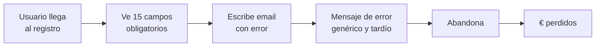
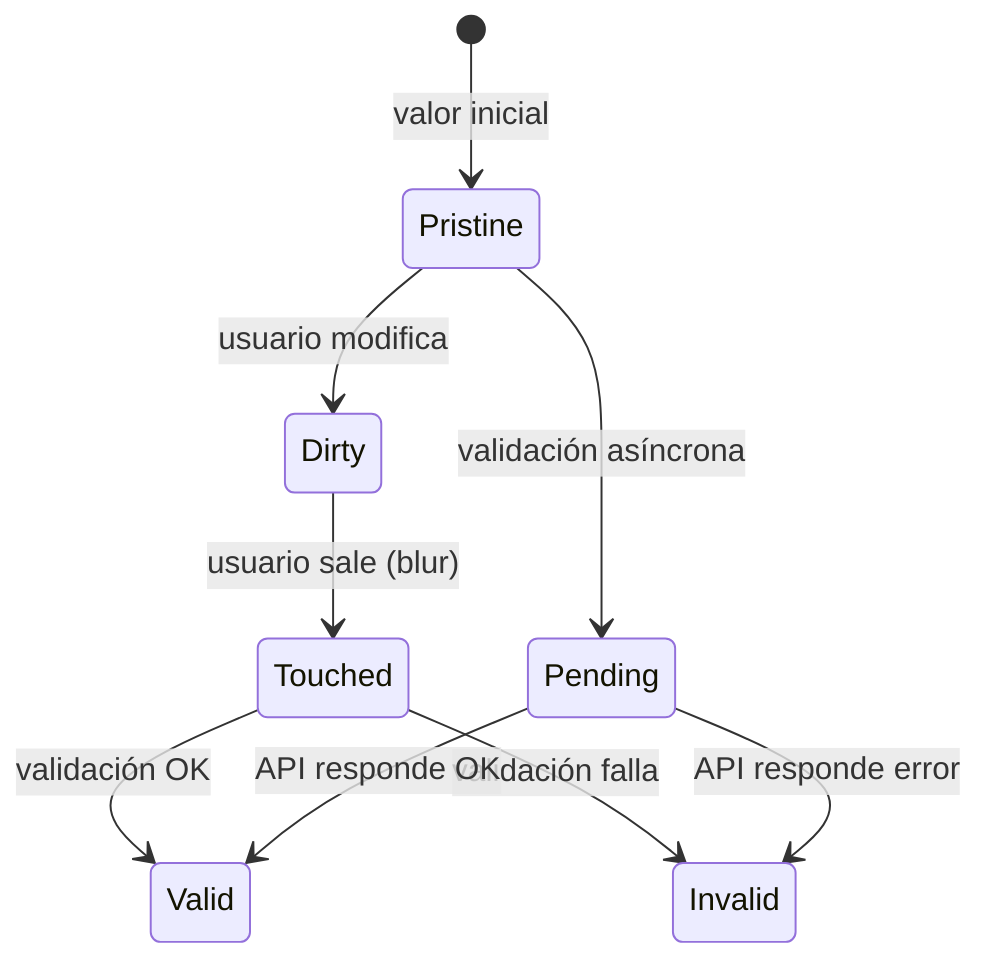
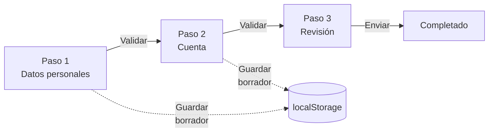
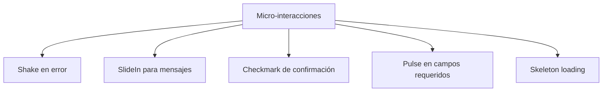
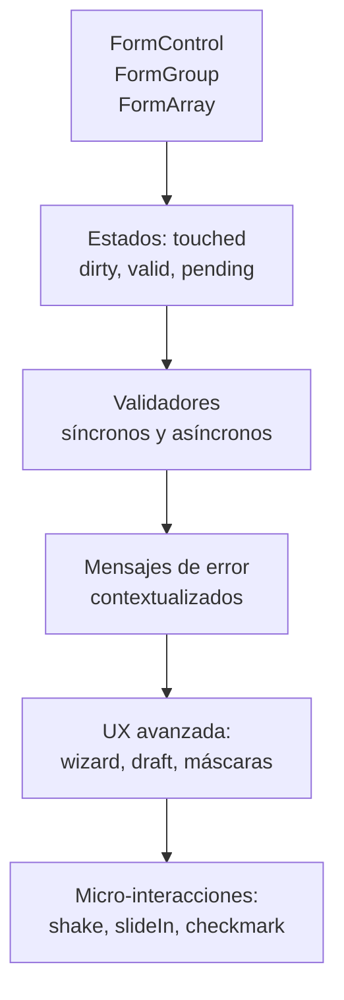

# Unidad 12 — Formularios e Interacción

---

## Portada

### Módulo 0488 — Desarrollo de Interfaces
## Formularios e Interacción
#### Reactive Forms + Validación + UX + Micro-interacciones

Note:
Bienvenidos a la Unidad 12. Los formularios son el punto de fricción más crítico entre el usuario y la aplicación. Un formulario mal diseñado pierde usuarios; uno bien diseñado los convierte. Hoy veremos Reactive Forms en profundidad, validadores personalizados, UX avanzada y micro-interacciones que marcan la diferencia.

---

## Objetivos de aprendizaje

- Dominar Reactive Forms: <mark>FormControl, FormGroup, FormArray</mark> <!-- .element: class="fragment" -->
- Crear validadores síncronos y asíncronos personalizados <!-- .element: class="fragment" -->
- Construir mensajes de error contextualizados y accesibles <!-- .element: class="fragment" -->
- Implementar formularios multi-paso con Signals <!-- .element: class="fragment" -->
- Auto-guardado de borradores y confirmación de salida <!-- .element: class="fragment" -->
- Micro-interacciones: shake, slideIn, checkmark, pulse <!-- .element: class="fragment" -->

Note:
Seis objetivos que cubren todo el ciclo de vida de un formulario profesional. Desde la estructura con FormControl/FormGroup/FormArray, pasando por validaciones síncronas y asíncronas, hasta la UX avanzada con wizards, auto-guardado y micro-interacciones.

---

## Motivación: El caso del registro abandonado



### El 67% de los usuarios abandona formularios mal diseñados

Note:
Estadística real: 2 de cada 3 usuarios abandonan formularios con mala UX. Los motivos principales: demasiados campos de golpe, validación agresiva (errores antes de escribir), mensajes de error poco útiles, y falta de feedback visual. Cada abandono es dinero perdido. Vamos a aprender a diseñar formularios que los usuarios completen.

---

## Sección A: Reactive Forms — La base

```typescript
this.invoiceForm = this.fb.group({
  header: this.fb.group({
    number: ['', [Validators.required, Validators.pattern(/^FAC-\d{4}-\d{4}$/)]],
    date: [new Date().toISOString().split('T')[0], Validators.required],
  }),
  client: this.fb.group({
    name: ['', Validators.required],
    cif: ['', [Validators.required, cifValidator()]],
    email: ['', [Validators.required, Validators.email]],
  }),
  lines: this.fb.array([this.createLine()]),
});
```

Note:
Reactive Forms sitúa la lógica en TypeScript, no en el HTML. Tres bloques: `FormControl` (un campo), `FormGroup` (agrupación de controles), `FormArray` (colección dinámica). En el ejemplo: header y client son FormGroups, lines es un FormArray. Cada control tiene su valor inicial y validadores.

---

## Estados de un FormControl



Note:
Un FormControl tiene 6 propiedades de estado. `touched`/`untouched`: ¿ha interactuado y salido? `dirty`/`pristine`: ¿ha modificado el valor? `valid`/`invalid`: ¿pasa los validadores? `pending`: ¿hay validación asíncrona en curso? La regla de oro: NUNCA mostrar errores en campos untouched. Dejad que el usuario interactúe primero.

---

## La regla de oro de los errores

```typescript
// ❌ MAL: mostrar error siempre
if (control.invalid) { ... }

// ✅ BIEN: mostrar error solo después de tocar
if (control.invalid && control.touched) { ... }

// ✅ BIEN: mostrar error si se intentó enviar
if (control.invalid && (control.touched || formSubmitted)) { ... }
```

### Principio: <!-- .element: class="fragment" -->
Un formulario recién cargado debe verse <mark>limpio</mark>, sin campos en rojo ni mensajes de error <!-- .element: class="fragment" -->

Note:
Esta regla es la diferencia entre un formulario profesional y uno amateur. Mostrar errores antes de que el usuario haya escrito nada es hostil. El usuario no ha tenido oportunidad de hacerlo bien. Los errores deben aparecer solo después de que el usuario haya interactuado con el campo (touched) o tras un intento de envío fallido.

---

## Clases CSS condicionales por estado

```typescript
emailClasses = computed(() => {
  const c = this.emailControl;
  return {
    'border-gray-300': c.pristine,
    'border-green-400 focus:ring-green-500': c.valid && c.touched,
    'border-red-400 focus:ring-red-500': c.invalid && c.touched,
    'border-yellow-400 bg-yellow-50': c.pending,
  };
});

showEmailError = computed(() =>
  this.emailControl.invalid && this.emailControl.touched
);
```

Note:
Este patrón mapea cada estado del control a clases Tailwind. Pristine: borde gris neutro. Valid + touched: borde verde (confirmación sutil). Invalid + touched: borde rojo. Pending: borde amarillo + spinner. Todo reactivo con `computed()`. Las clases se actualizan automáticamente cuando el estado del control cambia.

---

## Sección B: Validadores personalizados

### DNI español

```typescript
export function dniValidator(): ValidatorFn {
  return (control: AbstractControl): ValidationErrors | null => {
    const value = control.value;
    if (!value) return null;

    const dniRegex = /^(\d{8})([A-Z])$/;
    const match = value.toUpperCase().match(dniRegex);
    if (!match) {
      return { dni: { message: 'Formato: 8 dígitos + letra' } };
    }

    const number = parseInt(match[1], 10);
    const letter = match[2];
    const validLetters = 'TRWAGMYFPDXBNJZSQVHLCKE';
    const calculatedLetter = validLetters[number % 23];

    if (letter !== calculatedLetter) {
      return { dni: { message: 'La letra no coincide con el número' } };
    }
    return null;
  };
}
```

Note:
Un `ValidatorFn` recibe un `AbstractControl` y devuelve `null` (válido) o un objeto de error (inválido). El validador de DNI comprueba: 8 dígitos + 1 letra, y que la letra corresponda al número según el algoritmo módulo 23. El objeto de error incluye un mensaje descriptivo que usaremos para mostrar feedback.

---

## Validación cross-field: Password match

```typescript
export function passwordMatchValidator(
  passwordKey: string, confirmKey: string
): ValidatorFn {
  return (group: AbstractControl): ValidationErrors | null => {
    const password = group.get(passwordKey);
    const confirm = group.get(confirmKey);
    if (!password || !confirm) return null;

    if (password.value !== confirm.value) {
      const error = { passwordMismatch: true };
      confirm.setErrors({ ...confirm.errors, ...error });
      return error;
    }

    // Limpiar error si coincide
    if (confirm.hasError('passwordMismatch')) {
      const { passwordMismatch, ...otherErrors } = confirm.errors || {};
      confirm.setErrors(
        Object.keys(otherErrors).length ? otherErrors : null
      );
    }
    return null;
  };
}
```

Note:
La validación cross-field se aplica al FormGroup, no a controles individuales. Compara dos campos — típicamente contraseña y confirmación. Cuando no coinciden, añade el error al campo de confirmación. Cuando coinciden, lo limpia sin afectar otros errores que pueda tener. Este patrón es reutilizable para cualquier par de campos (fechas inicio/fin, email principal/secundario).

---

## Validación asíncrona: Email exists

```typescript
private emailExistsValidator(): AsyncValidatorFn {
  return (control: AbstractControl): Observable<ValidationErrors | null> => {
    if (!control.value) return of(null);

    return this.userService.checkEmailExists(control.value).pipe(
      debounceTime(500),       // No saturar la API
      distinctUntilChanged(),  // Evitar peticiones duplicadas
      map(exists => exists ? { emailExists: true } : null),
      catchError(() => of(null)), // Error de red → no bloquear
      first(),                  // Completar tras primera emisión
    );
  };
}

// Uso
this.emailControl = new FormControl('', {
  validators: [Validators.required, Validators.email],
  asyncValidators: [this.emailExistsValidator()],
  updateOn: 'blur',  // Validar al perder el foco
});
```

Note:
La validación asíncrona consulta una API externa. Es crucial: `debounceTime(500)` para no enviar una petición por pulsación, `distinctUntilChanged()` para no repetir la misma consulta, `catchError` para no bloquear el formulario si la API falla. `updateOn: 'blur'` es la mejor opción: valida cuando el usuario termina con el campo, no a cada tecla.

---

## updateOn: Cuándo validar

| Opción | Cuándo valida | Recomendado para |
|--------|--------------|------------------|
| `'change'` | Cada pulsación | Formularios cortos, sin async |
| <mark>`'blur'`</mark> | Al perder el foco | **Mayoría de formularios** |
| `'submit'` | Solo al enviar | Formularios muy cortos |

Note:
`'change'` da feedback inmediato pero puede ser molesto (error mientras escribes). `'blur'` es respetuoso: espera a que termines con el campo. `'submit'` concentra todo al final — frustrante para formularios largos. La recomendación general: `'blur'` para campos con validación asíncrona, `'change'` para campos simples.

---

## Sección C: Mensajes de error

### Sistema profesional de mensajes

```typescript
getErrorMessage(control: AbstractControl, fieldName: string): string | null {
  if (!control.errors || (!control.touched && !this.formSubmitted)) return null;

  const errors = control.errors;
  if (errors['required']) return `"${fieldName}" es obligatorio`;
  if (errors['email']) return 'Introduce un email válido';
  if (errors['minlength'])
    return `Mínimo ${errors['minlength'].requiredLength} caracteres`;
  if (errors['dni']) return errors['dni'].message;
  if (errors['emailExists']) return 'Este email ya está registrado';
  if (errors['passwordMismatch']) return 'Las contraseñas no coinciden';
  if (errors['dateRange']) return errors['dateRange'].message;

  return 'Campo inválido';
}
```

Note:
Un sistema profesional de mensajes mapea cada tipo de error de validación a un texto descriptivo en el idioma del usuario. Los errores de validadores personalizados (dni, iban, dateRange) incluyen el mensaje en el propio objeto de error. El sistema solo muestra el mensaje si el control está `touched` o si se intentó enviar el formulario.

---

## FormErrorComponent reutilizable

```typescript
@Component({
  selector: 'ui-form-error',
  standalone: true,
  template: `
    @if (errorMessage()) {
      <p class="mt-1.5 text-xs text-red-600 animate-slideIn flex items-start gap-1"
         role="alert">
        <svg class="h-3.5 w-3.5 mt-0.5 shrink-0" aria-hidden="true">...</svg>
        <span>{{ errorMessage() }}</span>
      </p>
    }
  `,
})
export class FormErrorComponent {
  control = input.required<AbstractControl>();
  fieldName = input('Este campo');
  errorMessage = signal<string | null>(null);

  // Se suscribe a statusChanges para actualizar el mensaje
}
```

### Uso: <!-- .element: class="fragment" -->
```html
<ui-form-error [control]="form.get('email')!" fieldName="Email" />
```

Note:
Este componente encapsula toda la lógica de presentación de errores. Se suscribe a `statusChanges` del control y actualiza el mensaje reactivamente. Usa `role="alert"` para que los lectores de pantalla anuncien el error automáticamente. La animación `animate-slideIn` suaviza la aparición.

---

## UX de validación: Las 4 reglas de oro

1. <mark>No mostrar errores antes de la interacción</mark> <!-- .element: class="fragment" -->
2. <mark>Validar en el momento adecuado</mark> (blur para formato, change para simple) <!-- .element: class="fragment" -->
3. <mark>Limpiar errores al corregir</mark> — borde verde inmediato <!-- .element: class="fragment" -->
4. <mark>Resumen al enviar</mark> — marcar todos touched + scroll al primer error <!-- .element: class="fragment" -->

Note:
Cuatro reglas que definen la UX de validación. La 4ª es crítica: cuando el usuario pulsa "Enviar" y hay errores, marcamos todos los campos como touched, mostramos todos los errores, y hacemos scroll automático al primer campo con error. Esto evita que el usuario tenga que buscar dónde está el problema.

---

## Scroll al primer error al enviar

```typescript
submitForm(): void {
  this.formSubmitted = true;

  if (this.form.invalid) {
    this.markFormGroupTouched(this.form);
    afterNextRender(() => {
      const firstError = document.querySelector('.ng-invalid');
      firstError?.scrollIntoView({ behavior: 'smooth', block: 'center' });
      (firstError as HTMLElement)?.focus();
    });
    return;
  }
  this.processForm();
}

private markFormGroupTouched(formGroup: FormGroup): void {
  Object.values(formGroup.controls).forEach(control => {
    control.markAsTouched();
    if (control instanceof FormGroup) this.markFormGroupTouched(control);
  });
}
```

Note:
Al enviar un formulario inválido: marcamos recursivamente todos los controles como touched (incluyendo FormGroups anidados), buscamos el primer elemento con clase `.ng-invalid`, hacemos scroll suave hasta él y lo enfocamos. Esto da al usuario un camino claro: "el problema está aquí, corrígelo".

---

## Sección D: Formularios multi-paso (Wizard)



Note:
Los wizards dividen formularios largos en pasos secuenciales, reduciendo la carga cognitiva y la tasa de abandono. Cada paso es un FormGroup independiente que se valida antes de avanzar. La barra de progreso muestra pasos completados (check), paso actual (azul) y pendientes (gris). El botón "Guardar borrador" persiste en localStorage.

---

## Wizard — Implementación con Signals

```typescript
@Component({...})
export class WizardFormComponent {
  currentStep = signal(0);
  completedSteps = signal<Set<number>>(new Set());

  steps = [
    { id: 'personal', label: 'Datos personales', group: 'personalInfo' },
    { id: 'account', label: 'Cuenta', group: 'accountInfo' },
    { id: 'review', label: 'Revisión', group: 'review' },
  ];

  form = this.fb.group({
    personalInfo: this.fb.group({
      firstName: ['', Validators.required],
      lastName: ['', Validators.required],
      dni: ['', [Validators.required, dniValidator()]],
    }),
    accountInfo: this.fb.group({
      email: ['', [Validators.required, Validators.email]],
      passwords: this.fb.group({...}, {
        validators: passwordMatchValidator('password', 'confirm')
      }),
    }),
    review: this.fb.group({
      acceptTerms: [false, Validators.requiredTrue],
    }),
  });

  nextStep(): void {
    if (this.currentGroup().invalid) {
      this.markGroupTouched(this.currentGroup());
      return;
    }
    this.completedSteps.update(s => new Set(s).add(this.currentStep()));
    this.currentStep.update(s => Math.min(s + 1, this.steps.length - 1));
  }
}
```

Note:
La clave del wizard con Signals: `currentStep` controla qué paso se renderiza, `completedSteps` guarda qué pasos se han completado (para la barra de progreso). `nextStep()` valida el paso actual antes de avanzar — si es inválido, marca los campos del paso como touched y no avanza. El último paso muestra "Completar" en lugar de "Siguiente".

---

## Formularios dinámicos con FormArray

```typescript
// Factura con líneas dinámicas
invoiceForm = this.fb.group({
  lines: this.fb.array([this.createLine()])
});

get lines(): FormArray {
  return this.invoiceForm.get('lines') as FormArray;
}

createLine(): FormGroup {
  return this.fb.group({
    description: ['', Validators.required],
    quantity: [1, [Validators.required, Validators.min(1)]],
    unitPrice: [0, [Validators.required, Validators.min(0)]],
  });
}

addLine(): void {
  this.lines.push(this.createLine());
}

removeLine(index: number): void {
  this.lines.removeAt(index);
}
```

Note:
Los FormArray permiten añadir y eliminar dinámicamente grupos de campos. Esencial para facturas (líneas), direcciones (múltiples direcciones), miembros de equipo. `push()` añade, `removeAt()` elimina. Se puede deshabilitar el botón de eliminar si solo queda una línea. Tras añadir, hacemos scroll hasta la nueva línea para feedback visual.

---

## FormArray — Cálculos reactivos con Signals

```typescript
lineTotals = computed(() =>
  this.lines.controls.map((_, i) => {
    const line = this.lines.at(i);
    return (line.get('quantity')?.value || 0) *
           (line.get('unitPrice')?.value || 0);
  })
);

subtotal = computed(() => this.lineTotals().reduce((s, t) => s + t, 0));
tax = computed(() => this.subtotal() * 0.21);
total = computed(() => this.subtotal() + this.tax());
```

### Template: <!-- .element: class="fragment" -->
```html
<p class="text-sm font-semibold">{{ lineTotals()[i] | currency:'EUR' }}</p>
<!-- ... -->
<dd class="font-bold">{{ total() | currency:'EUR' }}</dd>
```

Note:
Los `computed` derivan subtotal, IVA y total en tiempo real a partir de los valores del FormArray. Cuando el usuario cambia cantidad o precio, los totales se recalculan instantáneamente. Esto es mucho más eficiente que recalcular en cada evento de cambio. La reactividad de Signals brilla aquí.

---

## Auto-guardado de borradores (FormDraftService)

```typescript
@Injectable({ providedIn: 'root' })
export class FormDraftService {
  private readonly PREFIX = 'form_draft_';

  save(formId: string, data: any): void {
    localStorage.setItem(
      this.PREFIX + formId,
      JSON.stringify({ data, timestamp: Date.now() })
    );
  }

  load(formId: string): any | null {
    const stored = localStorage.getItem(this.PREFIX + formId);
    if (!stored) return null;
    const draft = JSON.parse(stored);
    // Expirar borradores de más de 24h
    if (Date.now() - draft.timestamp > 24 * 60 * 60 * 1000) {
      this.clear(formId);
      return null;
    }
    return draft.data;
  }

  clear(formId: string): void {
    localStorage.removeItem(this.PREFIX + formId);
  }
}
```

Note:
El auto-guardado mejora drásticamente la UX en formularios largos. Cada 2 segundos, si el formulario está `dirty`, guardamos en localStorage. Al volver a la página, detectamos si hay un borrador y preguntamos si recuperarlo. Los borradores expiran a las 24 horas. Al enviar exitosamente, limpiamos el borrador.

---

## Auto-guardado — Integración en el componente

```typescript
ngOnInit(): void {
  // Recuperar borrador
  const draft = this.draftService.load(this.FORM_ID);
  if (draft && confirm('Tienes un borrador de hace ' +
      this.draftService.getDraftAge(this.FORM_ID) + '. ¿Recuperarlo?')) {
    this.productForm.patchValue(draft);
  }

  // Auto-guardar cada 2 segundos
  this.draftSub = this.productForm.valueChanges.pipe(
    debounceTime(2000),
    filter(() => this.productForm.dirty),
  ).subscribe(value => this.draftService.save(this.FORM_ID, value));
}

submitForm(): void {
  if (this.productForm.valid) {
    this.productService.create(this.productForm.value).subscribe(() => {
      this.draftService.clear(this.FORM_ID); // Limpiar al guardar
      this.router.navigate(['/products']);
    });
  }
}
```

Note:
Dos detalles importantes: al preguntar por la recuperación, mostramos la antigüedad del borrador ("hace 5 minutos", "hace 2 horas"). Al enviar exitosamente, limpiamos el borrador. Si el usuario descarta el formulario sin guardar, el borrador persiste para la próxima visita.

---

## Confirmación al salir (CanDeactivate)

```typescript
export interface CanComponentDeactivate {
  canDeactivate: () => boolean | Observable<boolean>;
}

@Injectable({ providedIn: 'root' })
export class PendingChangesGuard
    implements CanDeactivate<CanComponentDeactivate> {
  canDeactivate(component: CanComponentDeactivate): boolean {
    return component.canDeactivate ? component.canDeactivate() : true;
  }
}

// En el componente
canDeactivate(): boolean {
  if (this.submitted || this.productForm.pristine) return true;
  return confirm('Tienes cambios sin guardar. ¿Salir?');
}
```

Note:
El guard `CanDeactivate` protege al usuario de perder cambios al navegar a otra página o cerrar. Si el formulario está pristine (sin modificar) o ya se envió, permite salir. Si no, muestra un confirm. Esto evita la frustración de "he escrito 20 campos y he perdido todo al hacer click sin querer".

---

## Máscaras de input: Teléfono

```typescript
@Directive({
  selector: '[uiPhoneMask]',
  standalone: true,
  host: { '(input)': 'onInput($event)', '(keydown)': 'onKeydown($event)' },
})
export class PhoneMaskDirective implements ControlValueAccessor {
  onInput(event: Event): void {
    const input = event.target as HTMLInputElement;
    let value = input.value.replace(/\D/g, ''); // Solo dígitos
    if (value.startsWith('34')) value = value.substring(2);

    // Formatear: 612 345 678
    if (value.length > 3) value = value.substring(0, 3) + ' ' + value.substring(3);
    if (value.length > 7) value = value.substring(0, 7) + ' ' + value.substring(7);
    value = value.substring(0, 11);

    input.value = value;
    this.onChange(value.replace(/\s/g, '')); // Valor sin espacios
  }

  onKeydown(event: KeyboardEvent): void {
    const allowed = ['Backspace', 'Delete', 'ArrowLeft', 'ArrowRight', 'Tab'];
    if (allowed.includes(event.key)) return;
    if (!/^\d$/.test(event.key)) event.preventDefault(); // Solo dígitos
  }
}
```

Note:
Las máscaras de entrada guían al usuario reduciendo errores. Este ejemplo formatea un teléfono español como `612 345 678` en tiempo real. Solo permite dígitos, bloquea letras y caracteres especiales. Implementa `ControlValueAccessor` para integrarse con Reactive Forms: el valor en el FormControl es el número sin espacios (solo dígitos).

---

## Sección E: Micro-interacciones



### Principio: Cada micro-interacción debe tener un <mark>propósito funcional</mark>, no solo decorativo

Note:
Las micro-interacciones son animaciones pequeñas que mejoran la percepción de respuesta. No son decoración: cada una comunica algo. Shake = "algo va mal". SlideIn = "aquí hay información nueva". Pulse = "mira aquí". Skeleton = "esto está cargando". La duración ideal: 150-400ms.

---

## Shake en error

```css
@keyframes shake {
  0%, 100% { transform: translateX(0); }
  20% { transform: translateX(-4px); }
  40% { transform: translateX(4px); }
  60% { transform: translateX(-4px); }
  80% { transform: translateX(4px); }
}
.animate-shake { animation: shake 0.4s ease-in-out; }
```

```html
<input [class.animate-shake]="formSubmitted && emailControl.invalid" />
```

Note:
La animación shake es una sacudida horizontal que comunica error de forma instintiva. Dura 400ms. Se aplica condicionalmente solo cuando el formulario se ha intentado enviar y el campo es inválido. Es importante no abusar: solo en el intento de envío, no en cada pulsación.

---

## SlideIn y Checkmark

```css
/* SlideIn: mensajes de error que aparecen suavemente */
@keyframes slideIn {
  from { transform: translateY(-4px); opacity: 0; }
  to { transform: translateY(0); opacity: 1; }
}
.animate-slideIn { animation: slideIn 0.2s ease-out; }

/* Checkmark: confirmación al corregir un campo */
@keyframes checkmark {
  0% { transform: scale(0) rotate(-45deg); opacity: 0; }
  50% { transform: scale(1.3) rotate(0deg); }
  100% { transform: scale(1) rotate(0deg); opacity: 1; }
}
.animate-checkmark { animation: checkmark 0.3s ease-out; }
```

Note:
SlideIn (200ms) para mensajes de error: aparecen deslizándose desde arriba, no bruscamente. Checkmark (300ms) para confirmación: cuando un campo pasa de inválido a válido, una animación sutil de "check" confirma al usuario que la corrección fue aceptada. Son detalles pequeños que marcan la diferencia en la percepción de calidad.

---

## Skeleton loading para formularios

```html
@if (loading()) {
  <div class="space-y-4 animate-pulse">
    <div class="h-4 bg-gray-200 rounded w-1/4"></div>
    <div class="h-10 bg-gray-200 rounded w-full"></div>
    <div class="h-4 bg-gray-200 rounded w-1/4 mt-6"></div>
    <div class="h-10 bg-gray-200 rounded w-full"></div>
    <div class="h-4 bg-gray-200 rounded w-1/4 mt-6"></div>
    <div class="h-20 bg-gray-200 rounded w-full"></div>
  </div>
} @else {
  <form [formGroup]="productForm">...</form>
}
```

Note:
Cuando un formulario de edición carga datos de la API, mostrar campos vacíos durante 2-3 segundos causa desconcierto. En su lugar, mostramos skeletons: rectángulos grises con `animate-pulse` que imitan la forma del contenido que cargará. Las dimensiones de los skeletons deben coincidir aproximadamente con los campos reales para evitar saltos bruscos.

---

## Toast de confirmación

```typescript
submitForm(): void {
  if (this.form.invalid) {
    this.markFormGroupTouched(this.form);
    return;
  }

  this.submitting.set(true);
  this.productService.create(this.form.value).subscribe({
    next: (result) => {
      this.toastService.success(
        'Producto creado',
        'El producto se ha guardado correctamente'
      );
      this.router.navigate(['/products', result.id]);
    },
    error: () => {
      this.toastService.error(
        'Error al guardar',
        'No se pudo crear el producto. Inténtalo de nuevo'
      );
      this.submitting.set(false);
    },
  });
}
```

Note:
El toast de confirmación es el cierre perfecto para la interacción. Éxito: toast verde con check, redirección automática. Error: toast rojo con mensaje descriptivo, el botón de envío se rehabilita para reintentar. El toast desaparece automáticamente (5s para éxito, 8s para error, dando más tiempo para leer).

---

## Estados del botón de envío

| Estado | Visual | Comportamiento |
|--------|--------|----------------|
| Default | Color de variante | Clickable |
| Hover | Oscurecido | Clickable |
| Disabled | Atenuado, cursor not-allowed | No clickable |
| Loading | Spinner + texto oculto (sr-only) | No clickable |

Note:
El botón de envío debe comunicar su estado claramente. Loading es crítico: el botón mantiene el mismo tamaño pero muestra un spinner, el texto se oculta visualmente pero permanece para lectores de pantalla, y el botón está deshabilitado. Esto evita dobles envíos y da feedback de que se está procesando.

---

## Demo: Registro completo con UX

```typescript
@Component({
  selector: 'app-register-form',
  standalone: true,
  imports: [ReactiveFormsModule, NgClass, FormErrorComponent, ButtonComponent],
  template: `...`,
})
export class RegisterFormComponent {
  registerForm = this.fb.group({
    personalInfo: this.fb.group({
      fullName: ['', [Validators.required, Validators.minLength(3)]],
      email: ['', {
        validators: [Validators.required, Validators.email],
        asyncValidators: [this.emailExistsValidator()],
        updateOn: 'blur',
      }],
      phone: ['', [Validators.required, Validators.pattern(/^\d{9}$/)]],
    }),
    passwords: this.fb.group({
      password: ['', [Validators.required, Validators.minLength(8)]],
      confirm: ['', Validators.required],
    }, { validators: passwordMatchValidator('password', 'confirm') }),
    terms: [false, Validators.requiredTrue],
  });

  formSubmitted = signal(false);
  submitting = signal(false);
}
```

Note:
Vamos a construir un registro completo aplicando todo lo aprendido. Estructura: `personalInfo` (nombre, email con validación asíncrona, teléfono) + `passwords` (con validación cross-field) + `terms` (checkbox obligatorio). Signals para `formSubmitted` y `submitting`. Validación asíncrona en email con debounce de 500ms y estado pending.

---

## Actividad en clase: Validador de CIF e IBAN

**Duración:** 60 minutos

**Objetivo:** Implementar validadores personalizados para CIF español e IBAN en un formulario de alta de cliente

**Entregable:** `cifValidator()` + `ibanValidator()` + formulario funcional con feedback visual

### Formato CIF español: <!-- .element: class="fragment" -->
- Letra + 7 dígitos + dígito de control <!-- .element: class="fragment" -->
- Algoritmo: sumar pares e impares por separado <!-- .element: class="fragment" -->

### Formato IBAN español: <!-- .element: class="fragment" -->
- ES + 22 dígitos <!-- .element: class="fragment" -->
- Algoritmo: módulo 97 (usar BigInt) <!-- .element: class="fragment" -->

Note:
Implementad estos dos validadores como `ValidatorFn`. Para el CIF, el dígito de control se calcula de forma diferente según la letra inicial. Para el IBAN, el algoritmo es estándar: mover los 4 primeros caracteres al final, convertir letras a números (A=10, B=11...), y verificar que módulo 97 = 1. Usad `BigInt` porque el número es enorme.

---

## Buenas prácticas

1. <mark>Reactive Forms</mark> para formularios con lógica compleja <!-- .element: class="fragment" -->
2. Validar en <mark>blur</mark>, no en cada pulsación <!-- .element: class="fragment" -->
3. <mark>Nunca</mark> mostrar errores en campos untouched <!-- .element: class="fragment" -->
4. Incluir siempre <mark>mensaje descriptivo</mark> en objetos de error <!-- .element: class="fragment" -->
5. <mark>debounceTime(300-500)</mark> en validadores asíncronos <!-- .element: class="fragment" -->
6. Scroll automático al <mark>primer error</mark> en envío fallido <!-- .element: class="fragment" -->

Note:
Seis prácticas que definen un formulario profesional. La más importante: nunca mostrar errores antes de la interacción. Un formulario limpio invita a rellenarlo; uno lleno de rojo ahuyenta. El debounce en validación asíncrona es obligatorio para no saturar la API.

---

## Errores frecuentes

1. ❌ Usar `*ngIf="control.invalid"` sin comprobar `touched` <!-- .element: class="fragment" -->
2. ❌ Validadores asíncronos sin `debounceTime` <!-- .element: class="fragment" -->
3. ❌ No limpiar errores cross-field al corregir <!-- .element: class="fragment" -->
4. ❌ `updateOn: 'change'` con validadores asíncronos <!-- .element: class="fragment" -->
5. ❌ Olvidar `role="alert"` en mensajes de error dinámicos <!-- .element: class="fragment" -->
6. ❌ No marcar `touched` en envío fallido <!-- .element: class="fragment" -->

Note:
El error más común y más dañino: mostrar errores en `control.invalid` sin verificar `touched`. El resultado es un formulario que grita errores al usuario antes de que haya tocado el teclado. También es frecuente olvidar `debounceTime` en validadores asíncronos, lo que provoca una avalancha de peticiones HTTP.

---

## Resumen



Note:
Hemos cubierto: Reactive Forms como base (FormControl/FormGroup/FormArray), estados de los controles y su traducción a feedback visual, validadores personalizados (DNI, IBAN, password match, email exists), sistema profesional de mensajes de error, UX avanzada (wizards, FormArray dinámico, auto-guardado, máscaras) y micro-interacciones que mejoran la percepción de calidad.

---

## Próximos pasos

### Unidad 13 — Design Systems

- Atomic Design: átomos → moléculas → organismos <!-- .element: class="fragment" -->
- Design Tokens: colores, tipografía, espaciado, sombras <!-- .element: class="fragment" -->
- Implementación con Tailwind 4 `@theme` <!-- .element: class="fragment" -->
- ThemeProvider y cambio de tema (claro/oscuro) <!-- .element: class="fragment" -->
- Comparativa de Design Systems reales <!-- .element: class="fragment" -->

Note:
En la próxima unidad daremos el salto de componentes individuales a sistemas de diseño completos. Aprenderéis Atomic Design, a definir Design Tokens como fuente única de verdad, y a implementar un ThemeProvider con cambio de tema en tiempo real. Veremos cómo lo hacen los grandes (Material 3, Ant, Carbon).

---

## ¡Gracias! ¿Preguntas?

### Repaso rápido:
- ¿Cuándo mostramos errores de validación? <!-- .element: class="fragment" -->
- ¿Qué hace `debounceTime` en validación asíncrona? <!-- .element: class="fragment" -->
- ¿Cómo se comparte estado de formulario entre pasos de un wizard? <!-- .element: class="fragment" -->

Note:
Tres preguntas para cerrar. 1) Mostramos errores solo cuando el control está touched o tras intento de envío. 2) debounceTime evita saturar la API con una petición por pulsación. 3) El estado se comparte mediante un FormGroup principal que agrupa los FormGroups de cada paso. ¿Alguna duda antes de terminar?
