# Unidad 22: Proyecto Final Integrador "GesFlow"

---

## Portada

### Módulo 0488 — Desarrollo de Interfaces
# Proyecto Final: GesFlow

### Sistema de Gestión Empresarial Integral

**Angular 18+ · Electron · Figma · Storybook · Chart.js · PDFMake**

Curso DAM — Unidad 20 · 40 horas

Note:
Bienvenidos al proyecto final del módulo. GesFlow integra TODOS los conocimientos de las 19 unidades anteriores en una aplicación empresarial completa. Vais a diseñar, implementar, documentar y empaquetar un producto real.

---

## Objetivos del Proyecto

1. Integrar <mark>TODOS los RA del módulo</mark> en un único proyecto
2. Diseñar interfaces profesionales en <mark>Figma</mark> (Auto Layout, Design Tokens)
3. Implementar un <mark>Design System</mark> con Storybook (10+ componentes)
4. Desarrollar <mark>arquitectura Angular profesional</mark> feature-based
5. Construir <mark>7 funcionalidades empresariales</mark> completas
6. <mark>Empaquetar como app de escritorio</mark> con Electron

Note:
Este proyecto evalúa los 6 resultados de aprendizaje del módulo. Es la culminación de vuestro aprendizaje en Desarrollo de Interfaces. El proyecto simula un encargo profesional real: desde el diseño en Figma hasta el instalador final.

---

## Visión General de GesFlow

<div class="mermaid">
graph TB
    AUTH["🔐 Autenticación<br/>JWT + Guards"]
    DASH["📊 Dashboard<br/>5 KPIs + 3 gráficos"]
    CLIENTS["👥 Clientes<br/>CRUD completo"]
    INVOICES["🧾 Facturas<br/>Creación + PDF"]
    PRODUCTS["📦 Productos<br/>CRUD + stock"]
    REPORTS["📈 Informes<br/>PDF + CSV + Excel"]
    SETTINGS["⚙️ Configuración<br/>Perfil + Tema"]

    AUTH --> DASH
    DASH --> CLIENTS
    DASH --> INVOICES
    DASH --> PRODUCTS
    DASH --> REPORTS
    DASH --> SETTINGS
</div>

Note:
GesFlow cubre el flujo completo de una pyme: autenticación, dashboard de control, gestión de clientes, facturación con PDF profesional, catálogo de productos, informes exportables y configuración. Cada módulo aplica tecnologías específicas vistas en unidades anteriores.

---

## Resultados de Aprendizaje Evaluados

| RA | Descripción | Peso en GesFlow |
|---|---|---|
| RA 1 | Diseña interfaces de usuario | Figma + Design System |
| RA 2 | Implementa interfaces | Angular + Tailwind |
| RA 3 | Crea apps multiplataforma | Electron |
| RA 4 | Distribuye apps | electron-builder |
| RA 5 | Dashboards interactivos | Chart.js + KPIs |
| RA 6 | Genera informes | PDFMake + CSV + Excel |

Note:
Cada RA se evalúa en fases específicas del proyecto. La rúbrica detallada mapea cada criterio de evaluación oficial a una tarea concreta de GesFlow. No hay examen teórico: la evaluación es 100% práctica basada en el proyecto.

---

## Las 9 Fases del Proyecto

| Fase | Descripción | Horas | Semana |
|---|---|---|---|
| <mark>FASE 1</mark> | Diseño en Figma | 6h | 1 |
| <mark>FASE 2</mark> | Configuración proyecto Angular | 2h | 1 |
| <mark>FASE 3</mark> | Design System + Storybook | 8h | 1 |
| <mark>FASE 4</mark> | Layout y navegación | 3h | 1 |
| <mark>FASE 5</mark> | Features (funcionalidades) | 10h | 1-2 |
| <mark>FASE 6</mark> | UX y Accesibilidad | 3h | 2 |
| <mark>FASE 7</mark> | Responsive Design | 3h | 2 |
| <mark>FASE 8</mark> | Empaquetado Electron | 3h | 2 |
| <mark>FASE 9</mark> | Documentación final | 2h | 2 |

Note:
La planificación está diseñada para 40 horas (2 semanas a 4h/día). Las fases 1, 3 y 5 son las más intensivas. Empezar por el diseño (Figma) antes de programar es obligatorio: un buen diseño ahorra horas de refactorización.

---

## Timeline del Proyecto

```mermaid
gantt
    title Planificación GesFlow — 40 horas
    dateFormat  HH
    axisFormat  %Hh
    section Semana 1
    FASE 1 - Figma           :f1, 0, 6h
    FASE 2 - Configuración   :f2, after f1, 2h
    FASE 3 - Design System   :f3, after f2, 8h
    FASE 4 - Layout          :f4, after f3, 3h
    FASE 5 - Features        :f5, after f4, 10h
    section Semana 2
    FASE 6 - UX/Accesibilidad:f6, after f5, 3h
    FASE 7 - Responsive      :f7, after f6, 3h
    FASE 8 - Electron        :f8, after f7, 3h
    FASE 9 - Documentación   :f9, after f8, 2h
```



Note:
La semana 1 se centra en diseño, arquitectura e implementación. La semana 2 se centra en pulido (UX, accesibilidad, responsive), empaquetado y documentación. Algunas fases pueden solaparse: podéis empezar la documentación mientras hacéis responsive.

---

## FASE 1 — Diseño en Figma (6h)

### Pantallas obligatorias (mínimo 5):

1. <mark>Login / Registro</mark> — Email + contraseña, validación visual
2. <mark>Dashboard principal</mark> — KPIs + gráficos + tabla
3. <mark>Listado de clientes</mark> — Tabla + búsqueda + filtros + paginación
4. <mark>Creación/edición de factura</mark> — Líneas dinámicas + cálculos
5. <mark>Detalle de factura / Vista previa</mark> — Simulación del PDF

Note:
El diseño debe ser de alta fidelidad (píxel perfect). Usad Auto Layout para todo. Cada pantalla debe mostrar TODOS los estados: normal, hover, focus, error, disabled, loading, empty. Esto es lo que diferencia un diseño profesional de uno amateur.

---

## Design System en Figma

### Componentes obligatorios con variantes:

<div class="fragment">

- **Tokens**: colores (primario, éxito, error, neutros), tipografía (Inter), espaciado
- <mark>Button</mark> — 5 variantes, 3 tamaños, 6 estados
- <mark>Input</mark> — 5 tipos, 4 estados, con/sin label/icono
- <mark>Card</mark> — 3 variantes, con/sin header/footer
- <mark>Modal</mark> — 4 tamaños, overlay, animación
- <mark>Table</mark> — 3 variantes, paginación, ordenación
- <mark>Badge</mark> — 5 colores, 2 tamaños
- <mark>Toast</mark> — 4 variantes, 4 posiciones
- <mark>Dropdown</mark> — click/hover, alineación
- <mark>Tabs, Spinner, EmptyState, Skeleton</mark>

</div>

Note:
El Design System en Figma es la base de todo el proyecto. Cada componente debe diseñarse con Auto Layout y variantes. Los Design Tokens (colores, tipografía, espaciado) se exportarán a Tailwind CSS con `@theme`. Esto garantiza consistencia visual entre diseño y código.

---

## FASE 2 — Configuración del Proyecto (2h)

```bash
ng new gesflow --standalone --routing --style=css
cd gesflow
```

```bash
# Tailwind CSS 4
npm install tailwindcss @tailwindcss/vite

# Chart.js
npm install chart.js

# PDFMake
npm install pdfmake

# SheetJS
npm install xlsx

# Storybook
npx storybook@latest init --type angular

# Electron (dev)
npm install --save-dev electron electron-builder
npm install --save-dev concurrently wait-on cross-env
```

Note:
Instalación completa de dependencias. Tailwind CSS 4 con `@tailwindcss/vite`. Storybook se inicializa con soporte Angular. Electron y herramientas auxiliares como devDependencies. Verificad que `ng serve` funciona antes de continuar.

---

## Configuración Tailwind CSS 4 con @theme

```css
@import "tailwindcss";

@theme {
  --color-primary-50: #eff6ff;
  --color-primary-100: #dbeafe;
  --color-primary-200: #bfdbfe;
  --color-primary-300: #93c5fd;
  --color-primary-400: #60a5fa;
  --color-primary-500: #3b82f6;
  --color-primary-600: #2563eb;
  --color-primary-700: #1d4ed8;
  --color-primary-800: #1e40af;
  --color-primary-900: #1e3a8a;

  --color-success-500: #10b981;
  --color-warning-500: #f59e0b;
  --color-danger-500: #ef4444;

  --font-sans: 'Inter', ui-sans-serif, system-ui, sans-serif;
}
```

Note:
`@theme` es la nueva forma de personalizar Tailwind CSS 4. Definimos la paleta de colores corporativa completa y la tipografía. Estos tokens deben coincidir con los definidos en Figma. Ahora podemos usar clases como `bg-primary-600`, `text-success-500`, `font-sans`.

---

## Estructura de Carpetas Profesional

```
src/app/
├── core/
│   ├── services/       ← auth, api, electron, pdf, csv, excel
│   ├── guards/         ← auth.guard.ts
│   ├── interceptors/   ← auth.interceptor.ts
│   └── models/         ← user, client, invoice, product
├── shared/
│   └── components/     ← button, input, card, modal, table...
├── features/
│   ├── auth/           ← login, register
│   ├── dashboard/      ← KPIs, gráficos, tabla
│   ├── clients/        ← list, form, detail
│   ├── invoices/       ← list, form, detail
│   ├── products/       ← CRUD
│   ├── reports/        ← informes + exportación
│   └── settings/       ← perfil + empresa + preferencias
├── layout/
│   ├── main-layout/    ← header + sidebar + contenido
│   ├── header/
│   ├── sidebar/
│   └── footer/
├── app.component.ts
├── app.config.ts
└── app.routes.ts
```

Note:
Arquitectura feature-based: cada funcionalidad es una carpeta independiente con sus componentes, servicios y rutas. `core/` contiene servicios globales singleton. `shared/` contiene componentes del Design System reutilizables. `layout/` contiene la estructura común (header, sidebar). Esto escala bien a proyectos grandes.

---

## FASE 3 — Design System + Storybook (8h)

### Componentes obligatorios (mínimo 10):

Para cada componente: standalone, tipado estricto, ARIA, historias de Storybook con todos los estados

<div class="fragment">

1. <mark>gfl-button</mark> — 5 variantes × 3 tamaños × 6 estados
2. <mark>gfl-input</mark> — 5 tipos × 4 estados
3. <mark>gfl-card</mark> — 3 variantes
4. <mark>gfl-modal</mark> — overlay + animación
5. <mark>gfl-table</mark> — paginación + ordenación
6. <mark>gfl-badge</mark> — 5 colores
7. <mark>gfl-toast</mark> — notifications service
8. <mark>gfl-spinner</mark> — 3 tamaños
9. <mark>gfl-empty-state</mark> — ilustración + mensaje
10. <mark>gfl-skeleton</mark> — texto, card, tabla

</div>

Note:
El Design System es la base de la consistencia visual. Cada componente debe implementarse como standalone, con inputs tipados, accesibilidad ARIA y documentación en Storybook. Las historias deben cubrir TODOS los estados y variantes. Los tests de interacción (play functions) son un plus.

---

## Ejemplo: Componente Button

```typescript
export type ButtonVariant = 'primary' | 'secondary'
  | 'outline' | 'ghost' | 'danger';

@Component({
  selector: 'gfl-button', standalone: true,
  template: `
    <button [type]="type" [disabled]="disabled || isLoading"
      [attr.aria-busy]="isLoading"
      (click)="onClick.emit($event)">
      @if (isLoading) { <gfl-spinner /> }
      @if (icon && iconPosition === 'left' && !isLoading) {
        <span class="material-icons-outlined">{{ icon }}</span> }
      @if (label) { <span>{{ label }}</span> }
    </button>
  `
})
export class ButtonComponent {
  @Input() variant: ButtonVariant = 'primary';
  @Input() size: 'sm' | 'md' | 'lg' = 'md';
  @Input() label = '';
  @Input() icon = '';
  @Input() disabled = false;
  @Input() isLoading = false;
  @Output() onClick = new EventEmitter<MouseEvent>();
}
```

Note:
El componente Button ejemplifica el estándar de calidad: tipado estricto de variantes, soporte para iconos, estado loading con spinner, atributos ARIA (`aria-busy`), y eventos tipados. El mismo nivel de detalle se aplica a los 10+ componentes del Design System.

---

## Historia de Storybook para Button

```typescript
const meta: Meta<ButtonComponent> = {
  title: 'Design System/Button',
  component: ButtonComponent,
  tags: ['autodocs'],
  argTypes: {
    variant: { control: 'select',
      options: ['primary', 'secondary', 'outline',
        'ghost', 'danger'] },
    size: { control: 'select',
      options: ['sm', 'md', 'lg'] }
  }
};

export const Primary: Story = { args: { variant: 'primary' } };
export const Disabled: Story = { args: { disabled: true } };
export const Loading: Story = { args: { isLoading: true } };

export const ClickInteraction: Story = {
  args: { label: 'Haz clic aquí' },
  play: async ({ canvasElement }) => {
    const button = within(canvasElement)
      .getByRole('button');
    await userEvent.click(button);
  }
};
```

Note:
Cada historia documenta un estado. `autodocs` genera documentación automática. Los controls permiten interactuar con las props desde la UI de Storybook. Las play functions simulan interacciones de usuario y verifican que los eventos se emiten correctamente.

---

## FASE 4 — Layout y Navegación (3h)

```typescript
export const routes: Routes = [
  { path: '', redirectTo: 'dashboard', pathMatch: 'full' },
  {
    path: 'auth',
    loadChildren: () => import('./features/auth/auth.routes')
      .then(m => m.AUTH_ROUTES)
  },
  {
    path: '',
    canActivate: [authGuard],
    loadComponent: () => import('./layout/main-layout/...')
      .then(m => m.MainLayoutComponent),
    children: [
      { path: 'dashboard',
        loadChildren: () => import('./features/dashboard/...')
          .then(m => m.DASHBOARD_ROUTES) },
      { path: 'clients',
        loadChildren: () => import('./features/clients/...')
          .then(m => m.CLIENTS_ROUTES) },
      { path: 'invoices',
        loadChildren: () => import('./features/invoices/...')
          .then(m => m.INVOICES_ROUTES) },
      { path: 'products', /* ... */ },
      { path: 'reports', /* ... */ },
      { path: 'settings', /* ... */ }
    ]
  },
  { path: '**', redirectTo: 'dashboard' }
];
```

Note:
Lazy loading en todas las features: cada módulo se carga solo cuando el usuario navega a él. `authGuard` protege las rutas internas. El layout principal (header + sidebar + contenido) envuelve todas las features internas. Las rutas de auth (login/register) están fuera del layout.

---

## FASE 5 — Features (10h): Autenticación

- **Login**: Reactive Form con email + password
- **Register**: Formulario con nombre, email, password, confirmación
- <mark>**AuthService**</mark>: `login()`, `register()`, `logout()`, `isAuthenticated()`
- <mark>**AuthGuard**</mark>: redirige a `/auth/login` si no hay token
- <mark>**AuthInterceptor**</mark>: añade `Authorization: Bearer <token>` a todas las peticiones

```typescript
@Injectable({ providedIn: 'root' })
export class AuthService {
  private tokenKey = 'gesflow_token';
  isAuthenticated = signal(false);

  constructor() {
    this.isAuthenticated.set(!!localStorage.getItem(this.tokenKey));
  }

  login(email: string, password: string): Observable<any> {
    return this.http.post('/api/auth/login', { email, password })
      .pipe(tap((res: any) => {
        localStorage.setItem(this.tokenKey, res.token);
        this.isAuthenticated.set(true);
      }));
  }
}
```

Note:
La autenticación usa JWT simulado (json-server-auth o datos mock). El token se almacena en localStorage. `isAuthenticated` es un Signal para reactividad en la UI. El interceptor añade automáticamente el token a todas las peticiones salientes.

---

## FASE 5 — Dashboard

### Implementar:

- <mark>5 KPI Cards</mark>: ingresos, facturas, clientes, ticket medio, tasa cobro
- <mark>Gráfico de líneas</mark>: evolución ingresos 12 meses (ChartWidget)
- <mark>Barras horizontales</mark>: top 5 productos (ChartWidget)
- <mark>Doughnut</mark>: distribución por categoría (ChartWidget)
- <mark>Tabla</mark>: últimas 10 facturas con Badge de estado
- <mark>Filtro de fechas</mark>: 7d, 30d, 90d, 1 año, personalizado
- <mark>Exportación</mark>: CSV + PDF con gráficos incrustados

Note:
El dashboard integra Chart.js, Signals, Tailwind Grid y PDFMake. Los datos se obtienen de un DashboardService que devuelve datos mock. `computed()` transforma los datos al formato que esperan los componentes. `effect()` recarga al cambiar filtros.

---

## FASE 5 — Clientes (CRUD)

- <mark>Listado</mark>: tabla paginada, búsqueda con debounce 300ms, filtros (ciudad, estado), ordenación por columnas
- <mark>Formulario</mark>: Reactive Form con validación (nombre, NIF, email, teléfono, ciudad, CP)
- <mark>Detalle</mark>: datos del cliente + historial de facturas
- <mark>Acciones</mark>: editar, desactivar, eliminar con modal de confirmación
- <mark>Estados</mark>: vacío (ilustración + "Crear primer cliente"), carga (skeleton), error

Note:
Implementación CRUD completa con todos los estados de UI. La búsqueda usa debounce para no sobrecargar la API. El NIF debe validarse con formato español. La eliminación requiere confirmación mediante modal.

---

## FASE 5 — Facturas

### Creación de factura:
- <mark>Cabecera</mark>: selector cliente (dropdown buscable), fechas, número auto-generado
- <mark>Líneas</mark>: FormArray dinámico (concepto, cantidad, precio, IVA, importe calculado)
- <mark>Resumen</mark>: base imponible + IVA desglosado + total — <mark>computed()</mark> en tiempo real
- <mark>Acciones</mark>: Vista previa (PDF en nueva pestaña), Guardar borrador, Emitir

### Vista previa / PDF:
- Simulación visual del PDF en pantalla
- Botones: Descargar PDF, Marcar como pagada, Editar, Enviar por email

Note:
La factura es la funcionalidad más compleja. El FormArray permite añadir/eliminar líneas dinámicamente. Los totales se recalculan en tiempo real con `computed()`. El PDF se genera con PDFMake usando la plantilla profesional de la unidad 16. La vista previa usa `pdfMake.createPdf().open()`.

---

## FASE 5 — Productos, Informes y Configuración

### Productos (CRUD simple):
- Listado con tabla paginada
- Formulario: nombre, descripción, categoría, precio, IVA, stock
- Toggle activo/inactivo

### Informes:
- Selector de tipo: ventas por período, por cliente, top productos, resumen IVA
- Tabla + gráfico del informe seleccionado
- Exportación: PDF (con gráfico incrustado), CSV, Excel

### Configuración:
- <mark>Perfil</mark>: editar nombre, email, avatar, cambiar contraseña
- <mark>Empresa</mark>: datos que aparecen en las facturas (logo, CIF, banco)
- <mark>Preferencias</mark>: tema (claro/oscuro/sistema), idioma, moneda

Note:
Productos es el CRUD más sencillo. Informes reutiliza los servicios de PDF/CSV/Excel. Configuración permite personalizar la experiencia: el tema oscuro se implementa con la clase `dark` de Tailwind y un Signal global. Los datos de empresa se usan en las plantillas de factura.

---

## FASE 6 — UX y Accesibilidad (3h)

### Checklist de accesibilidad:

1. <mark>Lighthouse</mark>: puntuación ≥ 95 en accesibilidad
2. <mark>WAVE</mark>: cero errores (missing labels, contrast, empty buttons)
3. <mark>axe DevTools</mark>: tests automatizados
4. <mark>Navegación por teclado</mark>: Tab, Enter, Escape, flechas — todo accesible
5. <mark>Contraste</mark>: mínimo 4.5:1 (texto normal), 3:1 (texto grande)
6. <mark>Estados de UI</mark>: carga (skeleton), vacío (ilustración), error (reintentar)

Note:
La accesibilidad no es opcional ni un "extra". WCAG AA es el estándar mínimo profesional. Cada componente del Design System debe ser accesible desde su creación. No dejéis la accesibilidad para el final: es más costoso corregir 20 componentes que hacerlos bien desde el principio.

---

## FASE 7 — Responsive Design (3h)

### Adaptación por breakpoints:

| Breakpoint | Layout |
|---|---|
| 320-767px (móvil) | Sidebar overlay, 1 columna, scroll horizontal en tablas |
| 768-1023px (tablet) | Sidebar colapsado, 2 columnas KPIs |
| 1024-1279px (desktop) | Sidebar expandido, 4 columnas KPIs, 3 cols gráficos |
| 1280-1919px (wide) | Sidebar expandido, 5 columnas KPIs |
| 1920px+ (ultrawide) | Max-width 1400px centrado |

Note:
Probad cada pantalla en 5 breakpoints. El sidebar se adapta: overlay en móvil, colapsado en tablet, expandido en desktop. Las tablas con scroll horizontal en pantallas pequeñas. Los gráficos se apilan verticalmente. Los botones y elementos táctiles deben medir mínimo 44x44px.

---

## FASE 8 — Empaquetado con Electron (3h)

```javascript
// main.js
const { app, BrowserWindow, Menu } = require('electron');
const path = require('path');

let mainWindow;

function createWindow() {
  mainWindow = new BrowserWindow({
    width: 1366, height: 900,
    minWidth: 1024, minHeight: 700,
    title: 'GesFlow - Gestión Empresarial',
    icon: path.join(__dirname, 'assets/icon.png'),
    webPreferences: {
      nodeIntegration: false,
      contextIsolation: true,
      preload: path.join(__dirname, 'preload.js')
    }
  });

  if (process.env.NODE_ENV === 'development') {
    mainWindow.loadURL('http://localhost:4200');
  } else {
    mainWindow.loadFile(
      path.join(__dirname, 'dist', 'index.html'));
  }
}

app.whenReady().then(() => {
  createWindow();
  createMenu(mainWindow);
});

// Preload: exponer APIs para exportación, diálogos, notificaciones
```

Note:
La integración Electron sigue el patrón de la unidad 18. Añade funcionalidades nativas: menú Archivo/Edición/Ver/Ayuda, diálogos de archivo para exportar, notificaciones para facturas vencidas. electron-builder genera instaladores para las 3 plataformas.

---

## FASE 8 — Scripts de Build

```json
{
  "scripts": {
    "start": "ng serve",
    "build": "ng build --configuration production",
    "storybook": "storybook dev -p 6006",
    "build-storybook": "storybook build -o storybook-static",
    "electron:dev": "cross-env NODE_ENV=development concurrently \"ng serve\" \"wait-on http://localhost:4200 && electron .\"",
    "electron:build": "ng build --configuration production && electron-builder",
    "electron:build:win": "ng build --configuration production && electron-builder --win",
    "electron:build:mac": "ng build --configuration production && electron-builder --mac",
    "electron:build:linux": "ng build --configuration production && electron-builder --linux"
  }
}
```

Note:
Scripts para desarrollo (ng serve + storybook), producción (build), y Electron (desarrollo + empaquetado). `electron:dev` ejecuta Angular y Electron en paralelo para desarrollo con hot reload.

---

## FASE 9 — Documentación Final (2h)

### Entregables:

1. <mark>README.md</mark>: título, capturas, tecnologías, instrucciones, estructura, enlaces
2. <mark>Memoria PDF</mark>: portada, índice, análisis, diseño, implementación, pruebas, conclusiones
3. <mark>Storybook desplegado</mark>: GitHub Pages / Netlify / Vercel
4. <mark>Código fuente</mark>: repositorio GitHub público/privado
5. <mark>Instaladores</mark>: al menos 1 plataforma (.exe / .dmg / .AppImage)

Note:
La documentación es parte de la evaluación. El README debe ser profesional: badges de shields.io, capturas de las 5 pantallas, árbol de directorios. La memoria PDF se puede generar con PDFMake (meta: usáis vuestra propia herramienta para documentarla). Storybook desplegado es la referencia del Design System.

---

## Requisitos Técnicos Obligatorios (20 requisitos)

<div class="fragment">

1. ✅ Angular 18+ standalone con arquitectura feature-based
2. ✅ Tailwind CSS 4 con `@theme` y dark mode
3. ✅ Design System con 10+ componentes documentados en Storybook
4. ✅ Signals para estado reactivo (mínimo 10 signals)
5. ✅ Lazy loading en todas las features
6. ✅ Reactive Forms con validación
7. ✅ AuthGuard + AuthInterceptor
8. ✅ Chart.js con ChartWidget reutilizable
9. ✅ 5 KPI cards con tendencia y formato
10. ✅ 3 tipos de gráficos (líneas, barras, doughnut)
11. ✅ PDFMake con factura profesional (logo, tabla, QR, estilos)
12. ✅ Exportación CSV con BOM UTF-8
13. ✅ Exportación Excel con SheetJS
14. ✅ CRUD completo de clientes con todos los estados
15. ✅ FormArray dinámico en facturas
16. ✅ Lighthouse accesibilidad ≥ 85
17. ✅ Responsive verificado en 5 breakpoints
18. ✅ Electron: main.js + preload.js + ElectronService
19. ✅ Menú nativo en Electron
20. ✅ Instalador funcional (al menos 1 plataforma)

</div>

Note:
Estos 20 requisitos son la base para aprobar. Cada uno se evalúa en la rúbrica. Si cumplís todos, tenéis asegurado al menos un 7. Para llegar al 9-10, necesitáis calidad, buenas prácticas y ampliaciones.

---

## Rúbrica de Evaluación

| Criterio | Peso | Excelente (10) | Notable (7-8) | Suficiente (5-6) | Insuficiente (<5) |
|---|---|---|---|---|---|
| <mark>Diseño Figma</mark> | 10% | DS completo, 5+ pantallas HD | 5 pantallas, Auto Layout | Diseño básico | Sin Figma |
| <mark>DS + Storybook</mark> | 15% | 10+ componentes, tests interacción | 6-9 componentes | 3-5 básicos | Sin Storybook |
| <mark>Funcionalidad</mark> | 20% | Todo implementado y funcionando | ~80%, bugs menores | ~60% | <50% |
| <mark>Arquitectura</mark> | 10% | Feature-based, Signals, lazy loading | Buena organización | Estructura básica | Código desordenado |
| <mark>Tailwind + Responsive</mark> | 10% | @theme, 5 breakpoints, dark mode | Bien usado, responsive | Uso básico | Sin responsive |
| <mark>UX + Accesibilidad</mark> | 10% | Lighthouse ≥ 95, WAVE 0 errores | Lighthouse ≥ 85 | Lighthouse ≥ 70 | Sin criterios |
| <mark>PDF / Exportación</mark> | 10% | Factura profesional, informes con gráficos | Factura funcional, CSV/Excel | PDF básico, exportación parcial | No genera |
| <mark>Electron</mark> | 10% | Instalador funcional, menú, diálogos | App en ventana nativa | Config básica | Sin Electron |
| <mark>Código y prácticas</mark> | 5% | Sin any, sin console.log, ESLint clean | Tipado mayoritario | Uso de any | Errores compilación |

Note:
La funcionalidad pesa un 20% (lo más importante). Design System + Storybook un 15%. El resto se reparte equitativamente. Fijaos en que Electron vale un 10% — no lo dejéis para el final o no tendréis tiempo de hacerlo bien.

---

## Entregables (6 elementos)

1. 🔗 <mark>Repositorio GitHub</mark> con código fuente completo
2. 🎨 <mark>Proyecto Figma</mark> (enlace solo lectura)
3. 📚 <mark>Storybook desplegado</mark> (GitHub Pages/Netlify)
4. 💿 <mark>Instaladores</mark> (al menos 1 plataforma, ideal 3)
5. 📄 <mark>Memoria PDF</mark> del proyecto
6. 📋 <mark>README.md</mark> completo

Note:
Los 6 entregables son obligatorios. El más pesado en trabajo es el código fuente. El más importante para la primera impresión es el README. La memoria PDF debe ser profesional y puede generarse con vuestro propio PdfService (meta: usad GesFlow para documentar GesFlow).

---

## Mapeo Criterios Evaluación → GesFlow

| CE Oficial | Dónde se evalúa |
|---|---|
| RA1.a — Identifica elementos de diseño | FASE 1 Figma, FASE 3 Design System |
| RA1.b — Aplica principios de diseño | FASE 1 Figma |
| RA1.c — Crea componentes reutilizables | FASE 3 Storybook |
| RA1.d — Diseña interfaces responsive | FASE 7 Responsive |
| RA2.a — Implementa interfaces | FASE 2-5 Angular |
| RA2.b — Eventos y validación | FASE 5 Formularios, Signals |
| RA2.c — Gestiona estado UI | FASE 5 Signals, carga/vacío/error |
| RA2.d — Aplica estilos | FASE 2 Tailwind CSS 4 |
| RA3.a — Crea apps multiplataforma | FASE 8 Electron |
| RA3.b — Configura entorno escritorio | FASE 8 Electron + Angular |
| RA3.c — Implementa IPC | FASE 8 Main Process + Preload |
| RA4.a — Distribuye apps | FASE 8 electron-builder |
| RA5.a — Diseña dashboards | FASE 5 Dashboard |
| RA5.b — Usa librerías gráficos | FASE 5 Chart.js |
| RA6.a — Identifica tipos informes | FASE 5 Facturas, Informes |
| RA6.b — Usa librerías PDF | FASE 5 PDFMake |
| RA6.d — Genera documentos | FASE 5 PDF, CSV, Excel |

Note:
Cada criterio de evaluación oficial del currículo DAM está cubierto por al menos una fase del proyecto. Esta tabla demuestra la alineación completa entre el proyecto y la normativa educativa. No hay criterios que se queden sin evaluar.

---

## Actividades de Ampliación (7 opciones)

1. 🧪 <mark>Tests unitarios</mark> (Jasmine/Karma) — 5 servicios + 5 componentes
2. 🎭 <mark>Tests e2e</mark> (Cypress/Playwright) — 5 flujos completos
3. ⚙️ <mark>CI/CD completo</mark> — lint → test → build → deploy Storybook → release Electron
4. 📱 <mark>PWA</mark> — Service Worker, manifiesto, instalable en móvil
5. ☁️ <mark>Backend real</mark> — Firebase o Supabase
6. 🌍 <mark>i18n</mark> — español + inglés (ngx-translate)
7. 📲 <mark>Versión móvil</mark> con Capacitor (Android/iOS)

Note:
Estas ampliaciones son para subir nota o para alumnos avanzados. La ampliación 3 (CI/CD) es especialmente relevante para el mundo laboral. La 1 (tests) demuestra madurez profesional. La 6 (i18n) es muy valorada en empresas con producto internacional. Elegid 1-2 ampliaciones, no intentéis hacerlas todas.

---

## Planificación Temporal (40 horas totales)

| Día | Fase | Horas | Actividad principal |
|---|---|---|---|
| Lunes | FASE 1 | 4h | Diseño Figma: Login, Dashboard, Clientes |
| Martes | FASE 1 + 2 | 2h + 2h | Terminar Figma + Configurar proyecto |
| Miércoles | FASE 3 | 4h | Design System: Button, Input, Card, Modal |
| Jueves | FASE 3 + 4 | 4h + 3h | Terminar DS + Layout y navegación |
| Viernes | FASE 5 | 4h | Auth + Dashboard |
| Lunes | FASE 5 | 4h | Clientes CRUD + Facturas |
| Martes | FASE 5 | 4h | Productos + Informes + Configuración |
| Miércoles | FASE 6 + 7 | 3h + 3h | Auditoría UX/Accesibilidad + Responsive |
| Jueves | FASE 8 | 3h | Empaquetado Electron + instaladores |
| Viernes | FASE 9 | 2h | Documentación + README + Memoria PDF |

Note:
Planificación día a día. Las primeras horas en Figma son las más importantes: un buen diseño acelera todo lo demás. El viernes de la primera semana deberíais tener Auth y Dashboard funcionando. El miércoles de la segunda semana se pule todo. El jueves se empaqueta. El viernes se documenta y entrega.

---

## Demo: Servicio de Factura PDF para GesFlow

```typescript
@Injectable({ providedIn: 'root' })
export class InvoicePdfService {
  constructor() { pdfMake.vfs = pdfFonts.vfs; }

  generateInvoicePdf(invoice: Invoice,
      company: CompanyData): void {
    const docDef = this.buildDocument(invoice, company);
    pdfMake.createPdf(docDef)
      .download(`Factura_${invoice.number}.pdf`);
  }

  previewInvoicePdf(invoice: Invoice,
      company: CompanyData): void {
    pdfMake.createPdf(
      this.buildDocument(invoice, company)).open();
  }

  private buildDocument(invoice: Invoice,
      company: CompanyData): TDocumentDefinitions {
    const subtotal = invoice.lines.reduce(
      (sum, l) => sum + l.quantity * l.unitPrice, 0);
    const taxTotal = this.groupTaxes(invoice.lines)
      .reduce((sum, g) => sum + g.amount, 0);

    return {
      pageSize: 'A4',
      pageMargins: [45, 50, 45, 50],
      images: company.logoBase64
        ? { companyLogo: company.logoBase64 } : {},
      defaultStyle: { font: 'Roboto', fontSize: 10 },
      styles: {
        companyName: { fontSize: 16, bold: true,
          color: '#1e40af' },
        invoiceTitle: { fontSize: 26, bold: true,
          color: '#1e40af' },
        tableHeader: { fillColor: '#1e40af',
          color: '#ffffff', bold: true },
        totalAmount: { bold: true, color: '#1e40af' }
      },
      content: [
        { image: 'companyLogo', width: 120 },
        { text: 'FACTURA', style: 'invoiceTitle' },
        // Columnas: datos empresa | datos cliente
        { columns: [ /* ... */ ] },
        // Tabla de líneas con totales
        { table: {
          headerRows: 1,
          widths: ['*', 50, 75, 50, 75],
          body: [ /* cabecera + líneas + totales */ ]
        }},
        // Datos bancarios + QR
        { columns: [
          { text: company.bankAccount },
          { qr: `https://gesflow.app/verify/
            ${invoice.number}`, fit: 80 }
        ]}
      ]
    };
  }
}
```

Note:
Este servicio integra todo lo aprendido en la unidad 16. La plantilla incluye: logo, datos empresa/cliente en columnas, tabla de líneas con estilos corporativos, totales calculados automáticamente, QR de verificación y datos bancarios. Se usa `Intl.NumberFormat` para formato de moneda en euros.

---

## Demo: Dashboard con Chart.js y Signals

```typescript
@Component({ /* ... */ })
export class DashboardComponent implements OnInit {
  private dashboardService = inject(DashboardService);
  isLoading = signal(true);
  dashboardData = signal<any>(null);

  kpis = computed(() => {
    const d = this.dashboardData();
    if (!d) return [];
    return [
      { label: 'Ingresos', value: formatEur(d.revenue),
        trend: d.revenueTrend, icon: '💰' },
      { label: 'Facturas', value: String(d.invoices),
        trend: d.invoicesTrend, icon: '🧾' },
      // ...
    ];
  });

  revenueDatasets = computed(() => [{
    label: 'Ingresos',
    data: this.dashboardData()
      ?.monthlyRevenue?.map(m => m.amount) ?? [],
    borderColor: '#3b82f6', tension: 0.3, fill: true
  }]);

  categoryDatasets = computed(() => [{
    data: this.dashboardData()
      ?.revenueByCategory?.map(c => c.amount) ?? [],
    backgroundColor: ['#3b82f6', '#8b5cf6', '#10b981']
  }]);

  constructor() {
    effect(() => { this.loadDashboardData(); });
  }

  changeDateRange(range: string) {
    const now = new Date();
    let start: Date;
    switch (range) {
      case '7d': start = new Date(
        now.getTime() - 7*24*60*60*1000); break;
      case '30d': start = new Date(
        now.getTime() - 30*24*60*60*1000); break;
      default: start = new Date(now.getFullYear(), 0, 1);
    }
    this.dateRange.set({ start, end: now });
  }
}
```

Note:
El dashboard usa `computed()` para transformar datos de la API a formatos de componentes. `effect()` recarga datos al cambiar filtros. Las KPI cards incluyen tendencia con flecha y color. Los gráficos usan el ChartWidget reutilizable de la unidad 17.

---

## Buenas Prácticas para el Proyecto

1. <mark>Empieza por el diseño, no por el código</mark> — Figma primero, siempre
2. <mark>Un componente a la vez</mark> — implementa, documenta, verifica, siguiente
3. <mark>Commits frecuentes y descriptivos</mark> — conventional commits: `feat:`, `fix:`, `docs:`
4. <mark>Prueba en navegador antes que en Electron</mark> — la app debe funcionar sin Electron
5. <mark>No dejes la accesibilidad para el final</mark> — incorpórala desde el primer componente
6. <mark>Separa Smart (contenedores) de Dumb (presentacionales)</mark> — facilita testing y reutilización

Note:
La regla más importante: Figma primero. Un diseño bien pensado ahorra horas de refactorización. Los conventional commits (`feat: add invoice form`, `fix: dashboard date filter`) hacen el historial de git legible y profesional. La app debe funcionar en `ng serve` sin Electron; Electron es una capa extra.

---

## Errores Frecuentes en el Proyecto

1. <mark>Empezar a programar sin Figma</mark> — inconsistencia visual, pérdida de tiempo
2. <mark>Usar `any` en servicios y modelos</mark> — anula TypeScript, errores en runtime
3. <mark>Componentes gigantes (God Components)</mark> — 500 líneas, difícil mantener
4. <mark>No destruir instancias Chart.js</mark> — fuga de memoria en dashboard
5. <mark>Ignorar estados de carga/vacío/error</mark> — pantalla en blanco = mala UX
6. <mark>Hardcodear colores en vez de usar @theme</mark> — inconsistencia al cambiar tema

Note:
El error 1 es el más común y el más costoso. El error 3 (God Components) se evita con la arquitectura feature-based y separando Smart/Dumb. El error 4 causa que el dashboard se ralentice tras varias navegaciones. El error 5 hace que la app parezca rota cuando tarda en cargar o no hay datos.

---

## Resumen del Proyecto Final

- <mark>GesFlow</mark>: sistema de gestión empresarial integral (clientes, facturas, productos, dashboard)
- <mark>9 fases</mark> en 40 horas: diseño → configuración → DS → layout → features → UX → responsive → Electron → docs
- <mark>Tecnologías</mark>: Angular 18+, Tailwind CSS 4, Figma, Storybook, Chart.js, PDFMake, Electron
- <mark>20 requisitos técnicos</mark> obligatorios evaluados con rúbrica detallada
- <mark>6 entregables</mark>: código, Figma, Storybook, instaladores, memoria, README

Note:
GesFlow es vuestra carta de presentación como desarrolladores de interfaces. Un proyecto bien ejecutado demuestra que domináis el stack completo: desde el diseño en Figma hasta el instalador de escritorio. Es el tipo de proyecto que se pone en el portfolio y se enseña en entrevistas de trabajo.

---

## Próximos Pasos

1. 🚀 <mark>Empezad hoy mismo</mark> con el diseño en Figma
2. No subestiméis el tiempo: 40 horas pasan muy rápido
3. Priorizad funcionalidad sobre perfección
4. Pedid feedback a compañeros y profesor regularmente
5. Disfrutad del proceso: estáis construyendo un producto real

**📚 Recursos**:
- Angular Docs: https://angular.dev/
- Tailwind CSS 4: https://tailwindcss.com/docs/theme
- Chart.js: https://www.chartjs.org/docs/
- PDFMake Playground: http://pdfmake.org/playground.html
- Electron Docs: https://www.electronjs.org/docs/
- electron-builder: https://www.electron.build/

Note:
El proyecto final es la culminación de todo el módulo. Confiad en lo que habéis aprendido en las 19 unidades anteriores. Empezad por Figma hoy mismo. Organizad vuestro tiempo con la planificación diaria. Preguntad dudas pronto, no esperéis al último día. ¡Mucha suerte y a por ello!

---

## ¡Manos a la Obra!

# 🚀 GesFlow

### Sistema de Gestión Empresarial Integral

**Angular + Electron + Figma + Storybook + Chart.js + PDFMake**

---

**La mejor aplicación es la que se termina.**
*— Sabiduría del desarrollador*

Note:
Último mensaje: la app perfecta que nunca se termina vale cero. La app funcional que se entrega a tiempo vale mucho. Priorizad terminar sobre perfeccionar. Cada funcionalidad que funciona es un punto en la rúbrica. Cada hora invertida en Figma al principio ahorra 3 horas de código después. ¡A trabajar!
